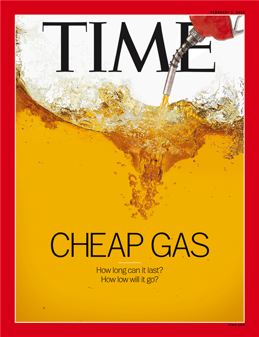
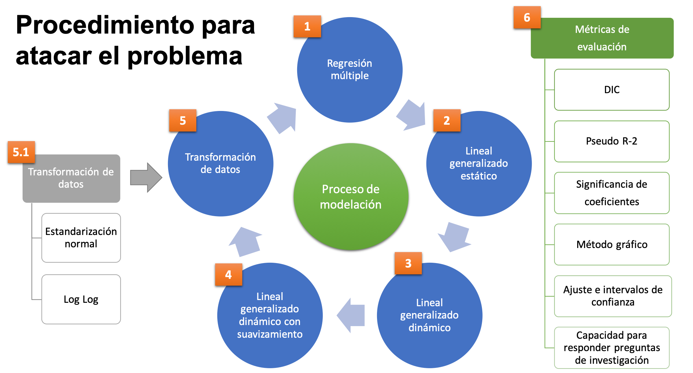

```{r setup, include=FALSE}
knitr::opts_chunk$set(echo = FALSE)
```

```{r setWD}

# Ruta ALE
setwd("~/Documents/ITAM_Maestria/03_Otono_2018/01_Regresion_Avanzada/04_Examenes/Examen_Final")

# Ruta Banxico
# setwd("//client/E$/ITAM_Maestria/03_Otono_2018/01_Regresion_Avanzada/05_Proyecto_Final")

```


# Introducción

## Contexto

- En la actualidad, el crudo es una de las principales materias primas y la principal fuente de energía para la transportación, la generación de electricidad y calefacción.


- El precio del petróleo se determina en el mercado a través de la interacción de la oferta y la demanda. Si el precio del petróleo sube: 

    - Consumidor: el precio de los bienes y servicios se incrementa por el aumento en los costos de producción y transporte. 
  
    - Productores de petróleo: pueden rebalancear sus déficits presupuestales, incrementar el gasto público y/o la inversión en capital.
  
  
- El West Texas Intermediate (WTI) es una mezcla de crudo producida en Texas y Oklahoma que sirve como \textbf{precio de referencia} para otras mezclas


## Problema

- Antes de la crisis financiera del 2008, la economía había experimentado un \textbf{aumento sostenido} en el precio internacional del petróleo.
    
    - El WTI llegó a un \textbf{máximo de 140 dls/barril} en junio de 2008. 

- Como consecuencia, el precio internacional del petróleo se desplomó.

    - El precio del WTI se \textbf{depreció 70\%} llegando a su mínimo de cotización de 41.68 dls/barril en enero de 2009.
    
    - Esta caída en los precios del petróleo afectó a las principales economías productoras del crudo, entre ellos a México. 
    

- Después de alcanzar este mínimo, el \textbf{precio del petróleo se recuperó}.

    - El WTI alcanzó un precio 105 dls/barril en junio de 2014, un nivel aún \textbf{muy por debajo de los 140 dls/barril} antes de la crisis del 2008. 

- En el periodo de jun-14 a ene-16, en plena recuperación de la crisis del 2008, el \textbf{precio del petróleo volvió a caer}. 

    - El precio del WTI pasó de 105 dls/barril a 33.62 dls/barril (\textbf{depreciación de 67\%}).
    
    - De hecho, los \textbf{precios internacionales del petróleo bajaron aún más que durante la crisis financiera}. 

## Problema

{width=147px} {width=147px} {width=147px}

## Causas de la caída del precio del petróelo 2014-2016

- Dentro de las principales causas en la caída de los precios del petróleo en el 2014-2016 se encuentran: 

    - \textbf{Independencia energética de Estados Unidos}
    
        - Paso de ser el principal importador de energía al productor más grande de petróleo y gas gracias a la técnica del "fracking". 
    
    - \textbf{Cambio de objetivos de la OPEP}
    
        - Aumentaron su producción para mantener precios bajos y competir con los precios de empresas americanas. 
    
    - \textbf{Desaceleración de la economía China}
    
        - China es la segunda economía más grande y el principal consumidor de energía. Está migrando a una economía con un mix energético más limpio. 
    
    - \textbf{Levantamiento de sanciones comerciales a Irán}
    
        - Irán tuvo la capacidad de exportar petróelo nuevamente incrementando la oferta mundial. 
    
    - \textbf{Apreciación del dólar estadounidense}
    
        - Un dólar más fuerte disminuye la demanda en países importadores.
        
## Objetivos

- El principal objetivo de este trabajo es proporcionar una \textbf{explicación empírica al comportamiento de los precios internacionales del petróleo durante la crisis petrolera de 2014-2016}, a partir de variables macroeconómicas.

- Para ello, se utiliza como herramienta de análisis distintos modelos de regresión en el contexto de los modelos lineales generalizados (GLM) que expliquen el precio del WTI en función de algunas variables macroeconómicas. 

- Como segundo objetivo, se busca \textbf{seleccionar un modelo que sirva para ajustar y pronosticar} el precio del WTI. 

## Hipótesis {.allowframebreaks}

- \textbf{Variable de respuesta:}

    - West Texas Intermediate (WTI): precio de los contratos de futuros  de la mezcla de petróleo. 

- \textbf{Variables explicativas:}

    -  JPM Dollar Index (JPM Dollar Index)
        
        - Un dólar más fuerte tiene una \textbf{relación negativa} con el precio internacional del petróleo porque al reducirse el poder adquisitivo de los países importadores de petróleo la demanda disminuye. 
  
    -	Chicago Board Options Exchange SPX Volatility Index (VIX) 
    
        - Mayor incertidumbre en los mercados tiene un impacto negativo en precio de los commodities. Esperamos una \textbf{relación negativa}. 

    -	Producción Total de Petróleo de la OPEP (Prod. OPEP) 
      
        - Si la OPEP incrementa su producción, el precio internacional del petróleo . En ese sentido esperamos una \textbf{relación negativa}.
  
    - Demanda mundial del petróleo (Dem. Petróleo).
  
        - Si la economía mundial o de las economías más grandes se desacelera el precio internacional del crudo disminuye. Esperamos una \textbf{relación negativa}.
  
    - Tasa de Largo Plazo de Estados Unidos (TBILL-10YR). 
        - Esta tasa es un proxy del comportamiento de la inversión a largo plazo. Se espera que ante una caída en los precios del petróleo, se desincentive la inversión física y de proyectos en el sector petrolero; es decir, una \textbf{relación positiva}.\footnote{The Economist. (2016)}
  
    - Tasa de Corto Plazo de Estados Unidos (TBILL-1YR). 
    
        - Es un indicador del rendimiento de las inversiones a corto plazo. Se espera que haya una \textbf{relación negativa} con esta variable.
  

# Datos

## Datos

\begin{table}[h]
\small
\caption{Resumen de los Datos}
\label{tabla:Datos}
\scalebox{0.7}{
\begin{tabular}{l|p{5cm}|p{3cm}|l|l}
\hline
Código & Variable &  Unidades & Fuente & Ticker \\
\hline
WTI & West Texas Intermediate &  Dólares por barril & Bloomberg & CL1 Comdty \\
\hdashline
JPM Dollar Index & JPM Dollar Index &	Unidades & Bloomberg & FXJPEMCI Index \\
\hdashline
VIX & Chicago Board Options Exchange SPX Volatility Index & Unidades & Bloomberg & VIX Index \\
\hdashline
Prod. OPEP & Producción Total de Petróleo de la OPEP & Millones de barriles por día & Bloomberg & OPCRTOTL Index \\
\hdashline
Dem. Petróleo & Demanda Total de Petróleo de la OPEP & Millones de barriles por día & Bloomberg & OPCBRTOT Index\\
\hline
TBILL-10YR & Tasa de Largo Plazo de Estados Unidos & Por ciento & FRED & DGS10\\
\hdashline
TBILL-1YR & Tasa de Corto Plazo de Estados Unidos & Por ciento & FRED & DGS1\\
\hline
\end{tabular}
}
\end{table}

## Análisis Exploratorio de los Datos:  Variable Respuesta

```{r librerias,message=FALSE, warning=FALSE}

# Cargamos librerias
library(R2jags) # Para simulaciones
library(tidyverse) # Para manipular datos
library(xtable) # para edición de tablas
library(pastecs)#para analisis descriptivo de datos

```

```{r funciones_aux}
source('02_Utils.R')
```

```{r LimpiezaDatos,warning=FALSE, message=FALSE}

source('01_Clean_Data_Petroleo.R')

```

```{r SetsDatos, cache=TRUE}
# Seleccionamos el set de datos a usar
datos<-datos_1 # Datos originales

# Extraemos las fechas 
Fecha<-datos$Fecha

# Eliminamos la fecha de los datos 
datos <- select(datos, -Fecha)

# Función para graficar series de tiempo con estos datos. 
plot_ts_datos<-plot_ts(datos,Fecha)

```

```{r PlotWTI,cache=TRUE, dependson=c('SetsDatos'), fig.pos='H', fig.width=12, fig.height=6, fig.cap='\\label{fig:PlotWTI}Serie de Tiempo del Precio del West Texas Intermediate'}

# WTI
plot_ts_datos('WTI','firebrick1','West Texas Intermediate','Dólares por barril')

```


## Análisis Exploratorio de los Datos: Variables Explicativas
```{r PlotsRegresores, cache=TRUE, dependson=c('SetsDatos'),fig.pos='H',fig.width=12,fig.height=6.5,fig.cap='\\label{fig:PlotsRegresores}Serie de Tiempo de los Regresores'}

par(mfrow=c(1,3))
# JPM_Dollar_Index
plot_ts_datos('JPM_Dollar_Index','royalblue1','a) JPM Dollar Index','Unidades')
# VIX_Index
plot_ts_datos('VIX_Index','darkgoldenrod1','b) VIX','Unidades')
# OPEP_TOTPROD
plot_ts_datos('OPEP_TOTPROD','olivedrab','c) Producción de la OPEP','Millones de barriles')

```


## Análisis Exploratorio de los Datos: Variables Explicativas
```{r PlotsRegresores2, cache=TRUE, dependson=c('SetsDatos'),fig.pos='H',fig.width=12,fig.height=6.5,fig.cap='\\label{fig:PlotsRegresores}Serie de Tiempo de los Regresores'}

par(mfrow=c(1,3))

# OPEP_TOTDEM
plot_ts_datos('OPEP_TOTDEM','lightblue1','d) Demanda de Petróleo','Millones de barriles')
# JPM_Dollar_Index
plot_ts_datos('TBILL_10YR','coral','e) Tasa Largo Plazo EU','Porciento')
# JPM_Dollar_Index
plot_ts_datos('TBILL_1YR','mediumpurple1','f) Tasa Corto Plazo EU','Porciento')
```

## Matriz de Correlaciones

```{r TablaCor, cache=TRUE, dependson=c('SetsDatos'), results='asis'}
colorCorrel<-function(x){
  
  ifelse(x>=0.4 & x<1, paste("\\color{red}{",formatC(x,dig=2,format="f"),"}"),
         ifelse(x>-1 & x<=-0.4, paste("\\color{red}{",formatC(x,dig=2,format="f"),"}"),
                paste("\\color{black}{",formatC(x,dig=2,format="f"),"}")))
}
# Matriz de correlaciones
mat_cor<-cor(datos)
mat_cor<-apply(mat_cor,2,function(x){colorCorrel(as.numeric(as.character(x)))})

colnames(mat_cor)<-c('WTI','JPM Dollar Ind.','VIX','Prod. OPEP','Dem. OPEP','TBILL-10YR','TBILL-1YR')
rownames(mat_cor)<-c('WTI','JPM Dollar Ind.','VIX','Prod. OPEP','Dem. OPEP','TBILL-10YR','TBILL-1YR')
mat_cor_tabla<-xtable(mat_cor,caption='Matriz de correlaciones de las variables de estudio',
                      label='tabla:mat_cor')
align(mat_cor_tabla)<-'lrrrrrrr'
print(mat_cor_tabla,comment=FALSE,print.placement='H',caption.placement = 'top',digits=2,size='small',scalebox=0.9,rotate.colnames=TRUE,sanitize.text.function = function(x) x)
```

# Estimación y Comparación de Modelos 

## Proceso de Estimación de Modelos



## Proceso de Estimación de Modelos

\begin{table}[ht]
\centering
\scriptsize
\caption{Pros y Contras}
\begin{tabular}{|l|p{4.5cm}|p{4.5cm}|}
\hline
  \textbf{Set de Datos} & \textbf{Pros} & \textbf{Contras}\\
\hline
\textbf{Originales} &  - Son interpetables de forma directa & - Modelo Dinámico Requiere suavizamiento muy grande\\
\hline
\textbf{Estandarizados} & - Minimiza la posibilidad de errores numéricos & - Disminuyó el número de modelos con coeficientes significativos\\
& - Coeficientes comparables en magnitud & - Explica menor variabilidad. \\
\hline
\textbf{Transformados} & - Menos parámetros porque se elimina el intercepto  & - No son interpetables de forma directa. \\
& -  Disminuyen los modelos con sobreajuste & - Hay que aplicar la transformación inversa \\
& - Mayor número de coeficientes significativos &  \\
\hline
\end{tabular}
\end{table}

## Comparación de Modelos 

```{r tablaCompModelos, echo=FALSE,results='asis'}

tabla_comp<-read.csv("comp_modelos.csv",head=TRUE)

# tabla_comp$Modelo<-c('Reg. Lineal Multiple Frec.', 'GLM Estatico','GLM Dinamico', 'GLM Dinam. Inter. Estat. & lambda=10', 'GLM Dinam. Inter. Estat. & lambda=100$','GLM Dinam. Inter. Estat. & lambda=100,000','Reg. Lineal Multiple Frec.', 'GLM Estatico','GLM Dinamico', 'GLM Dinam. Inter. Estat. & lambda=10$', 'GLM Dinam. Inter. Estat. & lambda=100$','GLM Dinam. Inter. Estat. & lambda=1,000$','Reg. Lineal Multiple Frec Sin Inter.', 'GLM Estatico Sin Inter.','GLM Dinamico Sin Inter.', 'GLM Dinam. Sin Inter & lambda=10$', 'GLM Dinam. Sin Inter. & lambda=100$','GLM Dinam. Sin Inter. & lambda=1,000$')

tabla_comp_modelos<-xtable(tabla_comp,caption='Comparacion de Modelos', label='tabla:comp_modelos')

addtorow<-list()
addtorow$pos<-list(nrow(tabla_comp_modelos))
addtorow$command<-c("\\hline\\multicolumn{12}{l}{Nota: El asterisco que acompa\\~na a algunos valores indica que los regresores s\\'olo fueron significativos en algunos periodos de tiempo.}\\\\\n")
print(tabla_comp_modelos,comment=FALSE,caption.placement = 'top',size='tiny',include.rownames=FALSE,rotate.colnames=TRUE,add.to.row=addtorow,scalebox=0.85,hline.after=c(-1,0,6,12))

```

# El Mejor Modelo 

## Selección del Mejor Modelo 

- Tomando en cuenta tanto el DIC, la pseudo$R^2$, el número de regresores significativos, el número de parámetros del modelo, el ajuste y la predicción;  los candidatos a mejor modelo serían:
    - El modelo estático sin intercepto con datos transformados
    - El modelo dinámico sin intercepto con factor de suavizamiento $\lambda=100$ y datos transformados
    
- Aunque el DIC para el primero es mucho menor \textbf{se elige como mejor modelo el modelo dinámico sin intercepto y factor de suavizamiento $\lambda=100$} pues con el estático no se puede analizar como ha ido evolucionando la relación entre las variables explicativas y el precio del WTI a lo largo de la muestra que es el objetivo principal de este análisis.

## Modelo Dinámico sin Intercepto, factor de suavizamiento $\lambda=100$ y Datos Transformados

\begin{eqnarray}\label{eq:mod_dinam_suav_100_transf}\nonumber
log(WTI)_t&=&\beta_{1,t} log(JPM)_t+\beta_{2,t}log(VIX)_t+\beta_{3,t} log(ProdOPEP)_t\\\nonumber
&&+\beta_{4,t} log(DemPet)_t+\beta_{5,t} log(TBILL10)_t+\beta_{6,t} log(TBILL1)_t+\epsilon_t\\\nonumber
\beta_{j,t}t&=&\beta_{j,t-1}+\omega_t\\
\omega_t&=&\lambda\epsilon_t
\end{eqnarray}
donde $\epsilon_t \sim N(0,V^{-1})$, $\omega_t \sim N(0,W^{-1})$ y $\lambda=100$. 

- Distribución inicial de coeficientes: $\beta_{j,0}\sim N(0,0.001)$.

- Distribución inicial $\epsilon_0$: $\epsilon_0\sim gamma(0.1,0.1)$.

- La estimación del modelo se realizó utilizando JAGS en R. 
    - 2 cadenas, 20,000 iteraciones, periodo de calentamiento de 2,000 iteraciones, sin adelagazamiento de la cadena. 
    
- $DIC=$ `r round(tabla_comp$DIC[17],2)`

- Pseudo-$R^2=$ `r round(tabla_comp$pseudoR2[17],2)`

## Ajuste del Modelo


## Regresores vs Precio del WTI

{height=300px}

## Coeficientes Estimados 

{height=300px}

## Coeficientes Estimados

{height=300px}

<!-- ## Coeficientes Estimados Prod. OPEP -->
<!--  -->

<!-- ## Coeficientes Estimados Prod. OPEP -->
<!--  -->


<!-- ## Coeficientes Estimados Prod. OPEP -->
<!--  -->


<!-- ## Coeficientes Estimados Prod. OPEP -->
<!--  -->

# Consideraciones Finales 

## Consideraciones Finales

- La flexibilidad de los modelos dinámicos generalizados nos permitió construir un modelo capaz de proporcionar una explicación de la crisis del petróleo en 2014-2016 acorde con las hipótesis del proyecto.

-	El comportamiento de los coeficientes a lo largo del tiempo permitió confirmar que las variables que más contribuyeron a la caída en los precios del petróleo fueron la apreciación del dólar, el aumentó en la producción de la OPEP y la desaceleración de la demanda mundial del crudo.

-	La transformación de los datos a escala logarítmica, el suavizamiento, combinar distintas medidas de ajuste y las hipótesis a priori sobre el comportamiento de las variables macroeconómicas fueron clave en la estimación, evaluación y selección del mejor modelo.

