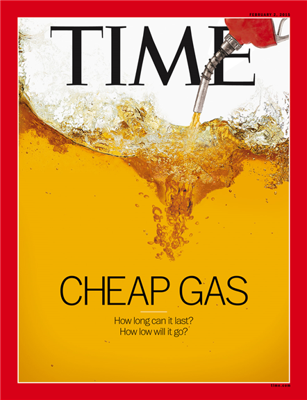

```{r setup, include=FALSE}
knitr::opts_chunk$set(echo = FALSE)
```

```{r setWD}
# Ruta ALE
setwd("~/Documents/ITAM_Maestria/03_Otono_2018/01_Regresion_Avanzada/04_Examenes/Examen_Final")

# Ruta Banxico
# setwd("//client/E$/ITAM_Maestria/03_Otono_2018/01_Regresion_Avanzada/04 Examenes/Examen_Final")

# Ruta Laura

# Ruta Dante
```

```{r librerias,message=FALSE, warning=FALSE}

# Cargamos librerias
library(R2jags) # Para simulaciones
library(tidyverse) # Para manipular datos
library(xtable) # para edición de tablas
library(pastecs)#para analisis descriptivo de datos

```

```{r funciones_aux}
source('02_Utils.R')
```


\newpage

# Introducción

El precio del petróleo se determina en el mercado a través de la interacción de la oferta y la demanda. La mayoría de estas transacciones tienen lugar en el mercado de futuros. Sin embrago, las fuerzas del mercado están influenciadas por los siguientes factores: la importancia que tiene el petróleo en nuestras economías, el sentimiento del mercado, la concentración de poder monopólico en distintas partes de la cadena de valor y la geopolítica\footnote{Kosakowski , P. (2018) \& Bos, J. (2015)}. En la actualidad, el crudo es la principal fuente de energía para la transportación, la generación de electricidad y la calefacción. Asimismo, es una de las principales materias primas en la producción de químicos, fertilizantes y plásticos\footnote{The Economist. (2016)}. 


Desde la perspectiva del consumidor, si el precio del petróleo sube, el precio de los bienes y servicios se incrementa; lo anterior se debe a que tanto los costos de producción como de transporte aumentan. Por otro lado, desde la perspectiva de países productores de petróleo si el precio del crudo se incrementa, éstos pueden balancear sus déficits presupuestales, incrementar el gasto público y/o la inversión en capital físico.


Antes de que estallara la crisis financiera internacional de 2008-2010, la economía mundial había experimentado un aumento sostenido en el precio internacional del petróleo. Por ejemplo, el precio del West Texas Intermediate (WTI) ---una mezcla de crudo producida en Texas y Oklahoma, y que sirve como precio de referencia para otras mezclas--- llegó a cotizar en un máximo de 140 dólares por barril (dls/barril) en junio de 2008. 


Como consecuencia la crisis financiera y económica del 2008-2010, el precio del petróleo se desplomó llegando el WTI a su cotización mínima de 41.68 dls/barril en enero de 2009; lo que represenó una depreciación de su precio del 70%.\footnote{Marzo, M. (2015)} Esta caída en los precios del petróleo provocó déficits fiscales, reducción en el gasto de gobierno y pérdidas para las empresas petroleras tanto privadas como públicas. Después de alcanzar este precio mínimo, el precio del petróleo se recuperó llegando el WTI a alcanzar un precio 105 dls/barril en junio de 2014, un nivel aún muy por debajo de los 140 dls/barril alcanzados antes de la crisis financiera internacional. 


En el periodo de junio de 2014 a enero de 2016, en plena recuperación de la crisis financiera internacional, el precio del petróleo volvió a caer. Dicha caída en los precios del crudo afectó a las principales economías productoras de este hidrocarburo, entre ellos a México. En particular, el precio del WTI pasó de 105 dls/barril a 33.62 dls/barril, lo que representó una depreciación de 67%. En esta coyuntura, los precios internacionales del petróleo bajaron aún más que durante la crisis financiera del 2008. 

{width=205px} {width=205px} {width=205px}


Algunas de las principales causas que explican la caída de los precios del petróleo de 2014-2016 son:

* \textbf{Independencia energética en Estados Unidos.} La producción de petróleo no convencional obtenido mediante la técnica de fracturación hidráulica (fracking por sus siglas en inglés) convirtió a este país de ser el principal importador de energía a ser el productor más grande de petróleo y gas del mundo. Cientos de yacimientos de petróleo están utilizando la fracturación hidráulica para producir millones de barriles desde 2011 a un precio muy por debajo de lo que solían comprar a varios países de la OPEP.\footnote{IEA, (2017)}


*	\textbf{Cambio de objetivos de la OPEP.} Esta organización internacional conformada por 15 países, entre los cuales Arabia Saudita, Kuwait, Irán, Irak y Venezuela son fundadores, concentra el 40% de la oferta mundial de petróleo.\footnote{Kosakowski , P. (2018) \& Bos, J. (2015)} Históricamente, este cartel ajustaba su producción de crudo para estabilizar el precio internacional del petróleo en una banda de 100-110 dls/barril. Sin embargo, en 2015 tomó la decisión radical de no recortar su producción para incrementar el precio del petróleo. De hecho, con el fin de desincentivar la producción de petróleo no convencional a través del fracking, han aumentado su producción para mantener bajos los precios internacionales y recortar el margen de ganancias de las empresas Americanas. En parte, esto se debe a que los costos de producción del fracking son relativamente más costosos que los de la producción convencional de los países de la OPEP. Por otro lado, hay quienes suponen que Arabia Saudita esta explotando su liderazgo con el beneplácito de Estados Unidos para desestabilizar las economías de Rusia e Irán. 


* \textbf{La desaceleración económica de China.} La segunda mayor economía del mundo y, el principal consumidor de energía, está creciendo menos que en años anteriores. Asimismo, la economía de este país se está transformando a una más orientada hacia los servicios y mix energético más limpio. \footnote{IEA, (2017) \& Marzo, M. (2015)} Lo anterior ha disminuido su demanda por energéticos como el petróleo.  


* \textbf{El levantamiento de sanciones comerciales a Irán.} Durante este periodo se levantaron sanciones comerciales a Irán por su programa nuclear que le impedían comerciar con el mercado internacional. De esta manera, Irán tuvo la capacidad de volvió a poner a exportar petróleo, aumentando la oferta mundial, lo que presionó el precio internacional del crudo a la baja.


* \textbf{La apreciación del dólar estadounidense.} Un dólar más fuerte suele tener una relación positiva con el precio del petróleo ya que, en moneda extranjera, cada barril de petróleo se vende a un precio más alto. Sin embargo, cabe destacar que, para países importadores del crudo, ante un dolar más fuerte la demanda puede disminuir pues estos países ven minado el poder adquisitivo de su moneda y dicha disminución podría llevar a una caída en el precio del petróelo.\footnote{Marzo, M. (2015)}

Como resultado de las causas antes mencionadas, durante el periodo de interés (2014-2016) hubo una sobreoferta de petróleo en el mercado que se ha mantenido hasta 2018. Después de este periodo, el precio internacional del petróleo se ha ido recuperando de manera lenta, pero aún no es posible determinar cuando volverá la economía mundial a experimentar precios altos como los previos a la crisis financiera. Lo que si es seguro es que, en los próximos años, el precio del hidrocarburo seguirá siendo más barato que en años anteriores.\footnote{International Energy Agency. (2018).}

De esta manera, el objetivo de este trabajo consiste en explicar la crisis del precio internacional del petróleo en el periodo 2014-2016 ajustando diferentes modelos de regresión que expliquen el precio del WTI en función de algunas variables macroeconómicas. En particular, se busca contrastar el modelo de regresión lineal múltiple (enfoque frecuentista) con los modelos lineales genralizados (estáticos y dinámicos) con enfoque bayesiano ya que, en muchas ocasiones, el modelo de regresión lineal múltiple normal es la primera opción para un ejercicio de regresión. Tambíen se busca contrastar los dos periodos de mayor cambio en el precio del petróelo en el periodo muestral: la crisis financiera del 2008-2009 y la crisis del petróleo del 2014-2016. 

Considerando el contexto del problema, se seleccionaron las siguientes variables macroeconómicas por su relevancia, disponibilidad de información e intuición para explicar el problema de la crisis del precio del petróleo.

Variable de respuesta:

  * West Texas Intermediate (WTI). Precio de los contratos de futuros de esta mezcla de crudo producida en Texas y Oklahoma que sirve como precio de referencia para otras mezclas.

Variables explicativas:

  *	\textbf{JPM Dollar Index (JPM Dollar Index)}. Un dólar más fuerte tiene una \textbf{relación positiva} con el precio internacional del petróleo porque al apreciarse el dólar frente a las economías emergentes, el precio de cada barril en moneda extranjera se incrementa. 
  
  *	\textbf{Chicago Board Options Exchange SPX Volatility Index (VIX)}. Mayor incertidumbre en los mercados tiene un impacto negativo en precio de los commodities. Esperamos una \textbf{relación negativa}. 
  
  *	\textbf{Producción Total de Petróleo de la OPEP (Prod. OPEP)}. Si la OPEP incrementa su producción, el precio internacional del petróleo baja. En ese sentido esperamos una \textbf{relación negativa.}
  
  *	\textbf{Demanda mundial del petróleo (Dem. Petróleo)}. Si la economía mundial o de las economías más grandes se desacelera el precio internacional del crudo disminuye. Esperamos una \textbf{relación negativa.}
  
  *	\textbf{Tasa de Largo Plazo de Estados Unidos (TBILL-10YR)}. La tasa de interés de los bonos del tesoro de Estados Unidos son un proxy del comportamiento de la inversión a largo plazo. Asimismo, muchas de las tasas de interés internacionales están asociadas al comportamiento del TBILL. Se espera que ante un desincentivo en inversión física y proyectos en el sector petrolero haya una caída en los precios del petróleo haya ; es decir, se espera una \textbf{relación negativa}.\footnote{The Economist. (2016)}
  
  *	\textbf{Tasa de Corto Plazo de Estados Unidos (TBILL-1YR)}. La tasa de referencia a 1 año es un indicador del rendimiento de las inversiones a corto plazo. Se espera que haya una \textbf{relación negativa} con esta variable.
  

Modelo:

  * Debido a la complejidad del problema que se quiere explorar, \textbf{esperamos que los modelos lineales generalizados ofrezcan una mayor flexibilidad} para explicar el comportamiento de los regresores a lo largo del tiempo.


El resto del trabajo está organizado de la siguiente manera. En la sección \ref{sec:Datos} se presenta una descripción y análisis exploratorio de los datos. Posteriormente, en la sección \ref{sec:EstimModelos} se presenta la estimación de modelos de regresión distintos en tres bloques: con datos originales (\ref{sec:Originales}), con datos estandarizados (\ref{sec:Estandarizados}) y con datos transformados aplicando la transformación logaritmo (\ref{sec:Originales}). La comparación de los distintos modelos, la selección del mejor modelo y su respectiva interpretación se encuentran en la sección \ref{sec:MejorModelo}. Finalmente, las consideraciones finales se presentan en la sección \ref{sec:Consid.Finales}. En el apéndice (sección \ref{sec:Apend}) se pueden consultar los códigos BUGS utilizados en cada modelo. 


\newpage

# Datos

## Descripción de los Datos\label{sec:Datos}

\begin{table}[h]
\small
\caption{Resumen de los Datos}
\label{tabla:Datos}
\begin{tabular}{l|p{5cm}|p{3cm}|l|l}
\hline
Código & Variable &  Unidades & Fuente & Ticker \\
\hline
WTI & West Texas Intermediate &  Dólares por barril & Bloomberg & CL1 Comdty \\
\hdashline
JPM Dollar Index & JPM Dollar Index &	Unidades & Bloomberg & FXJPEMCI Index \\
\hdashline
VIX & Chicago Board Options Exchange SPX Volatility Index & Unidades & Bloomberg & VIX Index \\
\hdashline
Prod. OPEP & Producción Total de Petróleo de la OPEP & Millones de barriles por día & Bloomberg & OPCRTOTL Index \\
\hdashline
Dem. Petróleo & Demanda Total de Petróleo & Millones de barriles por día & Bloomberg & OPCBRTOT Index\\
\hline
TBILL-10YR & Tasa de Largo Plazo de Estados Unidos & Por ciento & FRED & DGS10\\
\hdashline
TBILL-1YR & Tasa de Corto Plazo de Estados Unidos & Por ciento & FRED & DGS1\\
\hline
\end{tabular}
\end{table}


Se tienen observaciones mensuales del WTI, del JPM Dollar Index, del VIX, de la producción y demanda de petróleo por parte de la OPEP, así como las tasas de corto y largo plazo en Estados Unidos. La tabla \ref{tabla:Datos} resume las fuentes de información de los datos a utilizar en este trabajo. La muestra contiene 225 observaciones que corresponden al periodo de enero del 2000 a septiembre del 2018. Para estimar los modelos se utiliza el periodo comprendido entre enero del 2000 y junio del 2018; mientras que el horizonte de pronóstico va de julio a septiembre del mismo año. La siguiente sección muestra una análisis exploratorio de los datos. 

```{r LimpiezaDatos,warning=FALSE, message=FALSE}

source('01_Clean_Data_Petroleo.R')

```

## Análisis Exploratorio de los Datos

La variable WTI representa el precio de los contratos de futuros del petróleo crudo (para contratos de 1000 barriles). Como se puede apreciar en la figura \ref{fig:PlotWTI}, desde el inicio de la muestra y hasta antes de la crisis financiera del 2008, el precio del WTI presentaba una tendencia creciente. Posteriormente, durante la crisis presentó una caída significativa pasando de 140 dólares por barril a menos de 50 dólares por barril. Después de dicha crisis, el precio del WTI se recuperó alcanzando, en algunos periodos, precios superiores a los 100 dólares por barril. Sin embargo, en el primer trimestre del 2014 y hasta finales del 2015 (periodo de interés, marcado con la barra gris) volvió a presentar una caída drástica llegando a aproximadamente 36 dólares por barril; de hecho, ésta fue mayor a la crisis del 2008. Dicha caída se ha revertido en los últimos, pero no parece regresar a los niveles previos al 2014 e incluso podría tratarse de un cambio estructural.


```{r SetsDatos, cache=TRUE}
# Seleccionamos el set de datos a usar
datos<-datos_1 # Datos originales

# Extraemos las fechas 
Fecha<-datos$Fecha

# Eliminamos la fecha de los datos 
datos <- select(datos, -Fecha)

# Función para graficar series de tiempo con estos datos. 
plot_ts_datos<-plot_ts(datos,Fecha)

```

```{r PlotWTI,cache=TRUE, dependson=c('SetsDatos'), fig.pos='H', fig.width=12, fig.height=6, fig.cap='\\label{fig:PlotWTI}Serie de Tiempo del Precio del West Texas Intermediate'}

# WTI
plot_ts_datos('WTI','firebrick1','West Texas Intermediate','Dolares por barril')

```

```{r TablaStatDesc, cache=TRUE, dependson=c('SetsDatos'), results='asis'}
# Matriz de correlaciones
estdesc<-rbind(stat.desc(datos),apply(datos,2,getmode))[c(8:9,15,12:14,4:6),]
# Nombre de filas y columnas
colnames(estdesc)<-c('WTI','JPM Dollar Ind.','VIX','Prod. OPEP','Dem. Petroleo','TBILL-10YR','TBILL-1YR')
rownames(estdesc)<-c('Mediana','Media','Moda','Varianza','Desv.Est.','Coef. Var.','Minimo','Maximo','Rango')
# Impresion de la tabla
estdesc_tabla<-xtable(estdesc,caption='Estadisticas Descriptivas de las Variables de Estudio',
                      label='tabla:estdesc')
align(estdesc_tabla)<-'lrrrrrrr'
print(estdesc_tabla,comment=FALSE,print.placement='H',caption.placement = 'top',digits=2,size='small')
```

```{r PlotsRegresores, cache=TRUE, dependson=c('SetsDatos'),fig.pos='H',fig.width=12,fig.height=12,fig.cap='\\label{fig:PlotsRegresores}Serie de Tiempo de los Regresores'}

par(mfrow=c(3,2))
# JPM_Dollar_Index
plot_ts_datos('JPM_Dollar_Index','royalblue1','a) JPM Dollar Index','Unidades')
# VIX_Index
plot_ts_datos('VIX_Index','darkgoldenrod1','b) VIX','Unidades')
# OPEP_TOTPROD
plot_ts_datos('OPEP_TOTPROD','olivedrab',"c) Produccion de la OPEP",'Millones de barriles')
# OPEP_TOTDEM
plot_ts_datos('OPEP_TOTDEM','lightblue1','d) Demanda de Petroleo','Millones de barriles')
# JPM_Dollar_Index
plot_ts_datos('TBILL_10YR','coral','e) Tasa Largo Plazo EU','Porciento')
# JPM_Dollar_Index
plot_ts_datos('TBILL_1YR','mediumpurple1','f) Tasa Corto Plazo EU','Porciento')
```


La tabla \ref{tabla:estdesc} muestra algunas estadísticas descriptivas de cada una de las variables explicativas que se van a utilizar en la estimación de los modelos; por su parte, la figura \ref{fig:PlotsRegresores} muestra la serie de tiempo de las mismas. El JPM Dollar Index, figura \ref{fig:PlotsRegresores} a), representa el índice del tipo de cambio del dólar americano respecto a las monedas de algunas economías emergentes. En este sentido, es una medida de la fortaleza del dólar. Cabe destacar que existen otros indicadores similares (como el DXY), pero que ponderan por el tipo de cambio de las economías avanzadas que, en su mayoría, no son productoras de petróleo; por lo que el impacto en el precio del WTI sería menor. Desde 2002 y previo a la crisis del 2008, el dólar presentó una fortaleza creciente frente a las economías emergentes; mientras que durante la crisis del 2008 se debilitó de manera importante. A pesar de haber tenido una rápida recuperación en el periodo post-crisis, el JPM Dollar Index presentó su mayor caída en el periodo 2011-2016, llegando a niveles incluso menores que los del 2008. 


La figura \ref{fig:PlotsRegresores} b) muestra la serie de tiempo del VIX, el cual refleja una estimación de la volatilidad futura del mercado basada en el promedio ponderado de las volatilidades implícitas para una amplia gama de precios de ejercicio. La serie del VIX presenta valores altos al inicio de la muestra y, como era de esperarse, presenta un gran pico en la crisis financiera del 2008 pues es el momento de mayor incertidumbre en los mercados a lo largo del periodo muestral. Cabe destacar que durante el periodo de interés la estimación de la volatilidad futura del mercado se mantuvo relativamente estable. 


La producción total de petróleo por parte de los países miembros de la OPEP se puede encontrar en la figura \ref{fig:PlotsRegresores} c). De manera general, se puede apreciar una tendencia creciente a lo largo de todo el periodo muestral, aunque con algunos episodios a la baja en la producción del crudo. Es interesante destacar que, durante la crisis financiera del 2008, la producción de petróleo por parte de la OPEP tuvo una fuerte caída; mientras que en el periodo de interés, la producción de petróleo se incremento a un ritmo elevado, llegando a máximos históricos a finales del 2016. De hecho, en la literatura, el incremento en la oferta del petróleo se reconoce como una de las principales causas de la caída de los precios de crudo.


La figura \ref{fig:PlotsRegresores} d) muestra la serie de tiempo de la demanda de petróleo tanto por parte de países miembros de la OPEP como de los no miembros de la misma. Análogo al caso de la producción de petróleo, la demanda de este comodity se ha incrementado a lo largo de toda la muestra. Además, esta serie parece tener un componente estacional, incrementándose la demanda por petróleo en los meses de invierno y disminuyendo durante el verano. Durante el periodo de interés destaca un incremento de la demanda en el segundo semestre del 2015; sin embargo este no es el incremento más pronunciado de toda la muestra. Posiblemente, esta variable ayude a capturar tendencia en la estimación de los modelos. 


La gráfica de la serie de tiempo de la tasa de largo plazo de Estados Unidos (Bono del Tesoro a 10 años) se puede encontrar en la figura \ref{fig:PlotsRegresores} e). En general, la tasa de largo plazo ha disminuido a lo largo de la muestra, indicando que se esperaban tasas de corto plazo menores a las observadas. A diferencia del resto de los indicadores, la tasa de largo plazo no muestra un comportamiento marcadamente distinto durante la crisis del 2008 (existen otros periodos con caídas similares a las del 2008 e incluso mayores). Durante el periodo de interés, esta tasa no muestra un comportamiento extraordinario. Sin embargo, en los últimos dos años se ha presentado un incremento de la tasa de largo plazo; lo cual, está en linea con la expectativa de normalización de la política monetaria de Estados Unidos. 


Por último, la figura \ref{fig:PlotsRegresores} f) muestra la evolución del Bono del Tesoro a un año de Estados Unidos; es decir, de la tasa de corto plazo. Se puede observar que entre el año 2000 y 2004, la tasa de corto plazo disminuyó significativamente pasando de niveles superiores al 6%, a niveles cercanos al 1%. Entre el 2004 y mediados del 2006, se dio un fuerte incremento en esta tasa alcanzando niveles cercanos al 5% y manteniéndose estable en este nivel por un par de años. Ante la crisis del 2008, la tasa de corto plazo comenzó con un ciclo de expansión de la política monetaria para fomentar el consumo y la inversión; en este sentido, Estados Unidos mantuvo su tasa de corto plazo cerca del cero desde el 2009 y hasta finales del 2015 para reactivar la economía. Finalmente, ante las señales de recuperación económica, y como se aprecia en la gráfica, a partir del 2016 se inicio un ciclo de alzas de tasas de interés para normalizar la política monetaria de dicho país, lo que se refleja en una tasa de corto plazo mayor hacia finales de la muestra. 


```{r TablaCor, cache=TRUE, dependson=c('SetsDatos'), results='asis'}
# Matriz de correlaciones
mat_cor<-cor(datos)
mat_cor_tabla<-apply(mat_cor,2,function(x){colorCorrel(as.numeric(as.character(x)))})

colnames(mat_cor_tabla)<-c('WTI','JPM Dollar Ind.','VIX','Prod. OPEP','Dem. Petroleo','TBILL-10YR','TBILL-1YR')
rownames(mat_cor_tabla)<-c('WTI','JPM Dollar Ind.','VIX','Prod. OPEP','Dem. Petroleo','TBILL-10YR','TBILL-1YR')
mat_cor_tabla<-xtable(mat_cor_tabla,caption='Matriz de Correlaciones de las Variables de Estudio',
                      label='tabla:mat_cor')

align(mat_cor_tabla)<-'lrrrrrrr'

print(mat_cor_tabla,comment=FALSE,print.placement='H',caption.placement = 'top',digits=2,size='small',scalebox=0.9,rotate.colnames=TRUE,sanitize.text.function = function(x) x)
```

La tabla \ref{tabla:mat_cor} muestra la matriz de correlaciones de todas las variables en la muestra. En particular estamos interesados en conocer la correlación de cada uno de los regresores con el precio del WTI. Ninguna variable tiene una correlación superior a 0.5 con la variable de interés, sin embargo varias de ellas podrían considerarse altas. El índice del dólar, el nivel de producción de la OPEP y la demanda del Petróleo tiene una correlación alta y positiva con el WTI (`r round(mat_cor[1,2],2)`, `r round(mat_cor[1,4],2)`, y `r round(mat_cor[1,5],2)` respectivamente); por lo que esperaríamos que en los distintos modelos a estimar, estas variables fueran significativas y con coeficiente positivo. Tanto la tasa de largo como la de corto plazo tienen una correlación alta, pero negativa, con el precio del petróleo (`r round(mat_cor[1,6],2)` y `r round(mat_cor[1,7],2)`), por lo tanto. Por último el VIX tiene una correlación negativa pero muy pequeña con el WTI `r round(mat_cor[1,3],2)` por lo que podría no ser una variable significativa a la hora de estimar los modelos. 

```{r Params, cache=TRUE, dependson=c('SetsDatos')}

# No. obs predicción
n <- nrow(datos)
# No. obs pronosticos
m <- 3
# No. regresores
k<- 6

# hyperparametros
niter<-20000
nchains<-2
nburning<-0.1*niter
semilla<-3567

```

La siguiente sección describe el proceso de estimación de los distintos modelos, su especificación y algunas observaciones inmediatas de los mismos. 


# Estimación de Modelos \label{sec:EstimModelos}

Como se mencionó con anterioridad, uno de los objetivos de este proyecto es analizar la crisis de los precios del petróleo 2014-2016. En esta sección se procede a estimar distintos modelos de regresión para analizar si las variables de la muestra tienen impacto en el precio del WTI y, en particular, conocer la forma en que cada una de las variables explicativas incidió en ésta durante el periodo de interés. 


La estimación de los modelos se hace en tres bloques: utilizando los datos originales, estandarizando los datos y transformando los datos (secciones \ref{sec:Originales}, \ref{sec:Estandarizados} y \ref{sec:Transformados}). Para cada uno de estos bloques se estiman al menos un modelo de regresión lineal múltiple normal (con enfoque frecuentista), un modelo lineal generalizado estático, un modelo dinámico y un modelo dinámico con suavizamiento. A lo largo de cada una de las secciones se hace referencia a las razones por las cuales se decide estimar uno u otro modelo, los valores DIC y pseudo-$R^2$ obtenidos, así como los problemas que se presentaron en cada paso. Cabe mencionar que se presenta la estimación del modelo de regresión lineal frecuentista únicamente con la finalidad de contrastarlo con los modelos bayesianos que hemos visto en clase; ya que, en muchas ocasiones, este modelo es la primera opción que viene al a mente al estimar modelos de regresión. 


## Datos Originales \label{sec:Originales}

En esta sección se utilizan los datos originales; es decir, sin ningún tipo de escalamiento o transformación para estimar los distintos modelos. La ventaja de esto es que los coeficientes tienen una intrerpretaciñon directa; la desventaja es que podrían presentarse problemas númericos de estimacion por el manejo de distintas escalas en los datos. 


### Modelo de Regresión Lineal Múltiple Normal

Como primer modelo se  estima una regresión lineal múltiple (con enfoque frecuentista) ya que, en la mayoría de los casos, ésta sería la primer opción a utilizar. El modelo a estimar se define como
\begin{equation}\label{eq:RegLin}
WTI_t=\beta_0+\beta_1JPM_t+\beta_2VIX_t+\beta_3 ProdOPEP_t+\beta_4 DemPet_t+\beta_5 TBILL10_t+\beta_6 TBILL1_t+\epsilon_t
\end{equation}


```{r MRLM,results='asis',cache=TRUE, dependson=c('SetsDatos','Params')}

# Modelo de regresón con enfoque clásico
modelo_RegLin <- lm(data = datos, formula = WTI ~ .)
tabla_mod_RegLin<-summary(modelo_RegLin)$coefficients
rownames(tabla_mod_RegLin)<-c('Intercepto','JPM Dollar Ind.','VIX Ind.','Prod. OPEP','Dem.Petróleo', 'TBILL-1OYR','TBILL-1YR')
colnames(tabla_mod_RegLin)<-c('Estimacion','Desv. Est.','Valor t','Valor-p')

R2_RegLin<-summary(modelo_RegLin)$adj.r.squared

tabla_mod_RegLin<-xtable(tabla_mod_RegLin,
                         caption='Coeficientes Estimados Para el Modelo \\eqref{eq:RegLin}',
                         label='tabla:coef_mod_RegLin')
align(tabla_mod_RegLin)<-'l|rrrr'
print(tabla_mod_RegLin,comment=FALSE,caption.placement = 'top')

```

Como se puede apreciar en la tabla \ref{tabla:coef_mod_RegLin}, todos los regresores son significativos al 95% de confianza salvo el VIX y la tasa de largo plazo. En cuanto a los regresores que sí son significativos, el signo de los coeficientes coincide con lo esperado a partir de la matriz de correlaciones. En este sentido, ante un incremento de una unidad en el JPM Dollar Index (apreciación del dólar frente a monedas de economías emergentes), el precio del WTI se incrementaría en `r round(coef(summary(modelo_RegLin))[2,1],2)` dólares por barril; un incremento de un millón de barriles producidos llevaría a un incremento del precio del WTI de  `r round(coef(summary(modelo_RegLin))[4,1],2)` dólares por barril, un incremento de un millón de barriles en la demanda del petróleo estaría asociado a un incremento en el precio del WTI de `r round(coef(summary(modelo_RegLin))[5,1],2)` dólares por barril y un incremento de un punto porcentual en la tasa de tasa de corto plazo disminuiría el precio del WTI en `r round(coef(summary(modelo_RegLin))[7,1],2)` dólares por barril. Este modelo tiene un coeficiente de $R^2 ajustada=$ `r round(summary(modelo_RegLin)$r.squared,2)`; es decir, el modelo explica un `r round(summary(modelo_RegLin)$r.squared,3)*100` % de la varianza de los datos. Este valor servirá para comparar con el valor de la pseudo-$R^2$ de los modelos bayesianos. 

```{r tsWTI_RegLin, cache=TRUE, dependson=c('GLM_Dinamico_suav_10'),fig.pos='H', fig.width=12,fig.height=6,fig.cap='\\label{fig:tsWTI_RegLin}Ajuste y Prediccion: Modelo \\eqref{eq:RegLin}'}
#t vs y
par(mfrow=c(1,1))

y_hat_RegLin<-modelo_RegLin$fitted.values

xmin<-1
xmax<-n
ymin<-min(c(datos$WTI,y_hat_RegLin))
ymax<-max(c(datos$WTI,y_hat_RegLin))

plot(1:n,datos$WTI,type="l",lwd=3,lty=1,col="grey50",xaxt='n',ylim=c(ymin,ymax),xlim=c(xmin,xmax),xlab='',ylab='WTI') # Observado

rect(xleft=match("ene-08",Fecha),ybottom=par("usr")[3],xright=match("dic-09",Fecha),ytop=par("usr")[4],col='#3333334D',border=NA)
rect(xleft=match("abr-14",Fecha),ybottom=par("usr")[3],xright=match("ene-16",Fecha),ytop=par("usr")[4],col='#3333334D',border=NA)

lines(1:n,c(y_hat_RegLin[1:(n-m+1)],rep(NA,m-1)),lty=1,lwd=2,col='firebrick1') # Ajustado

lines(1:n,c(rep(NA,n-m),y_hat_RegLin[(n-m+1):n]),lty=1,lwd=2,col='royalblue1') # Pronosticado

axis(1,at=seq(1,n,6),labels=Fecha[seq(1,n,6)],las=2)
# axis(1,at=c(seq(1,nobs,6),(n-m):n),labels=Fechas[c(seq(1,nobs,6),(n-m):n)],las=2)

legend("topleft",legend=c('Observado','Ajustado','Pronosticado'),lty=c(1,2,1),lwd=c(2,1,2),col=c('grey50','firebrick1','royalblue1'))
```

La figura \ref{fig:tsWTI_RegLin} muestra el ajuste y la predicción del modelo de regresión lineal clásico. El modelo replica de forma correcta la dinámica general del
WTI; sin embargo hay momentos en los que sobrestima o subestima el valor observado. En cuanto al horizonte de pronóstico, el modelo subestima el precio del petróleo por aproximadamente 22 dólares por barril. 

\newpage


### GLM Estático

```{r GLM_Estatico, cache=TRUE, dependson=c('SetsDatos','Params'), message=FALSE, warning=FALSE, eval=TRUE, include=FALSE,cache=TRUE, dependson=c('SetsDatos')}

source('Modelos/Modelo_Estatico.R')

```

El segundo modelo a estimar es un modelo lineal generalizado normal estático; de hecho, este modelo coincide con un modelo de regresión normal lineal bajo el enfoque bayesiano. El modelo está definido como:
\begin{eqnarray}\label{eq:mod_estatico}\nonumber
WTI_t&\sim& N(\mu_t,\tau_i)\\\nonumber
\mu_t&=&\beta_0+\beta_1JPM_t+\beta_2VIX_t+\beta_3 ProdOPEP_t+\beta_4 DemPet_t+\beta_5 TBILL10_t+\beta_6 TBILL1_t\\
\tau_i&=&\tau
\end{eqnarray}

Como distribución inicial de los coeficientes $\beta_j$ se utiliza una normal no informativa; esto es $\beta_j\sim N(0,0.001)$ con $j=0,1,\cdots,6$. La estimación del modelo se realizó utilizando JAGS en R. Se corrieron `r format(niter,scipen=999)` simulaciones para `r nchains` cadenas con un periodo de calentamiento de `r nburning` observaciones y sin adelgazamiento de la cadena (n.thin=1). En cuanto al ajuste del modelo, éste tuvo un valor $DIC=$ `r format(out_estat.dic,scipen=999)` y una pseudo-$R^2=$ `r format(round(pseudoR2_estat,2),scipen=999)`, por lo que el modelo está capturando aproximadamente el `r round(pseudoR2_estat,3)*100`% de la varianza de los datos.

```{r Resumen_GLM_Estatico,cache=TRUE, dependson=c('GLM_Estatico'),results='asis'}
#Tabla resumen
out_estat.sum.t_tabla<-xtable(out_estat.sum.t,
                              caption='Coeficientes Estimados para el Modelo \\eqref{eq:mod_estatico}',
                              label='tabla:coef_mod_estat')

colnames(out_estat.sum.t_tabla)[5]<-"Dem.Petroleo"
rownames(out_estat.sum.t_tabla)[5]<-"Dem.Petroleo"

align(out_estat.sum.t_tabla)<-'l|rrrrrr'
print(out_estat.sum.t_tabla,comment=FALSE,caption.placement = 'top')
```

La tabla \ref{tabla:coef_mod_estat} muestra los coeficientes estimados para este modelo. Como estimadores puntuales se tienen la media (bajo pérdida cuadrática), la mediana (bajo pérdida absoluta) y la moda (bajo pérdida vecindad); además se incluye la estimación por intervalos. Como se puede apreciar, los estimadores puntuales de la media y la mediana son muy parecidos para todos los coeficientes; mientras que el estimador puntual de la moda es el que más difiere en todos los casos. Todos los regresores son significativos --- y sus respectivos intervalos de probabilidad no contienen al cero --- salvo los correspondientes al nivel de producción de la OPEP y a la tasa de corto plazo. Estos resultados contrastan con los del modelo de regresión lineal clásico. 

De esta manera, para los coeficientes significativos se tiene que un incremento de una unidad en el índice del dólar (todo lo demás constante) estará relacionado con un incremento de `r abs(round(out_estat.sum.t[2,1],2))` dólares por barril en el precio del WTI; un incremento de una unidad en el índice de volatilidad conlleva a una disminución de `r abs(round(out_estat.sum.t[3,1],2))` dólares por barril en el precio del petróleo, un incremento de un millón de barriles en la demanda del petróleo incrementará su precio en `r abs(round(out_estat.sum.t[5,1],2))` dólares por barril y un incremento de un punto porcentual en la tasa de largo plazo estará relacionado con una disminución de `r abs(round(out_estat.sum.t[6,1],2))` dólares por barril en el precio del WTI. 

```{r PlotRegresores_Estatico, cache=TRUE, dependson=c('GLM_Estatico'),fig.pos='H',fig.width=12,fig.height=10,fig.cap='\\label{fig:Regresores_Estatico}Regresores vs WTI: Modelo \\eqref{eq:mod_estatico}'}
#Predictions
par(mfrow=c(3,2))
# JPM_Dollar_Index vs. WTI
plot_RegvsWTI(x.name='JPM_Dollar_Index',out.yp=out_estat.yp,pos_leg='topleft')
# VIX_Index vs. WTI
plot_RegvsWTI(x.name='VIX_Index',out.yp=out_estat.yp,pos_leg='topleft')
# OPEP_TOTPROD vs. WTI
plot_RegvsWTI(x.name='OPEP_TOTPROD',out.yp=out_estat.yp,pos_leg='topleft')
# OPEP_TOTDEM vs. WTI
plot_RegvsWTI(x.name='OPEP_TOTDEM',out.yp=out_estat.yp,pos_leg='topleft')
# TBILL_10YR vs. WTI
plot_RegvsWTI(x.name='TBILL_10YR',out.yp=out_estat.yp,pos_leg='topright')
# TBILL_1YR vs. WTI
plot_RegvsWTI(x.name='TBILL_1YR',out.yp=out_estat.yp,pos_leg='topright')
```

La figura \ref{fig:Regresores_Estatico} muestra el valor observado, el valor pronosticado y los intervalos de predicción para cada uno de los regresores vs el precio del WTI. Se puede notar que la variabilidad en todos los regresores esalta y que algunas observaciones quedan fuera de las bandas de predicción. 

```{r tsWTI_Estatico, cache=TRUE, dependson=c('GLM_Estatico'), fig.pos='H',fig.width=12,fig.height=6,fig.cap='\\label{fig:tsWTI_Estat}Ajuste y Prediccion: Modelo \\eqref{eq:mod_estatico}'}
#t vs y
par(mfrow=c(1,1))
plot_tsWTI(out.yp=out_estat.yp,pos_leg='topleft')
```

Por último, la figura \ref{fig:tsWTI_Estat} muestra la serie de tiempo observada para el precio del WTI, los valores pronosticados y el pronóstico para el tercer trimestre del 2018 junto con sus intervalos de predicción.  El modelo captura de forma correcta la evolución del precio del WTI en la mayoría de los periodos; sin embargo, en algunos momentos la predicción sobrestima o subestima el verdadero valor como es el caso de la crisis del 2008 y, sobre todo, del periodo de interés. Si bien el pronóstico fuera de muestra tiene una tendencia que coincide con lo observado, el verdadero valor de la serie se sale de la banda de predicción entre julio y septiembre del 2018. 

<!-- \newpage -->

### GLM Dinámico

```{r GLM_Dinamico, cache=TRUE, dependson=c('SetsDatos','Params'), message=FALSE, warning=FALSE, eval=TRUE, include=FALSE}
source('Modelos/Modelo_Dinamico.R')
```

Dado que el modelo estático parece no replicar correctamente la dinámica del WTI en algunos momentos del tiempo, como tercer modelo se estima un modelo lineal generalizado normal dinámico definido como:
\begin{eqnarray}\label{eq:mod_dinam}\nonumber
WTI_t&=&\beta_{0,t}+\beta_{1,t}JPM_t+\beta_{2,t}VIX_t+\beta_{3,t} ProdOPEP_t+\beta_{4,t} DemPet_t\\\nonumber
&&+\beta_{5,t} TBILL10_t+\beta_{6,t} TBILL1_t+\epsilon_t\\
\beta_{j,t}t&=&\beta_{j,t-1}+\omega_t
\end{eqnarray}

donde $\epsilon_t \sim N(0,V^{-1})$ y $\omega_t \sim N(0,W^{-1})$. Como distribución inicial de los coeficientes $\beta_j$ se utiliza una normal no informativa; esto es $\beta_{j,0}\sim N(0,0.001)$ con $j=0,1,\cdots,6$. Por su parte, como distribución inicial para $\epsilon_0$ y $\omega_0$ se utilizan distribuciones gamma no informativas; es decir $\epsilon_0\sim gamma(0.1,0.1)$ y $\omega_0\sim gamma(0.1,0.1)$. La estimación del modelo se realizó utilizando JAGS en R. Se corrieron `r format(niter,scipen=999)` simulaciones para `r nchains` cadenas con un periodo de calentamiento de `r nburning` observaciones y sin adelgazamiento de la cadena (n.thin=1). En cuanto al ajuste del modelo, éste tuvo un valor $DIC=$ `r format(out_dinam.dic,scipen=999)` y una pseudo-$R^2=$ `r format(round(pseudoR2_dinam,2),scipen=999)`, por lo que el modelo está capturando el `r round(pseudoR2_dinam,3)*100`% de la varianza de los datos, lo que nos da una señal de un posible sobreajuste.

```{r Resumen_GLM_dinam, cache=TRUE, dependson=c('GLM_Dinamico'), eval=FALSE, include=FALSE}
#Tabla resumen
out_dinam.sum.t_alpha_tabla<-xtable(out_dinam.sum.t_alpha,
                                    caption='Interceptos Estimados para el Modelo Dinámico',
                                    label='tabla:coef_mod_dinam')
align(out_dinam.sum.t_alpha_tabla)<-'l|rrrrrr'
print(out_dinam.sum.t_alpha_tabla,comment=FALSE,caption.placement = 'top')
out_dinam.sum.t_beta_tabla<-xtable(out_dinam.sum.t_beta,
                                   caption='Coeficientes Estimados para el Modelo Dinámico',
                                   label='tabla:coef_mod_dinam')
align(out_dinam.sum.t_beta_tabla)<-'l|rrrrrr'
print(out_dinam.sum.t_beta_tabla,comment=FALSE,caption.placement = 'top')
```

La figura \ref{fig:plotRegresores_Dinam} muestra el valor observado, el valor pronosticado y los intervalos de predicción para cada uno de los regresores vs el precio del WTI. Se puede notar que la variabilidad en todos los regresores para la mayoría de las observaciones ahora es mínima y que prácticamente todas las predicciones coinciden con los valores observados. Nuevamente, esto podría estar hablando de problemas de sobre ajuste en el modelo o de problemas numéricos en JAGS. 

```{r PlotRegresores_Dinam, cache=TRUE, dependson=c('GLM_Dinamico'), fig.pos='H', fig.width=12,fig.height=10,fig.cap='\\label{fig:plotRegresores_Dinam}Regresores vs WTI: Modelo \\eqref{eq:mod_dinam}'}
#Predictions
par(mfrow=c(3,2))
# JPM_Dollar_Index vs. WTI
plot_RegvsWTI(x.name='JPM_Dollar_Index',out.yp=out_dinam.yp,pos_leg='topleft')
# VIX_Index vs. WTI
plot_RegvsWTI(x.name='VIX_Index',out.yp=out_dinam.yp,pos_leg='topleft')
# OPEP_TOTPROD vs. WTI
plot_RegvsWTI(x.name='OPEP_TOTPROD',out.yp=out_dinam.yp,pos_leg='topleft')
# OPEP_TOTDEM vs. WTI
plot_RegvsWTI(x.name='OPEP_TOTDEM',out.yp=out_dinam.yp,pos_leg='topleft')
# TBILL_10YR vs. WTI
plot_RegvsWTI(x.name='TBILL_10YR',out.yp=out_dinam.yp,pos_leg='topright')
# TBILL_1YR vs. WTI
plot_RegvsWTI(x.name='TBILL_1YR',out.yp=out_dinam.yp,pos_leg='topright')
```

La figura \ref{fig:tsWTI_Dinam} muestra la serie de tiempo observada para el precio del WTI, los valores pronosticados y el pronóstico para el tercer trimestre del 2018 junto con sus intervalos de predicción.  Efectivamente, el modelo está sobreajustando a los datos. Este replica de manera exacta la evolución del precio del WTI a lo largo de la muestra y el ancho del intervalo de predicción es mínimo. En contraste, la predicción para el tercer trimestre del 2018 es muy mala y los intervalos de predicción son muy anchos ya que el modelo no es capaz de generalizar los patrones importantes. 

```{r tsWTI_Dinam, cache=TRUE, dependson=c('GLM_Dinamico'), fig.pos='H', fig.width=12,fig.height=6,fig.cap='\\label{fig:tsWTI_Dinam}Ajuste y Prediccion: Modelo \\eqref{eq:mod_dinam}'}
#t vs y
par(mfrow=c(1,1))
plot_tsWTI(out.yp=out_dinam.yp,pos_leg='topleft')
```

Por último, la figura \ref{fig:tsBetas_Dinam} muestra la serie de tiempo de los coeficientes estimados en el modelo. Cabe destacar que en este modelos, ninguno de los coeficientes es significativo en ningún momento del tiempo. Esto se puede apreciar en el hecho de que la serie de tiempo de la mayoría de los coeficientes es plana, salvo con unos pequeños picos en la crisis del 2008 para los primeros cuatro regresores. 

```{r tsBetas_Dinam, cache=TRUE, dependson=c('GLM_Dinamico'), message=FALSE, warning=FALSE, fig.pos='H', fig.width=12,fig.height=10,fig.cap='\\label{fig:tsBetas_Dinam}Coeficientes Estimados: Modelo \\eqref{eq:mod_dinam}'}
#betas
par(mfrow=c(3,2))
plot_beta_dinam<-plot_beta(out.beta=out_dinam.beta)
aux<-lapply(1:6,plot_beta_dinam)
```


### GLM Dinámico con Intercepto Estático y Suavizamiento ($\lambda=10$)

```{r GLM_Dinamico_suav_10, cache=TRUE, dependson=c('SetsDatos','Params'), message=FALSE, warning=FALSE, eval=TRUE, include=FALSE}
source('Modelos/Mod_suav_10.R')
```

Dado que el modelo dinámico presenta sobre ajuste, los regresores no son significativos y el DIC no tiene sentido respecto al modelo estático, como cuarto modelo se estima un modelo lineal generalizado normal dinámico con intercepto estático y suavizamiento definido como:
\begin{eqnarray}\label{eq:mod_dinam_suav_10}\nonumber
WTI_t&=&\beta_{0,t}+\beta_{1,t}JPM_t+\beta_{2,t}VIX_t+\beta_{3,t} ProdOPEP_t+\beta_{4,t} DemPet_t\\\nonumber
&&+\beta_{5,t} TBILL10_t+\beta_{6,t} TBILL1_t+\epsilon_t\\\nonumber
\beta_{j,t}t&=&\beta_{j,t-1}+\omega_t\\
\omega_t&=&\lambda\epsilon_t
\end{eqnarray}

donde $\epsilon_t \sim N(0,V^{-1})$ y $\lambda=10$. Como distribución inicial de los coeficientes $\beta_j$ se utiliza una normal no informativa; esto es $\beta_{j,0}\sim N(0,0.001)$ con $j=0,1,\cdots,6$. Por su parte, como distribución inicial para $\epsilon_0$ se utiliza una distribución gamma no informativa; es decir $\epsilon_0\sim gamma(0.1,0.1)$. La estimación del modelo se realizó utilizando JAGS en R. Se corrieron `r format(niter,scipen=999)` simulaciones para `r nchains` cadenas con un periodo de calentamiento de `r nburning` observaciones y sin adelgazamiento de la cadena (n.thin=1). En cuanto al ajuste del modelo, éste tuvo un valor $DIC=$ `r format(out_dinam_suav_10.dic,scipen=999)` y una pseudo-$R^2=$ `r format(round(pseudoR2_dinam_suav_10,2),scipen=999)`, por lo que el modelo está capturando el `r round(pseudoR2_dinam_suav_10,3)*100`% de la varianza de los datos. Esto podría ser una señal de que el factor de suavizamiento no fue suficiente y el modelo está sobreajustando a los datos. 

```{r Resumen_GLM_dinam_suav_10, cache=TRUE, dependson=c('GLM_Dinamico_suav_10'), eval=FALSE, include=FALSE}
#Tabla resumen
out_dinam_suav_10.sum.t_beta_tabla<-xtable(out_dinam_suav_10.sum.t_beta,
                                           caption='Coeficientes Estimados para el Modelo Dinámico',
                                           label='tabla:coef_mod_dinam')
align(out_dinam_suav_10.sum.t_beta_tabla)<-'l|rrrrrr'
print(out_dinam_suav_10.sum.t_beta_tabla,comment=FALSE,caption.placement = 'top')
```

```{r PlotRegresores_Dinam_suav10, cache=TRUE, dependson=c('GLM_Dinamico_suav_10'), FIG.POS='H',fig.width=12,fig.height=10,fig.cap='\\label{fig:PlotRgresroes_Dinam_suav10}Regresores vs WTI: Modelo \\eqref{eq:mod_dinam_suav_10}'}
#Predictions
par(mfrow=c(3,2))
# JPM_Dollar_Index vs. WTI
plot_RegvsWTI(x.name='JPM_Dollar_Index',out.yp=out_dinam_suav_10.yp,pos_leg='topleft')
# VIX_Index vs. WTI
plot_RegvsWTI(x.name='VIX_Index',out.yp=out_dinam_suav_10.yp,pos_leg='topright')
# OPEP_TOTPROD vs. WTI
plot_RegvsWTI(x.name='OPEP_TOTPROD',out.yp=out_dinam_suav_10.yp,pos_leg='topleft')
# OPEP_TOTDEM vs. WTI
plot_RegvsWTI(x.name='OPEP_TOTDEM',out.yp=out_dinam_suav_10.yp,pos_leg='topleft')
# TBILL_10YR vs. WTI
plot_RegvsWTI(x.name='TBILL_10YR',out.yp=out_dinam_suav_10.yp,pos_leg='topright')
# TBILL_1YR vs. WTI
plot_RegvsWTI(x.name='TBILL_1YR',out.yp=out_dinam_suav_10.yp,pos_leg='topright')
```

```{r tsWTI_Dinam_suav_10, cache=TRUE, dependson=c('GLM_Dinamico_suav_10'), fig.pos='H',fig.width=12,fig.height=6,fig.cap='\\label{fig:tsWTI_Dinam_suav_10}Ajuste y Prediccion: Modelo \\eqref{eq:mod_dinam_suav_10}'}
#t vs y
par(mfrow=c(1,1))
plot_tsWTI(out.yp=out_dinam_suav_10.yp,pos_leg='topleft')
```

La figura \ref{fig:PlotRgresroes_Dinam_suav10} muestra el valor observado, el valor pronosticado y los intervalos de predicción para cada uno de los regresores vs el precio del WTI. Se puede notar que la variabilidad en todos los regresores para la mayoría de las observaciones sigue siendo mínima y que prácticamente todas las predicciones coinciden con los valores observados. Esto podría estar hablando de problemas de sobre ajuste en el modelo o de problemas numéricos en JAGS confirmando que el valor de $\lambda=10$ parece ser insuficiente. 

La figura \ref{fig:tsWTI_Dinam_suav_10} muestra la serie de tiempo observada para el precio del WTI, los valores pronosticados y el pronóstico para el tercer trimestre del 2018 junto con sus intervalos de predicción.  Efectivamente, el modelo está sobreajustando a los datos. Este replica de manera exacta la evolución del precio del WTI a lo largo de la muestra y el ancho del intervalo de predicción es mínimo. En contraste, la predicción para el tercer trimestre del 2018 captura la subida de julio a agosto del 2018, pero mantiene esta tendencia que es contraria a los últimos dos meses de horizonte de pronóstico. Además, los intervalos de predicción son muy anchos ya que el modelo no es capaz de generalizar los patrones importantes. 

Por último, la figura \ref{fig:tsBetas_Dinam_suav_10} muestra la serie de tiempo de los coeficientes estimados en el modelo. Cabe destacar que en este modelo, sólo el JPM Dollar Index y el VIX son significativos para algunos momentos del tiempo. Esto se puede apreciar en el hecho de que la serie de tiempo de la mayoría de los coeficientes oscila al rededor del cero. En ambos periodos de crisis la serie del coeficiente de JPM Dollar Index muestra una fuerte caída, significando que su impacto en el precio del WTI disminuyó en estos años. A pesar de no ser significativos, lo mismo ocurre con la demanda del petróleo y la tasa de largo plazo. En contraste el efecto del VIX deisminuye en la crisis financiera, pero se incrementa en la crisis del petróleo.  

```{r tsBetas_Dinam_suav_10, cache=TRUE, dependson=c('GLM_Dinamico_suav_10'),message=FALSE, warning=FALSE, fig.pos='H', fig.width=12,fig.height=10,fig.cap='\\label{fig:tsBetas_Dinam_suav_10}Coeficientes Estimados: Modelo \\eqref{eq:mod_dinam_suav_10}'}
#betas
par(mfrow=c(3,2))
plot_beta_dinam_suav_10<-plot_beta(out.beta=out_dinam_suav_10.beta)
aux<-lapply(1:6,plot_beta_dinam_suav_10)
```

\newpage

### GLM Dinámico con Intercepto Estático y Suavizamiento ($\lambda=100$)

```{r GLM_Dinamico_suav_100, cache=TRUE, dependson=c('SetsDatos','Params'),message=FALSE, warning=FALSE, eval=TRUE, include=FALSE}
source('Modelos/Mod_suav_100.R')
```

Dado que el modelo dinámico con intercepto estático y suavizamiento ($\lambda=100$) presenta sobre ajuste, como quinto modelo se estima un modelo lineal generalizado normal dinámico con intercepto estático y mayor suavizamiento definido como:
\begin{eqnarray}\label{eq:mod_dinam_suav_100}\nonumber
WTI_t&=&\beta_{0,t}+\beta_{1,t}JPM_t+\beta_{2,t}VIX_t+\beta_{3,t} ProdOPEP_t+\beta_{4,t} DemPet_t+\\\nonumber
&&\beta_{5,t} TBILL10_t+\beta_{6,t} TBILL1_t+\epsilon_t\\\nonumber
\beta_{j,t}t&=&\beta_{j,t-1}+\omega_t\\
\omega_t&=&\lambda\epsilon_t
\end{eqnarray}

donde $\epsilon_t \sim N(0,V^{-1})$ y $\lambda=100$. Como distribución inicial de los coeficientes $\beta_j$ se utiliza una normal no informativa; esto es $\beta_{j,0}\sim N(0,0.001)$ con $j=0,1,\cdots,6$. Por su parte, como distribución inicial para $\epsilon_0$ se utiliza una distribución gamma no informativa; es decir $\epsilon_0\sim gamma(0.1,0.1)$. La estimación del modelo se realizó utilizando JAGS en R. Se corrieron `r format(niter,scipen=999)` simulaciones para `r nchains` cadenas con un periodo de calentamiento de `r nburning` observaciones y sin adelgazamiento de la cadena (n.thin=1). En cuanto al ajuste del modelo, éste tuvo un valor $DIC=$ `r format(out_dinam_suav_100.dic,scipen=999)` y una pseudo-$R^2=$ `r format(round(pseudoR2_dinam_suav_100,2),scipen=999)`, por lo que el modelo está capturando el `r round(pseudoR2_dinam_suav_100,3)*100`% de la varianza de los datos. Es decir, el suavizamiento sigue siendo insuficiente. 

```{r Resumen_GLM_dinam_suav_100,eval=FALSE, include=FALSE}
#Tabla resumen
out_dinam_suav_100.sum.t_beta_tabla<-xtable(out_dinam_suav_100.sum.t_beta,
                                            caption='Coeficientes Estimados para el Modelo Dinámico',
                                            label='tabla:coef_mod_dinam')
align(out_dinam_suav_100.sum.t_beta_tabla)<-'l|rrrrrr'
print(out_dinam_suav_100.sum.t_beta_tabla,comment=FALSE,caption.placement = 'top')
```

```{r PlotRegresores_Dinam2_suav100,fig.pos='H',fig.width=12,fig.height=10,fig.cap='\\label{fig:PlotRegresores_Dinam_suav100}Regresores vs WTI: Modelo \\eqref{eq:mod_dinam_suav_100}'}
#Predictions
par(mfrow=c(3,2))
# JPM_Dollar_Index vs. WTI
plot_RegvsWTI(x.name='JPM_Dollar_Index',out.yp=out_dinam_suav_100.yp,pos_leg='topleft')
# VIX_Index vs. WTI
plot_RegvsWTI(x.name='VIX_Index',out.yp=out_dinam_suav_100.yp,pos_leg='topright')
# OPEP_TOTPROD vs. WTI
plot_RegvsWTI(x.name='OPEP_TOTPROD',out.yp=out_dinam_suav_100.yp,pos_leg='topleft')
# OPEP_TOTDEM vs. WTI
plot_RegvsWTI(x.name='OPEP_TOTDEM',out.yp=out_dinam_suav_100.yp,pos_leg='topleft')
# TBILL_10YR vs. WTI
plot_RegvsWTI(x.name='TBILL_10YR',out.yp=out_dinam_suav_100.yp,pos_leg='topright')
# TBILL_1YR vs. WTI
plot_RegvsWTI(x.name='TBILL_1YR',out.yp=out_dinam_suav_100.yp,pos_leg='topright')
```

La figura \ref{fig:PlotRegresores_Dinam_suav100} muestra el valor observado, el valor pronosticado y los intervalos de predicción para cada uno de los regresores vs el precio del WTI. Se puede notar que la variabilidad en todos los regresores sigue siendo mínima, lo que indica que aún podemos tener problemas de sobreajuste y que se requiere aumentar el suavizamiento de la serie para poder generalizar la dinámica del WTI. Sólo algunas observaciones, que parecen ser datos atípicos, tienen una variabilidad alta. 

```{r tsWTI_Dinam_suav_100,fig.width=12,fig.height=6,fig.cap='\\label{fig:tsWTI_Dinam_suav_100}Ajuste y Prediccion: Modelo \\eqref{eq:mod_dinam_suav_100}'}

#t vs y
par(mfrow=c(1,1))
plot_tsWTI(out.yp=out_dinam_suav_100.yp,pos_leg='topleft')

```

La figura \ref{fig:tsWTI_Dinam_suav_100} muestra la serie de tiempo observada para el precio del WTI, los valores pronosticados y el pronóstico para el tercer trimestre del 2018 junto con sus intervalos de predicción.  Nuevamente, el modelo está sobreajustando a los datos ya que este replica de manera exacta la evolución del precio del WTI a lo largo de la muestra y el ancho del intervalo de predicción vuelve a ser mínimo. En contraste, la predicción para el tercer trimestre del 2018 se mantiene constante en el último valor observado y los intervalos de predicción son muy anchos. 

Por último, la figura \ref{fig:tsBetas_Dinam_suav_100} muestra la serie de tiempo de los coeficientes estimados en el modelo. Prácticamente ningún coeficiente es significativo. Esto se puede apreciar en el hecho de que la serie de tiempo de la mayoría de los coeficientes oscila al rededor del cero. Sin embargo, algunos coeficientes muestran movimientos a lo largo del periodo muestral como el JPM Dollar Index que se incrementa hasta antes del 2008 y después se mantiene constante; o bien, el VIX que decrece al inicio de la muestra, pero se incrementa posteriormente.


```{r tsBetas_Dinam_suav_100,message=FALSE, warning=FALSE, fig.pos='H',fig.width=12,fig.height=10,fig.cap='\\label{fig:tsBetas_Dinam_suav_100}Coeficientes Estimados: Modelo \\eqref{eq:mod_dinam_suav_100}'}
#betas
par(mfrow=c(3,2))
plot_beta_dinam_suav_100<-plot_beta(out.beta=out_dinam_suav_100.beta)
aux<-lapply(1:6,plot_beta_dinam_suav_100)

```


\newpage

### GLM Dinámico con Intercepto Estático y Suavizamiento ($\lambda=100,000$)

```{r GLM_Dinamico_suav_100000,cache=TRUE, dependson=c('SetsDatos','Params'),message=FALSE, warning=FALSE, eval=TRUE, include=FALSE}
source('Modelos/Mod_suav_100000.R')
```


Dado que los dos modelos dinámicos anteriores presentan sobre ajuste, para el quinto modelo se incrementó el valor de $\lambda$ a 100,000. Esto es, el modelo se define como:
\begin{eqnarray}\label{eq:mod_dinam_suav_100000}\nonumber
WTI_t&=&\beta_{0,t}+\beta_{1,t}JPM_t+\beta_{2,t}VIX_t+\beta_{3,t} ProdOPEP_t+\beta_{4,t} DemPet_t\\\nonumber
&&+\beta_{5,t} TBILL10_t+\beta_{6,t} TBILL1_t+\epsilon_t\\\nonumber
\beta_{j,t}t&=&\beta_{j,t-1}+\omega_t\\
\omega_t&=&\lambda\epsilon_t
\end{eqnarray}

donde $\epsilon_t \sim N(0,V^{-1})$ y $\lambda=100000$. Como distribución inicial de los coeficientes $\beta_j$ se utiliza una normal no informativa; esto es $\beta_{j,0}\sim N(0,0.001)$ con $j=0,1,\cdots,6$. Por su parte, como distribución inicial para $\epsilon_0$ se utiliza una distribución gamma no informativa; es decir $\epsilon_0\sim gamma(0.1,0.1)$. La estimación del modelo se realizó utilizando JAGS en R. Se corrieron `r format(niter,scipen=999)` simulaciones para `r nchains` cadenas con un periodo de calentamiento de `r nburning` observaciones y sin adelgazamiento de la cadena (n.thin=1). En cuanto al ajuste del modelo, éste tuvo un valor $DIC=$ `r format(out_dinam_suav_100000.dic,scipen=999)` y una pseudo-$R^2=$ `r format(round(pseudoR2_dinam_suav_100000,3),scipen=999)`, por lo que el modelo está capturando aproximadamente el `r round(pseudoR2_dinam_suav_100000,3)*100`% de la varianza de los datos.

```{r Resumen_GLM_dinam_suav_100000,cache=TRUE,dependson=c('GLM_Dinamico_suav_100000'),eval=FALSE, include=FALSE}
#Tabla resumen
out_dinam_suav_100000.sum.t_beta_tabla<-xtable(out_dinam_suav_100000.sum.t_beta,
                                               caption='Coeficientes Estimados para el Modelo Dinámico',
                                               label='tabla:coef_mod_dinam')
align(out_dinam_suav_100000.sum.t_beta_tabla)<-'l|rrrrrr'
print(out_dinam_suav_100000.sum.t_beta_tabla,comment=FALSE,caption.placement = 'top')
```

La figura \ref{fig:PlotRegresores_Dinam2_suav_100000} muestra el valor observado, el valor pronosticado y los intervalos de predicción para cada uno de los regresores vs el precio del WTI. A diferencia de los modelos anteriores con suavizamiento, al usar $\lambda=100,000$ ya se puede observar variabilidad en los datos. Además, los valores pronosticados no son idénticos a los observados por lo que se espera que este modelo sí esté generalizando la dinámica del WTI. 

```{r PlotRegresores_Dinam2_suav_100000,cache=TRUE,dependson=c('GLM_Dinamico_suav_100000'),fig.pos='H',fig.width=12,fig.height=10,fig.cap='\\label{fig:PlotRegresores_Dinam2_suav_100000}Regresores vs WTI: Modelo \\eqref{eq:mod_dinam_suav_100000}'}
#Predictions
par(mfrow=c(3,2))
# JPM_Dollar_Index vs. WTI
plot_RegvsWTI(x.name='JPM_Dollar_Index',out.yp=out_dinam_suav_100000.yp,pos_leg='topleft')
# VIX_Index vs. WTI
plot_RegvsWTI(x.name='VIX_Index',out.yp=out_dinam_suav_100000.yp,pos_leg='topright')
# OPEP_TOTPROD vs. WTI
plot_RegvsWTI(x.name='OPEP_TOTPROD',out.yp=out_dinam_suav_100000.yp,pos_leg='topleft')
# OPEP_TOTDEM vs. WTI
plot_RegvsWTI(x.name='OPEP_TOTDEM',out.yp=out_dinam_suav_100000.yp,pos_leg='topleft')
# TBILL_10YR vs. WTI
plot_RegvsWTI(x.name='TBILL_10YR',out.yp=out_dinam_suav_100000.yp,pos_leg='topright')
# TBILL_1YR vs. WTI
plot_RegvsWTI(x.name='TBILL_1YR',out.yp=out_dinam_suav_100000.yp,pos_leg='topright')
```


```{r tsWTI_Dinam_suav_100000,cache=TRUE,dependson=c('GLM_Dinamico_suav_100000'),fig.pos='H',fig.width=12,fig.height=6,fig.cap='\\label{fig:tsWTI_Dinam_suav_100000}Ajuste y Prediccion: Modelo \\eqref{eq:mod_dinam_suav_100000}'}
#t vs y
par(mfrow=c(1,1))
plot_tsWTI(out.yp=out_dinam_suav_100000.yp,pos_leg='topleft')
```

La figura \ref{fig:tsWTI_Dinam_suav_100000} muestra la serie de tiempo observada para el precio del WTI, los valores pronosticados y el pronóstico para el tercer trimestre del 2018 junto con sus intervalos de predicción.  En este modelo podemos observar que la predicción ya no es idéntica a la serie observada, pero que captura mucho mejor la dinámica del WTI que el modelo estáticom; sobretodo las caídas del 2008 y del 2015. Además, el pronóstico fuera  muestra sigue la misma tendencia que los valores observados y el intervalo de probabilidad es mucho menor que en los casos anteriores. 

```{r tsBetas_Dinam_suav_100000,cache=TRUE,dependson=c('GLM_Dinamico_suav_100000'),message=FALSE, warning=FALSE,fig.pos='H', fig.width=12,fig.height=10,fig.cap='\\label{fig:tsBetas_Dinam_suav_100000}Coeficientes Estimados: Modelo \\eqref{eq:mod_dinam_suav_100000}'}
#betas
par(mfrow=c(3,2))
plot_beta_dinam_suav_100000<-plot_beta(out.beta=out_dinam_suav_100000.beta)
aux<-lapply(1:6,plot_beta_dinam_suav_100000)
```


Por último, la figura \ref{fig:tsBetas_Dinam_suav_100000} muestra la serie de tiempo de los coeficientes estimados en el modelo. Únicamente los coeficientes del JPM Dollar Index y VIX son significativos con un 90% de confianza y sus intervalos de probabilidad no contiene al cero a lo largo del periodo muestral. En particular, el efecto de JPM Dollar Index disminuye en el inicio del a crisis del 2008 y se mantiene constante hacia el final de la misma; mientras que durante la crisis del petróleo del 2015 el efecto de este indicador disminuye considerablemente. En cuanto al VIX, la serie de tiempo del coeficiente estimado presenta una tendencia decreciente y luego creciente; y únicamente durante la crisis del 2008 se puede notar un cambio de comportamiento. El resto de los coeficientes no son significativos, pero se puede destacar que, gráficamente, el efecto de la demanda de petróleo disminuye considerablemente en ambos periodos de interés.


\newpage


## Datos Estandarizados \label{sec:Estandarizados}

Pensando en la posibilidad de errores numéricos en JAGS, en esta sección se utilizan los datos estandarizados para volver a estimar los modelos antes presentados. La estandarización de las variables explicativas, así como de la variable respuesta se realiza restando al media y dividiendo entre la desviación estándar.  

```{r datos_Std}
# Seleccioanmos el set de datos a usar
datos<-datos_1_estand

# Extraemos las fechas
Fecha<-datos$Fecha

# Eliminamos la fecha de los datos
datos <- select(datos, -Fecha)

```

### Modelo de Regresión Lineal Múltiple Normal

Como séptimo modelo, y con fines de comparación, se  estima una regresión lineal múltiple (con enfoque frecuentista). El modelo a estimar se define como
\begin{equation}\label{eq:RegLin_Std}
WTI_t=\beta_0+\beta_1JPM_t+\beta_2VIX_t+\beta_3 ProdOPEP_t+\beta_4 DemPet_t+\beta_5 TBILL10_t+\beta_6 TBILL1_t+\epsilon_t
\end{equation}

```{r RegLin_Std,results='asis', cache=TRUE,  dependson=c('SetsDatos','Params')}

# Modelo de regresón con enfoque clásico
modelo_RegLin_Std <- lm(data = datos, formula = WTI ~ .)

tabla_mod_RegLin_Std<-summary(modelo_RegLin_Std)$coefficients
rownames(tabla_mod_RegLin_Std)<-c('Intercepto','JPM Dollar Ind.','VIX Ind.','Prod. OPEP','Dem. Petroleo', 'TBILL-1OYR','TBILL-1YR')
colnames(tabla_mod_RegLin_Std)<-c('Estimacion','Desv. Est.','Valor t','Valor-p')

R2_RegLin_Std<-summary(modelo_RegLin_Std)$adj.r.squared

tabla_mod_RegLin_Std<-xtable(tabla_mod_RegLin_Std,
                         caption='Coeficientes Estimados para el Modelo  \\eqref{eq:RegLin_Std}',
                         label='tabla:coef_mod_RegLin_Std')

align(tabla_mod_RegLin_Std)<-'l|rrrr'
print(tabla_mod_RegLin_Std,comment=FALSE,caption.placement = 'top')

```

En la tabla \ref{tabla:coef_mod_RegLin_Std}, se puede apreciar que con los datos estandarizados, las variables explicativas significativas se mantienen. En este caso, JPM Dollar Index, el nivel de producción de la OPEP, la demanda del petróleo y la tasa de corto plazo son  significativas con un nivel $\alpha$ de $0.05$. En cuanto a los regresores que sí son significativos, el signo de los coeficientes coincide con lo esperado a partir de la matriz de correlaciones. En este sentido, ante un incremento de una unidad en el JPM Dollar Index estandarizado, el precio estandarizado del WTI se incrementaría en `r round(coef(summary(modelo_RegLin_Std))[2,1],2)` dólares por barril; un incremento de una unidad en la producción de la OPEP estandarizada llevaría a un incremento del precio estandarizado del WTI de  `r round(coef(summary(modelo_RegLin_Std))[4,1],2)` dólares por barril, un incremento de una unidad en la demanda estandarizada de la OPEP estaría asociado a un incremento en el precio estandarizado del WTI de `r round(coef(summary(modelo_RegLin_Std))[5,1],2)` dólares por barril y un incremento de un punto porcentual estandarizado en la tasa de corto plazo disminuiría el precio estandarizado del WTI en `r round(coef(summary(modelo_RegLin_Std))[7,1],2)` dólares por barril. 


En este caso, al estar los datos estandarizados, los coeficientes son comparables entre sí y nos dan una idea de la importancia relativa de cada variable independiente. Se puede observar que la variable significativa con mayor peso (importancia) es el JPM Dollar Index y la variable significativa con menor importancia es el VIX. Este modelo tiene un coeficiente de $R^2=$ `r round(summary(modelo_RegLin_Std)$r.squared,2)`; es decir, el modelo explica un `r round(summary(modelo_RegLin_Std)$r.squared,3)*100` % de la varianza de los datos.

```{r tsWTI_RegLinStd, cache=TRUE, dependson=c('GLM_Dinamico_suav_10'),fig.pos='H',fig.width=12,fig.height=6,fig.cap='\\label{fig:tsWTI_RegLin_Std}Ajuste y Prediccion: Modelo \\eqref{eq:RegLin_Std}'}
#t vs y
par(mfrow=c(1,1))

y_hat_RegLin_std<-modelo_RegLin_Std$fitted.values

xmin<-1
xmax<-n
ymin<-min(c(datos$WTI,y_hat_RegLin_std))
ymax<-max(c(datos$WTI,y_hat_RegLin_std))

plot(1:n,datos$WTI,type="l",lwd=3,lty=1,col="grey50",xaxt='n',ylim=c(ymin,ymax),xlim=c(xmin,xmax),xlab='',ylab='WTI') # Observado

rect(xleft=match("ene-08",Fecha),ybottom=par("usr")[3],xright=match("dic-09",Fecha),ytop=par("usr")[4],col='#3333334D',border=NA)
rect(xleft=match("abr-14",Fecha),ybottom=par("usr")[3],xright=match("ene-16",Fecha),ytop=par("usr")[4],col='#3333334D',border=NA)

lines(1:n,c(y_hat_RegLin_std[1:(n-m+1)],rep(NA,m-1)),lty=1,lwd=2,col='firebrick1') # Ajustado

lines(1:n,c(rep(NA,n-m),y_hat_RegLin_std[(n-m+1):n]),lty=1,lwd=2,col='royalblue1') # Pronosticado

axis(1,at=seq(1,n,6),labels=Fecha[seq(1,n,6)],las=2)
# axis(1,at=c(seq(1,nobs,6),(n-m):n),labels=Fechas[c(seq(1,nobs,6),(n-m):n)],las=2)

legend("topleft",legend=c('Observado','Ajustado','Pronosticado'),lty=c(1,2,1),lwd=c(2,1,2),col=c('grey50','firebrick1','royalblue1'))
```

La figura \ref{fig:tsWTI_RegLin_Std} muestra el ajuste y la predicción del modelo de regresión lineal clásico con datos estandarizados. El modelo replica de forma correcta la dinámica general del precio del WTI, aunque pareciera ir un periodo desfasado. En cuanto al horizonte de pronóstico, el modelo subestima el precio del petróleo y la predicción parece decrecer en lugar de incrementarse como la serie observada. 

\newpage

### GLM Estático

```{r GLM_Estatico_Std,cache=TRUE, dependson=c('SetsDatos','Params'), message=FALSE, warning=FALSE, eval=TRUE, include=FALSE}
source('Modelos/Modelo_Estatico_Std.R')
```

El octavo modelo a estimar es un modelo lineal generalizado normal estático. El modelo está definido como:
\begin{eqnarray}\label{eq:mod_estatico_Std}\nonumber
  WTI_t&\sim& N(\mu_t,\tau_i)\\\nonumber
  \mu_t&=&\beta_0+\beta_1JPM_t+\beta_2VIX_t+\beta_3 ProdOPEP_t+\beta_4 DemPet_t+\beta_5 TBILL10_t+\beta_6 TBILL1_t\\
  \tau_i&=&\tau
\end{eqnarray}

Como distribución inicial de los coeficientes $\beta_j$ se utiliza una normal no informativa; esto es $\beta_j\sim N(0,0.001)$ con $j=0,1,\cdots,6$. La estimación del modelo se realizó utilizando JAGS en R. Se corrieron `r format(niter,scipen=999)` simulaciones para `r nchains` cadenas con un periodo de calentamiento de `r nburning` observaciones y sin adelgazamiento de la cadena (n.thin=1). En cuanto al ajuste del modelo, éste tuvo un valor $DIC=$ `r format(out_estat_std.dic,scipen=999)` y una pseudo-$R^2=$ `r format(round(pseudoR2_estat_std,2),scipen=999)`, por lo que el modelo está capturando aproximadamente el `r round(pseudoR2_estat_std,3)*100`% de la varianza de los datos (comparable con lo obtenido en el modelo de regresión lineal múltiple anterior).

```{r Resumen_GLM_estatico_std,cache=TRUE, dependson=c('GLM_Estatico_Std'), results='asis'}
#Tabla resumen
out_estat_std.sum.t_tabla<-xtable(out_estat_std.sum.t,
                              caption='Coeficientes Estimados para el Modelo \\eqref{eq:mod_estatico_Std}',
                              label='tabla:coef_mod_estat_std')

rownames(out_estat_std.sum.t_tabla)[5]<-"Dem.Petroleo"

align(out_estat_std.sum.t_tabla)<-'l|rrrrrr'
print(out_estat_std.sum.t_tabla,comment=FALSE,caption.placement = 'top')
```

La tabla \ref{tabla:coef_mod_estat_std} muestra los coeficientes estimados para este modelo. Como estimadores puntuales se tienen la media (bajo pérdida cuadrática), la mediana (bajo pérdida absoluta) y la moda (bajo pérdida vecindad); además se incluye la estimación por intervalos. Como se puede apreciar, los estimadores puntuales de la media y la mediana son muy parecidos para todos los coeficientes; mientras que el estimador puntual de la moda es el que más difiere en algunos los casos (como en la producción de la OPEP y la tasa de largo plazo). Todos los regresores son significativos --- y sus respectivos intervalos de probabilidad no contienen al cero --- salvo los correspondientes al intercepto, al VIX Index, y a la tasa de largo plazo. Estos resultados coinciden con los resultados del modelo de regresión lineal clásico. 

De esta manera, para los coeficientes significativos se tiene que un incremento de una unidad estandarizada en el índice del dólar (todo lo demás constante) estará relacionado con un incremento de `r abs(round(out_estat_std.sum.t[2,1],2))` dólares por barril en el precio del WTI estandarizado; un incremento de una unidad en la producción estandarizada  de la OPEP conlleva a un incremento de `r abs(round(out_estat_std.sum.t[4,1],2))` dólares por barril en el precio estandarizado del petróleo, un incremento de una unidad en la demanda estandarizada del petróleo incrementará su precio estandarizado en `r abs(round(out_estat_std.sum.t[5,1],2))` dólares por barril y un incremento de un punto porcentual en la tasa de corto plazo estará relacionado con una disminución de `r abs(round(out_estat_std.sum.t[7,1],2))` dólares por barril en el precio estandarizado del WTI. 

```{r PlotRegresores_estatico_std, cache=TRUE, dependson=c('GLM_Estatico_Std'), fig.pos='H', fig.width=12,fig.height=10,fig.cap='\\label{fig:Regresores_Estatico_Std}Regresores vs WTI: Modelo \\eqref{eq:mod_estatico_Std}'}
#Predictions
par(mfrow=c(3,2))
# JPM_Dollar_Index vs. WTI
plot_RegvsWTI(x.name='JPM_Dollar_Index',out.yp=out_estat_std.yp,pos_leg='topleft')
# VIX_Index vs. WTI
plot_RegvsWTI(x.name='VIX_Index',out.yp=out_estat_std.yp,pos_leg='topleft')
# OPEP_TOTPROD vs. WTI
plot_RegvsWTI(x.name='OPEP_TOTPROD',out.yp=out_estat_std.yp,pos_leg='topleft')
# OPEP_TOTDEM vs. WTI
plot_RegvsWTI(x.name='OPEP_TOTDEM',out.yp=out_estat_std.yp,pos_leg='topleft')
# TBILL_10YR vs. WTI
plot_RegvsWTI(x.name='TBILL_10YR',out.yp=out_estat_std.yp,pos_leg='topright')
# TBILL_1YR vs. WTI
plot_RegvsWTI(x.name='TBILL_1YR',out.yp=out_estat_std.yp,pos_leg='topright')
```

La figura \ref{fig:Regresores_Estatico_Std} muestra el valor observado, el valor pronosticado y los intervalos de predicción para cada uno de los regresores vs el precio del WTI. Se puede notar que la variabilidad en todos los regresores es muy alta y que muchas observaciones quedan fuera de las bandas de predicción. 

```{r tsWTI_estatico_std,cache=TRUE, dependson=c('GLM_Estatico_Std'),fig.pos='H', fig.width=12,fig.height=6,fig.cap='\\label{fig:tsWTI_Estat_Std}Ajuste y Prediccion: Modelo \\eqref{eq:mod_estatico_Std}'}
#t vs y
par(mfrow=c(1,1))
plot_tsWTI(out.yp=out_estat_std.yp,pos_leg='topleft')
```

Por último, la figura \ref{fig:tsWTI_Estat_Std} muestra la serie de tiempo observada para el precio del WTI, los valores pronosticados y el pronóstico para el tercer trimestre del 2018 junto con sus intervalos de predicción. En este caso se puede observar que el modelo captura la evolución del precio del WTI, aunque introduce algunas sobrestimaciones y subestimaciones de los valores observados. 

\newpage

### GLM Dinámico

```{r GLM_Dinamico_Std,cache=TRUE, dependson=c('SetsDatos','Params'), message=FALSE, warning=FALSE, eval=TRUE, include=FALSE}
source('Modelos/Modelo_Dinamico_Std.R')
```

Dado que el modelo estático parece no replicar correctamente la dinámica del WTI en algunos momentos del tiempo, como tercer modelo se estima un modelo lineal generalizado normal dinámico definido como:
\begin{eqnarray}\label{eq:mod_dinam_Std}\nonumber
  WTI_t&=&\beta_{0,t}+\beta_{1,t}JPM_t+\beta_{2,t}VIX_t+\beta_{3,t} ProdOPEP_t+\beta_{4,t} DemPet_t\\\nonumber
  &&+\beta_{5,t} TBILL10_t+\beta_{6,t} TBILL1_t+\epsilon_t\\
  \beta_{j,t}t&=&\beta_{j,t-1}+\omega_t
\end{eqnarray}

donde $\epsilon_t \sim N(0,V^{-1})$ y $\omega_t \sim N(0,W^{-1})$. Como distribución inicial de los coeficientes $\beta_j$ se utiliza una normal no informativa; esto es $\beta_{j,0}\sim N(0,0.001)$ con $j=0,1,\cdots,6$. Por su parte, como distribución inicial para $\epsilon_0$ y $\omega_0$ se utilizan distribuciones gamma no informativas; es decir $\epsilon_0\sim gamma(0.1,0.1)$ y $\omega_0\sim gamma(0.1,0.1)$. La estimación del modelo se realizó utilizando JAGS en R. Se corrieron `r format(niter,scipen=999)` simulaciones para `r nchains` cadenas con un periodo de calentamiento de `r nburning` observaciones y sin adelgazamiento de la cadena (n.thin=1). En cuanto al ajuste del modelo, éste tuvo un valor $DIC=$ `r format(out_dinam_std.dic,scipen=999)` y una pseudo-$R^2=$ `r format(round(pseudoR2_dinam_std,2),scipen=999)`, por lo que el modelo está capturando el `r round(pseudoR2_dinam_std,3)*100`% de la varianza de los datos.

```{r Resumen_GLM_dinam_std,cache=TRUE, dependson=c('GLM_Dinamico_Std'), eval=FALSE, include=FALSE}
#Tabla resumen
out_dinam_std.sum.t_alpha_tabla<-xtable(out_dinam_std.sum.t_alpha,
                              caption='Interceptos Estimados para el Modelo Dinámico',
                              label='tabla:coef_mod_dinam_std')
align(out_dinam_std.sum.t_alpha_tabla)<-'l|rrrrrr'
print(out_dinam_std.sum.t_alpha_tabla,comment=FALSE,caption.placement = 'top')
out_dinam_std.sum.t_beta_tabla<-xtable(out_dinam_std.sum.t_beta,
                              caption='Coeficientes Estimados para el Modelo Dinámico',
                              label='tabla:coef_mod_dinam_std')
align(out_dinam_std.sum.t_beta_tabla)<-'l|rrrrrr'
print(out_dinam_std.sum.t_beta_tabla,comment=FALSE,caption.placement = 'top')
```


```{r PlotRegresores_dinam_std,cache=TRUE, dependson=c('GLM_Dinamico_Std'), fig.pos='H', fig.width=12,fig.height=10,fig.cap='\\label{fig:plotRegresores_dinam_std}Regresores vs WTI: Modelo \\eqref{eq:mod_dinam_Std}'}
#Predictions
par(mfrow=c(3,2))
# JPM_Dollar_Index vs. WTI
plot_RegvsWTI(x.name='JPM_Dollar_Index',out.yp=out_dinam_std.yp,pos_leg='topleft')
# VIX_Index vs. WTI
plot_RegvsWTI(x.name='VIX_Index',out.yp=out_dinam_std.yp,pos_leg='topleft')
# OPEP_TOTPROD vs. WTI
plot_RegvsWTI(x.name='OPEP_TOTPROD',out.yp=out_dinam_std.yp,pos_leg='topleft')
# OPEP_TOTDEM vs. WTI
plot_RegvsWTI(x.name='OPEP_TOTDEM',out.yp=out_dinam_std.yp,pos_leg='topleft')
# TBILL_10YR vs. WTI
plot_RegvsWTI(x.name='TBILL_10YR',out.yp=out_dinam_std.yp,pos_leg='topright')
# TBILL_1YR vs. WTI
plot_RegvsWTI(x.name='TBILL_1YR',out.yp=out_dinam_std.yp,pos_leg='topright')
```

La figura \ref{fig:plotRegresores_dinam_std} muestra el valor observado, el valor pronosticado y los intervalos de predicción para cada uno de los regresores vs el precio del WTI. Se puede notar que la variabilidad en todos los regresores para la mayoría de las observaciones ahora es mínima (en la mayoría de los casos) y que prácticamente todas las predicciones coinciden con los valores observados. Esto podría estar hablando de problemas de sobreajuste en el modelo. 

```{r tsWTI_dinam_std,cache=TRUE, dependson=c('GLM_Dinamico_Std'), fig.pos='H', fig.width=12,fig.height=6,fig.cap='\\label{fig:tsWTI_Dinam_Std}Ajuste y Prediccion: Modelo \\eqref{eq:mod_dinam_Std}'}
#t vs y
par(mfrow=c(1,1))
plot_tsWTI(out.yp=out_dinam_std.yp,pos_leg='topleft')
```

La figura \ref{fig:tsWTI_Dinam_Std} muestra la serie de tiempo observada para el precio del WTI, los valores pronosticados y el pronóstico para el tercer trimestre del 
En la figura se puede observar que el modelo está sobreajustando los datos ya que la línea de datos observados y la línea de datos predichos está sobrelapada casi perfectamente. Es decir, el modelo replica exactamente la evolución del precio del WTI a lo largo de la muestra y el intervalo de predicción se reduce significativamente. En este caso, la predicción para el último trimestre del 2018 mejora bastante. Los intervalos de confianza aumentan significativamente ya que el modelo no está aprendiendo, sino que está replicando los datos observados. 

\newpage

```{r tsBetas_dinam_std,cache=TRUE, dependson=c('GLM_Dinamico_Std'), message=FALSE, warning=FALSE, fig.pos='H', fig.width=12,fig.height=10,fig.cap='\\label{fig:tsBetas_Dinam_Std}Coeficientes Estimados: Modelo  \\eqref{eq:mod_dinam_Std}'}
#betas
par(mfrow=c(3,2))
plot_beta_dinam_std<-plot_beta(out.beta=out_dinam_std.beta)
aux<-lapply(1:6,plot_beta_dinam_std)
```

Por último, la figura \ref{fig:tsBetas_Dinam_Std} muestra la serie de tiempo de los coeficientes estimados en el modelo. Cabe destacar que en este modelo, ninguno de los coeficientes son significativos en ningún momento del tiempo. Esto se puede apreciar en el hecho de que la serie de tiempo de de todos los coeficientes incluye al cero, aunque en algunos casos, como la tasa de corto plazo, se puede observar cierta tendencia. 


### GLM Dinámico con Intercepto Estático y Suavizamiento ($\lambda=10$)

```{r GLM_Dinamico_suav_10_Std,  cache=TRUE, dependson=c('SetsDatos','Params'), message=FALSE, warning=FALSE, eval=TRUE, include=FALSE}
#ds
source('Modelos/Mod_suav_10_Std.R')
```

Dado que el modelo dinámico presenta sobreajuste, los regresores no son significativos y el DIC no tiene sentido respecto al modelo estático, como décimo modelo se estima un modelo lineal generalizado normal dinámico con intercepto estático y suavizamiento definido como:
\begin{eqnarray}\label{eq:mod_dinam_suav_10_Std}\nonumber
  WTI_t&=&\beta_{0,t}+\beta_{1,t}JPM_t+\beta_{2,t}VIX_t+\beta_{3,t} ProdOPEP_t+\beta_{4,t} DemPet_t\\\nonumber
  &&+\beta_{5,t} TBILL10_t+\beta_{6,t} TBILL1_t+\epsilon_t\\\nonumber
  \beta_{j,t}t&=&\beta_{j,t-1}+\omega_t\\
  \omega_t&=&\lambda\epsilon_t
\end{eqnarray}

donde $\epsilon_t \sim N(0,V^{-1})$ y $\lambda=10$. Como distribución inicial de los coeficientes $\beta_j$ se utiliza una normal no informativa; esto es $\beta_{j,0}\sim N(0,0.001)$ con $j=0,1,\cdots,6$. Por su parte, como distribución inicial para $\epsilon_0$ se utiliza una distribución gamma no informativa; es decir $\epsilon_0\sim gamma(0.1,0.1)$. La estimación del modelo se realizó utilizando JAGS en R. Se corrieron `r format(niter,scipen=999)` simulaciones para `r nchains` cadenas con un periodo de calentamiento de `r nburning` observaciones y sin adelgazamiento de la cadena (n.thin=1). En cuanto al ajuste del modelo, éste tuvo un valor $DIC=$ `r format(out_dinam_std_suav_10.dic,scipen=999)` y una pseudo-$R^2=$ `r format(round(pseudoR2_dinam_std_suav_10,2),scipen=999)`, por lo que el modelo está capturando aproximadamente el `r round(pseudoR2_dinam_std_suav_10,3)*100`% de la varianza de los datos.

```{r Resumen_GLM_dinam_std_suav_10, cache=TRUE, dependson=c('GLM_Dinamico_suav_10_Std'), eval=FALSE, include=FALSE}
#Tabla resumen
out_dinam_std_suav_10.sum.t_beta_tabla<-xtable(out_dinam_std_suav_10.sum.t_beta,
                              caption='Coeficientes Estimados para el Modelo Dinámico con lamba 10 y Datos Estandarizados',
                              label='tabla:coef_mod_dinam_suav_10_std')
align(out_dinam_std_suav_10.sum.t_beta_tabla)<-'l|rrrrrr'
print(out_dinam_std_suav_10.sum.t_beta_tabla,comment=FALSE,caption.placement = 'top')
```


```{r PlotRegresores_dinam_std_suav10, cache=TRUE, dependson=c('GLM_Dinamico_suav_10_Std'),fig.pos='H',fig.width=12,fig.height=10,fig.cap='\\label{fig:PlotRgresroes_Dinam_suav10_Std}Regresores vs WTI: Modelo \\eqref{eq:mod_dinam_suav_10_Std}'}
#Predictions
par(mfrow=c(3,2))
# JPM_Dollar_Index vs. WTI
plot_RegvsWTI(x.name='JPM_Dollar_Index',out.yp=out_dinam_std_suav_10.yp,pos_leg='topleft')
# VIX_Index vs. WTI
plot_RegvsWTI(x.name='VIX_Index',out.yp=out_dinam_std_suav_10.yp,pos_leg='topright')
# OPEP_TOTPROD vs. WTI
plot_RegvsWTI(x.name='OPEP_TOTPROD',out.yp=out_dinam_std_suav_10.yp,pos_leg='topleft')
# OPEP_TOTDEM vs. WTI
plot_RegvsWTI(x.name='OPEP_TOTDEM',out.yp=out_dinam_std_suav_10.yp,pos_leg='topleft')
# TBILL_10YR vs. WTI
plot_RegvsWTI(x.name='TBILL_10YR',out.yp=out_dinam_std_suav_10.yp,pos_leg='topright')
# TBILL_1YR vs. WTI
plot_RegvsWTI(x.name='TBILL_1YR',out.yp=out_dinam_std_suav_10.yp,pos_leg='topright')
```


La figura \ref{fig:PlotRgresroes_Dinam_suav10_Std} muestra el valor observado, el valor pronosticado y los intervalos de predicción para cada uno de los regresores vs el precio del WTI. Se puede notar que la variabilidad en todos los regresores aumentó, pero que prácticamente todas las predicciones coinciden con los valores observados. Esto podría estar hablando de problemas de sobre ajuste en el modelo o de problemas numéricos en JAGS por lo que el valor de $\lambda=10$ parece ser insuficiente. 


```{r tsWTI_dinam_std_suav_10, cache=TRUE, dependson=c('GLM_Dinamico_suav_10_Std'), fig.pos='H', fig.width=12,fig.height=6,fig.cap='\\label{fig:tsWTI_Dinam_suav_10_Std}Ajuste y Prediccion: Modelo \\eqref{eq:mod_dinam_suav_10_Std}'}
#t vs y
par(mfrow=c(1,1))
plot_tsWTI(out.yp=out_dinam_std_suav_10.yp,pos_leg='topleft')
```

La figura \ref{fig:tsWTI_Dinam_suav_10_Std} muestra la serie de tiempo observada para el precio del WTI, los valores pronosticados y el pronóstico para el tercer trimestre del 2018 junto con sus intervalos de predicción.  Se puede observar que el ajuste ya no es perfecto como lo era en el modelo dinámico sin suavizamiento. En este caso, la línea de nuestras predicciones ya no se sobrelapa sobre los datos observados en todos los puntos del tiempo. Esto muestra que el suavizamiento con $\lambda=10$ fue efectivo para disminuir el sobreajuste del modelo dinámico; no obstante, podría ser útil aumentar el factor de suavizamiento. 


```{r tsBetas_dinam_std_suav_10,cache=TRUE, dependson=c('GLM_Dinamico_suav_10_Std'), message=FALSE, warning=FALSE, fig.pos='H', fig.width=12,fig.height=10,fig.cap='\\label{fig:tsBetas_Dinam_suav_10_Std}Coeficientes Estimados: Modelo \\eqref{eq:mod_dinam_suav_10_Std}'}
#betas
par(mfrow=c(3,2))
plot_beta_dinam_std_suav_10<-plot_beta(out.beta=out_dinam_std_suav_10.beta)
aux<-lapply(1:6,plot_beta_dinam_std_suav_10)
```

Por último, la figura \ref{fig:tsBetas_Dinam_suav_10_Std} muestra la serie de tiempo de los coeficientes estimados en el modelo. Cabe destacar que en este modelo, incluso con la introducción del suavizamiento, los coeficientes siguen sin ser significativos y todos los coeficientes contienen al cero en algún momento del tiempo. 

\newpage

### GLM Dinámico con Intercepto Estático y Suavizamiento ($\lambda=100$)

```{r GLM_Dinamico_suav_100_Std,cache=TRUE, dependson=c('SetsDatos','Params'), message=FALSE, warning=FALSE, eval=TRUE, include=FALSE}
source('Modelos/Mod_suav_100_Std.R')
```
0
Dado que el modelo dinámico con intercepto estático y suavizamiento ($\lambda=100$) no es suficiente, como decimoprimer modelo se estima un modelo lineal generalizado normal dinámico con intercepto estático y mayor suavizamiento definido como:
\begin{eqnarray}\label{eq:mod_dinam_suav_100_Std}\nonumber
  WTI_t&=&\beta_{0,t}+\beta_{1,t}JPM_t+\beta_{2,t}VIX_t+\beta_{3,t} ProdOPEP_t+\beta_{4,t} DemPet_t\\\nonumber
  &&+\beta_{5,t} TBILL10_t+\beta_{6,t} TBILL1_t+\epsilon_t\\\nonumber
  \beta_{j,t}t&=&\beta_{j,t-1}+\omega_t\\
  \omega_t&=&\lambda\epsilon_t
\end{eqnarray}

donde $\epsilon_t \sim N(0,V^{-1})$, $\omega_t \sim N(0,W^{-1})$ y $\lambda=100$. Como distribución inicial de los coeficientes $\beta_j$ se utiliza una normal no informativa; esto es $\beta_{j,0}\sim N(0,0.001)$ con $j=0,1,\cdots,6$. Por su parte, como distribución inicial para $\epsilon_0$ se utiliza una distribución gamma no informativa; es decir $\epsilon_0\sim gamma(0.1,0.1)$. La estimación del modelo se realizó utilizando JAGS en R. Se corrieron `r format(niter,scipen=999)` simulaciones para `r nchains` cadenas con un periodo de calentamiento de `r nburning` observaciones y sin adelgazamiento de la cadena (n.thin=1). En cuanto al ajuste del modelo, éste tuvo un valor $DIC=$ `r format(out_dinam_std_suav_100.dic,scipen=999)` y una pseudo-$R^2=$ `r format(round(pseudoR2_dinam_std_suav_100,2),scipen=999)`, por lo que el modelo está capturando aproximadamente el `r round(pseudoR2_dinam_std_suav_100,3)*100`% de la varianza de los datos.

```{r Resumen_GLM_dinam_std_suav_100_Std,eval=FALSE, include=FALSE}
#Tabla resumen
out_dinam_std_suav_100.sum.t_beta_tabla<-xtable(out_dinam_std_suav_100.sum.t_beta,
                              caption='Coeficientes Estimados para el \\eqref{eq:mod_dinam_suav_100_Std}',
                              label='tabla:coef_mod_dinam_std_suav_100')
align(out_dinam_std_suav_100.sum.t_beta_tabla)<-'l|rrrrrr'
print(out_dinam_std_suav_100.sum.t_beta_tabla,comment=FALSE,caption.placement = 'top')
```


```{r PlotRegresores_dinam_std_suav_100,cache=TRUE, dependson=c('GLM_Dinamico_suav_100_Std'), fig.pos='H', fig.width=12,fig.height=10,fig.cap='\\label{fig:PlotRegresores_Dinam_suav100_Std}Regresores vs WTI: Modelo \\eqref{eq:mod_dinam_suav_100_Std}'}
#Predictions
par(mfrow=c(3,2))
# JPM_Dollar_Index vs. WTI
plot_RegvsWTI(x.name='JPM_Dollar_Index',out.yp=out_dinam_std_suav_100.yp,pos_leg='topleft')
# VIX_Index vs. WTI
plot_RegvsWTI(x.name='VIX_Index',out.yp=out_dinam_std_suav_100.yp,pos_leg='topright')
# OPEP_TOTPROD vs. WTI
plot_RegvsWTI(x.name='OPEP_TOTPROD',out.yp=out_dinam_std_suav_100.yp,pos_leg='topleft')
# OPEP_TOTDEM vs. WTI
plot_RegvsWTI(x.name='OPEP_TOTDEM',out.yp=out_dinam_std_suav_100.yp,pos_leg='topleft')
# TBILL_10YR vs. WTI
plot_RegvsWTI(x.name='TBILL_10YR',out.yp=out_dinam_std_suav_100.yp,pos_leg='topright')
# TBILL_1YR vs. WTI
plot_RegvsWTI(x.name='TBILL_1YR',out.yp=out_dinam_std_suav_100.yp,pos_leg='topright')
```

La figura \ref{fig:PlotRegresores_Dinam_suav100_Std} muestra el valor observado, el valor pronosticado y los intervalos de predicción para cada uno de los regresores vs el precio del WTI. Se puede notar que la variabilidad en todos los regresores aumentó, lo que indica que el modelo ya puede estar generalizando la dinámica del WTI. 

```{r tsWTI_dinam_std_suav_100,fig.width=12,cache=TRUE, dependson=c('GLM_Dinamico_suav_100_Std'),fig.pos='H', fig.height=6,fig.cap='\\label{fig:tsWTI_Dinam_suav_100_Std}Ajuste y Prediccion: Modelo \\eqref{eq:mod_dinam_suav_100_Std}'}
#t vs y
par(mfrow=c(1,1))
plot_tsWTI(out.yp=out_dinam_std_suav_100.yp,pos_leg='topleft')
```

La figura \ref{fig:tsWTI_Dinam_suav_100_Std} muestra la serie de tiempo observada para el precio del WTI, los valores pronosticados y el pronóstico para el tercer trimestre del 2018 junto con sus intervalos de predicción.  Al igual que en el modelo anterior, al usar $\lambda=100$ se puede observar que el ajuste del modelo a los datos ya no es perfecto. Asímismo, cabe notar que al aumentar el valor del suavizamiento, el intervalo de la predicción creció mientras que el del pronóstico disminuyó.  

\newpage

```{r tsBetas_dinam_std_suav_100,message=FALSE, cache=TRUE, dependson=c('GLM_Dinamico_suav_100_Std'), warning=FALSE, fig.pos='H', fig.width=12,fig.height=10,fig.cap='\\label{fig:tsBetas_Dinam_suav_100_std}Coeficientes Estimados: Modelo \\eqref{eq:mod_dinam_suav_100_Std}'}
#betas
par(mfrow=c(3,2))
plot_beta_dinam_std_suav_100<-plot_beta(out.beta=out_dinam_std_suav_100.beta)
aux<-lapply(1:6,plot_beta_dinam_std_suav_100)
```

Por último, la figura \ref{fig:tsBetas_Dinam_suav_100_std} muestra la serie de tiempo de los coeficientes estimados en el modelo. Aunque el suavizamiento de $\lambda = 100$, mejoró el sobreajuste del modelo no es suficiente ya que ningún coeficiente es significativo. Además, todos los coeficientes contienen al cero (en un intervalo de confianza del 95%) en algunos puntos del tiempo. Por lo tanto un suavizamiento de 100 sigue sin ser suficiente. 

### GLM Dinámico con Intercepto Estático y Suavizamiento ($\lambda=1,000$)

```{r GLM_Dinamico_suav_1000_Std,cache=TRUE, dependson=c('SetsDatos','Params'), message=FALSE, warning=FALSE, eval=TRUE, include=FALSE}
source('Modelos/Mod_suav_1000_Std.R')
```

Dado que los dos modelos dinámicos anteriores no han sido exitosos, para el décimosegundo modelo se incrementó el valor de $\lambda$ a 1,000. Esto es, el modelo se define como:
\begin{eqnarray}\label{eq:mod_dinam_suav_1000_Std}\nonumber
  WTI_t&=&\beta_{0,t}+\beta_{1,t}JPM_t+\beta_{2,t}VIX_t+\beta_{3,t} ProdOPEP_t+\beta_{4,t} DemPet_t\\\nonumber
  &&+\beta_{5,t} TBILL10_t+\beta_{6,t} TBILL1_t+\epsilon_t\\\nonumber
  \beta_{j,t}t&=&\beta_{j,t-1}+\omega_t\\
  \omega_t&=&\lambda\epsilon_t
\end{eqnarray}

donde $\epsilon_t \sim N(0,V^{-1})$ y $\lambda=1,000$. Como distribución inicial de los coeficientes $\beta_j$ se utiliza una normal no informativa; esto es $\beta_{j,0}\sim N(0,0.001)$ con $j=0,1,\cdots,6$. Por su parte, como distribución inicial para $\epsilon_0$ se utiliza una distribución gamma no informativa; es decir $\epsilon_0\sim gamma(0.1,0.1)$. La estimación del modelo se realizó utilizando JAGS en R. Se corrieron `r format(niter,scipen=999)` simulaciones para `r nchains` cadenas con un periodo de calentamiento de `r nburning` observaciones y sin adelgazamiento de la cadena (n.thin=1). En cuanto al ajuste del modelo, éste tuvo un valor $DIC=$ `r format(out_dinam_std_suav_1000.dic,scipen=999)` (mucho más alto al anterior) y una pseudo-$R^2=$ `r format(round(pseudoR2_dinam_std_suav_1000,2),scipen=999)`, por lo que el modelo está capturando aproximadamente el `r round(pseudoR2_dinam_std_suav_1000,3)*100`% de la varianza de los datos.

```{r Resumen_GLM_dinam_std_suav_1000,cache=TRUE, dependson=c('GLM_Dinamico_suav_1000_Std'), eval=FALSE, include=FALSE}
#Tabla resumen
out_dinam_std_suav_1000.sum.t_beta_tabla<-xtable(out_dinam_std_suav_1000.sum.t_beta,
                              caption='Coeficientes Estimados para el Modelo Dinámico con suavizamiento 1000',
                              label='tabla:coef_mod_dinam_suav_1000_Std')
align(out_dinam_std_suav_1000.sum.t_beta_tabla)<-'l|rrrrrr'
print(out_dinam_std_suav_1000.sum.t_beta_tabla,comment=FALSE,caption.placement = 'top')
```

```{r PlotRegresores_dinam_std2_suav_1000,cache=TRUE, dependson=c('GLM_Dinamico_suav_1000_Std'), fig.pos='H', fig.width=12,fig.height=10,fig.cap='\\label{fig:PlotRegresores_Dinam_suav_1000_Std}Regresores vs WTI: Modelo \\eqref{eq:mod_dinam_suav_1000_Std}'}
#Predictions
par(mfrow=c(3,2))
# JPM_Dollar_Index vs. WTI
plot_RegvsWTI(x.name='JPM_Dollar_Index',out.yp=out_dinam_std_suav_1000.yp,pos_leg='topleft')
# VIX_Index vs. WTI
plot_RegvsWTI(x.name='VIX_Index',out.yp=out_dinam_std_suav_1000.yp,pos_leg='topright')
# OPEP_TOTPROD vs. WTI
plot_RegvsWTI(x.name='OPEP_TOTPROD',out.yp=out_dinam_std_suav_1000.yp,pos_leg='topleft')
# OPEP_TOTDEM vs. WTI
plot_RegvsWTI(x.name='OPEP_TOTDEM',out.yp=out_dinam_std_suav_1000.yp,pos_leg='topleft')
# TBILL_10YR vs. WTI
plot_RegvsWTI(x.name='TBILL_10YR',out.yp=out_dinam_std_suav_1000.yp,pos_leg='topright')
# TBILL_1YR vs. WTI
plot_RegvsWTI(x.name='TBILL_1YR',out.yp=out_dinam_std_suav_1000.yp,pos_leg='topright')
```

La figura \ref{fig:PlotRegresores_Dinam_suav_1000_Std} muestra el valor observado, el valor pronosticado y los intervalos de predicción para cada uno de los regresores vs el precio del WTI. Respecto a los modelos anteriores se incrementa mucho la variabilidad en los datos. Además, los valores pronosticados ya no son idénticos a los observados por lo que se espera que el modelo esté generalizando mucho mejor el precio del WTI.  

```{r tsWTI_dinam_std_suav_1000,cache=TRUE, dependson=c('GLM_Dinamico_suav_1000_Std'), fig.pos='H', fig.width=12,fig.height=6,fig.cap='\\label{fig:tsWTI_Dinam_suav_1000_Std}Ajuste y Prediccion: Modelo \\eqref{eq:mod_dinam_suav_1000_Std}'}
#t vs y
par(mfrow=c(1,1))
plot_tsWTI(out.yp=out_dinam_std_suav_1000.yp,pos_leg='topleft')
```

La figura \ref{fig:tsWTI_Dinam_suav_1000_Std} muestra la serie de tiempo observada para el precio del WTI, los valores pronosticados y el pronóstico para el tercer trimestre del 2018 junto con sus intervalos de predicción.  En este modelo podemos observar que la predicción ya no es idéntica a la serie observada. De hecho, ahora el modelo sobreestima y subestima muchos datos a lo largo del periodo muestra; esto es lo que permite al modelo ser más flexible. Sin embargo, podríamos tener que el suavizamiento ya es demasiado alto. 

```{r tsBetas_dinam_std_suav_1000,cache=TRUE, dependson=c('GLM_Dinamico_suav_1000_Std'), message=FALSE, warning=FALSE, fig.pos='H', fig.width=12,fig.height=10,fig.cap='\\label{fig:tsBetas_dinam_std_suav_1000}Coeficientes Estimados: Modelo \\eqref{eq:mod_dinam_suav_1000_Std}'}
#betas
par(mfrow=c(3,2))
plot_beta_dinam_std_suav_1000<-plot_beta(out.beta=out_dinam_std_suav_1000.beta)
aux<-lapply(1:6,plot_beta_dinam_std_suav_1000)
```

Por último, la figura \ref{fig:tsBetas_dinam_std_suav_1000} muestra la serie de tiempo de los coeficientes estimados en el modelo. Nuevamente, ningún coeficiente es significativo y todos los intervalos de probabilidad conienen al cero en algún momento del tiempo. 


Todo esto nos dice que a lo mejor estandarizar los datos e introducir suavizamiento no es la estrategia correcta. Es por esto que pasaremos a transformar los datos. 


## Datos Transformados \label{sec:Transformados}

Después de los resultados obtenidos con los datos originales y los datos estandarizados se procede a aplicar una transformación a los datos. A cada una de las series en el modelo se le aplica la transformación logaritmo. De esta manera, a lo largo de esta sección se estiman los modelos antes presentados para tratar de ajustar y predecir el precio del WTI. 

<!-- La figura \ref{fig:Plots_transf} muestra las series de tiempo transformadas. Cómo se puede apreciar, son muy parecidas a las series de las figuras \ref{fig:PlotWTI} y \ref{fig:PlotsRegresores}, pero con menor volatilidad.  -->

```{r datosTransf, cache=TRUE}
# Seleccioanmos el set de datos a usar
datos<-datos_3

# Extraemos las fechas
Fecha<-datos$Fecha

# Eliminamos la fecha de los datos
datos <- select(datos, -Fecha)

# Función para graficar series de tiempo con estos datos. 
plot_ts_datos<-plot_ts(datos,Fecha)

```


```{r Plots_transf,cache=TRUE, eval=FALSE,include=FALSE, dependson=c('datosTransf'),fig.pos='H',fig.width=10,fig.height=8,fig.cap='\\label{fig:Plots_transf}Serie de Tiempo del Logaritmo de los Regresores'}

layout(matrix(c(1,1,2,3,4,5,6,7),4,2,byrow=TRUE))
# WTI<
plot_ts_datos('WTI','firebrick1','Log(West Texas Intermediate)','Unidades')

# JPM_Dollar_Index
plot_ts_datos('JPM_Dollar_Index','royalblue1','Log(JPM Dollar Index)','Unidades')
# VIX_Index
plot_ts_datos('VIX_Index','darkgoldenrod1','Log(VIX)','Unidades')
# OPEP_TOTPROD
plot_ts_datos('OPEP_TOTPROD','olivedrab','Log(Producción de la OPEP)','Unidades')
# OPEP_TOTDEM
plot_ts_datos('OPEP_TOTDEM','lightblue1','Log(Demanda de Petróleo)','Unidades')
# JPM_Dollar_Index
plot_ts_datos('TBILL_10YR','coral','Log(Tasa Largo Plazo EU)','Unidades')
# JPM_Dollar_Index
plot_ts_datos('TBILL_1YR','mediumpurple1','Log(Tasa Corto Plazo EU)','Unidades')
```


### Modelo de Regresión Lineal Múltiple Normal sin Intercepto

Al igual que en las secciones anteriores, con la finalidad de comparar los modelos bayesianos con el modelo regresión de lineal múltiple bajo el enfoque frecuentista se estima un modelo sin intercepto de la forma:
\begin{eqnarray}\nonumber\label{eq:RegLin_transf}
log(WTI_t)&=&\beta_1log(JPM_t)+\beta_2log(VIX_t)+\beta_3 log(ProdOPEP_t)+\beta_4 log(DemPet_t)\\
&&+\beta_5 log(TBILL10_t)+\beta_6 log(TBILL1_t)+\epsilon_t
\end{eqnarray}


```{r MRLMN_Transf,cache=TRUE, dependson=c('datosTransf'),results='asis'}
modelo_RegLin_Transf <- lm(data = datos, formula = WTI ~ .-1)

tabla_mod_RegLin_Transf<-summary(modelo_RegLin_Transf)$coefficients
rownames(tabla_mod_RegLin_Transf)<-c('JPM Dollar Ind.','VIX Ind.','Prod. OPEP','Dem. Petroleo', 'TBILL-1OYR','TBILL-1YR')
colnames(tabla_mod_RegLin_Transf)<-c('Estimacion','Desv. Est.','Valor t','Valor-p')

R2_RegLin_Transf<-summary(modelo_RegLin_Transf)$adj.r.squared

tabla_mod_RegLin_Transf<-xtable(tabla_mod_RegLin_Transf,
                         caption='Coeficientes Estimados para el Modelo \\eqref{eq:RegLin_transf}',
                         label='tabla:coef_mod_RegLin_Transf')
align(tabla_mod_RegLin_Transf)<-'l|rrrr'
print(tabla_mod_RegLin_Transf,comment=FALSE,caption.placement = 'top')
```

La tabla \ref{tabla:coef_mod_RegLin_Transf} muestra los coeficientes estimados para el modelo \ref{eq:RegLin_transf}. Todos los regresores son significativos al 95% de confianza salvo la tasa de largo plazo. En cuanto a los coeficientes del modelo, tomemos por ejemplo el JPM Dollar Index al tiempo $t=k$, entonces 
\begin{eqnarray*}
log(WTI_k)&=&\beta_1log(JPM_k)+\beta_2log(VIX_k)+\beta_3 log(ProdOPEP_k)+\beta_4 log(DemPet_k)\\
&&+\beta_5 log(TBILL10_k)+\beta_6 log(TBILL1_k).
\end{eqnarray*}

Supongamos que al tiempo $k+1$ el logaritmo del JPM Dollar Index se incrementa en una unidad todo lo demás constante; es decir, $log(JPM_{k+1})=log(JPM_k)+1$ entonces,
\begin{eqnarray*}
log(WTI_{k+1})&=&\beta_1log(JPM_{k+1})+\beta_2log(VIX_{k+1})+\beta_3 log(ProdOPEP_{k+1})+\beta_4 log(DemPet_{k+1})\\
&&+\beta_5 log(TBILL10_{k+1})+\beta_6 log(TBILL1_{k+1})\\
&=&\beta_1log(JPM)_{k}+\beta_1+\beta_2log(VIX)_{k}+\beta_3 log(ProdOPEP)_{k}+\beta_4 log(DemPet)_{k}\\
&&+\beta_5 log(TBILL10)_{k}+\beta_6 log(TBILL1)_{k}
\end{eqnarray*}


Por lo tanto, se sigue que $\beta_1=log(WTI_{k+1})-log(WTI_k)=log\left(\dfrac{WTI_{k+1}}{WTI_k}\right)$, entonces $exp\left\lbrace \beta_1\right\rbrace=\dfrac{WTI_{k+1}}{WTI_k}$ o bien, $WTI_{k+1}=\exp\left\lbrace\beta_1\right\rbrace WTI_k$. Por lo tanto, bajo este modelo, ante un incremento de una unidad en el logaritmo del índice del dolar, el logaritmo del cociente del WTI se incrementa en `r round(coef(summary(modelo_RegLin_Transf))[1,1],2)` unidades; o bien, el precio del WTI se incrementa en $(\exp\lbrace$ `r round(coef(summary(modelo_RegLin_Transf))[2,1],2)` $\rbrace-1)*100\%=$ `r round((exp(coef(summary(modelo_RegLin_Transf))[1,1])-1)*100,2)` %.


Análogamente, para el resto de los regresores significativos, se tiene que: ante un incremento de una unidad en el logaritmo del VIX Index, el precio del WTI disminuye en $(|\exp\left\lbrace\beta_2\right\rbrace-1|)*100\%=$ `r round(abs((exp(coef(summary(modelo_RegLin_Transf))[2,1])-1)*100),2)` %; ante un incremento de una unidad en el logaritmo del nivel de producción de la OPEP, el precio del WTI se incrementa en $(\exp\left\lbrace\beta_3\right\rbrace-1)*100\%=$ `r round((exp(coef(summary(modelo_RegLin_Transf))[3,1])-1)*100,2)` %; ante un incremento de una unidad en el logaritmo de la demanda de petróleo, el precio del WTI disminuye en $(|\exp\left\lbrace\beta_4\right\rbrace-1|)*100\%=$ `r round(abs((exp(coef(summary(modelo_RegLin_Transf))[4,1])-1)*100),2)` %; y ante un aumento de una unidad en el logaritmo de la tasa de corto plazo, el precio del WTI disminuye en $(|\exp\left\lbrace\beta_6\right\rbrace-1|)*100\%=$ `r round(abs((exp(coef(summary(modelo_RegLin_Transf))[6,1])-1)*100),2)` %. Este modelo tiene un coeficiente de $R^2=$ `r round(summary(modelo_RegLin_Transf)$r.squared,2)`; es decir, el modelo explica un `r round(summary(modelo_RegLin_Transf)$r.squared,3)*100` % de la varianza de los datos. 

```{r tsWTI_RegLin_transf, cache=TRUE, dependson=c('MRLMN_Transf'),fig.pos='H', fig.width=12,fig.height=6,fig.cap='\\label{fig:tsWTI_RegLin_transf}Ajuste y Prediccion: Modelo \\eqref{eq:RegLin_transf}'}
#t vs y
par(mfrow=c(1,1))

y_hat_RegLin_transf<-modelo_RegLin_Transf$fitted.values

xmin<-1
xmax<-n
ymin<-min(c(datos$WTI,y_hat_RegLin_transf))
ymax<-max(c(datos$WTI,y_hat_RegLin_transf))

plot(1:n,datos$WTI,type="l",lwd=3,lty=1,col="grey50",xaxt='n',ylim=c(ymin,ymax),xlim=c(xmin,xmax),xlab='',ylab='WTI') # Observado

rect(xleft=match("ene-08",Fecha),ybottom=par("usr")[3],xright=match("dic-09",Fecha),ytop=par("usr")[4],col='#3333334D',border=NA)
rect(xleft=match("abr-14",Fecha),ybottom=par("usr")[3],xright=match("ene-16",Fecha),ytop=par("usr")[4],col='#3333334D',border=NA)

lines(1:n,c(y_hat_RegLin_transf[1:(n-m+1)],rep(NA,m-1)),lty=1,lwd=2,col='firebrick1') # Ajustado

lines(1:n,c(rep(NA,n-m),y_hat_RegLin_transf[(n-m+1):n]),lty=1,lwd=2,col='royalblue1') # Pronosticado

axis(1,at=seq(1,n,6),labels=Fecha[seq(1,n,6)],las=2)
# axis(1,at=c(seq(1,nobs,6),(n-m):n),labels=Fechas[c(seq(1,nobs,6),(n-m):n)],las=2)

legend("topleft",legend=c('Observado','Ajustado','Pronosticado'),lty=c(1,2,1),lwd=c(2,1,2),col=c('grey50','firebrick1','royalblue1'))
```

La figura \ref{fig:tsWTI_RegLin_transf} muestra el ajuste y la predicción del modelo antes estimado. Éste replica de forma correcta la dinámica general del logaritmo del precio del WTI salvo por el final de la muestra, en el que el ajuste del modelo sigue una tendencia contraria a lo observado. Además, la predicción para el horizonte de pronóstico está muy por debajo del valor observado. 


### GLM Estático sin Intercepto

```{r GLM_Estatico_Sin_Intercepto,cache=TRUE, dependson=c('datosTransf'),message=FALSE, warning=FALSE, eval=TRUE, include=FALSE}
source('Modelos/Modelo_Estatico_Sin_Intercepto.R')
```

El decimocuarto modelo a estimar para los datos transformados es un modelo lineal generalizado normal estático sin intercepto, definido como
\begin{eqnarray}\label{eq:mod_estatico_transf}\nonumber
log(WTI_t)&\sim& N(\mu_t,\tau_t)\\\nonumber
\mu_t&=&\beta_1log(JPM_t)+\beta_2log(VIX_t)+\beta_3 log(ProdOPEP_t)+\beta_4 log(DemPet_t)\\\nonumber
&&+\beta_5 log(TBILL10_t)+\beta_6 log(TBILL1_t)\\
\tau_i&=&\tau
\end{eqnarray}

Como distribución inicial de los coeficientes $\beta_j$ se utiliza una normal no informativa; esto es $\beta_j\sim N(0,0.001)$ con $j=1,\cdots,6$. La estimación del modelo se realizó utilizando JAGS en R. Se corrieron `r format(niter,scipen=999)` simulaciones para `r nchains` cadenas con un periodo de calentamiento de `r nburning` observaciones y sin adelgazamiento de la cadena (n.thin=1). En cuanto al ajuste del modelo, éste tuvo un valor $DIC=$ `r format(out_estat_transf.dic,scipen=999)` y una pseudo-$R^2=$ `r format(round(pseudoR2_estat_transf,2),scipen=999)`, por lo que el modelo está capturando aproximadamente el `r round(pseudoR2_estat_transf,3)*100`% de la varianza de los datos.

```{r Resumen_GLM_estatico_Sin_Intercepto_Transf,cache=TRUE, dependson=c('GLM_Estatico_Sin_Intercepto'),results='asis'}
#Tabla resumen
out_estat_transf.sum.t_tabla<-xtable(out_estat_transf.sum.t,
                              caption='Coeficientes Estimados para el Modelo \\eqref{eq:mod_estatico_transf}',
                              label='tabla:coef_mod_estat_transf')

rownames(out_estat_transf.sum.t_tabla)[4]<-'Dem.Petroleo'

align(out_estat_transf.sum.t_tabla)<-'l|rrrrrr'
print(out_estat_transf.sum.t_tabla,comment=FALSE,caption.placement = 'top')
```

La tabla \ref{tabla:coef_mod_estat_transf} muestra los coeficientes estimados para este modelo. Como estimadores puntuales se tienen la media (bajo pérdida cuadrática), la mediana (bajo pérdida absoluta) y la moda (bajo pérdida vecindad); además se incluye la estimación por intervalos. Como se puede apreciar, los estimadores puntuales son muy parecidos entre sí salvo para la demanda de la OPEP. Todos los regresores son significativos y sus respectivos intervalos de probabilidad no contienen al cero.


En cuanto a los coeficientes del modelo, tomemos por ejemplo el JPM Dollar Index al tiempo $t=k$, entonces 
\begin{eqnarray*}
\mu_k&=&\beta_1log(JPM_k)+\beta_2log(VIX_k)+\beta_3 log(ProdOPEP_k)+\beta_4 log(DemPet_k)\\
&&+\beta_5 log(TBILL10_k)+\beta_6 log(TBILL1_k).
\end{eqnarray*}

Supongamos que al tiempo $k+1$ el logaritmo del JPM Dollar Index se incrementa en una unidad todo lo demás constante; es decir, $log(JPM_{k+1})=log(JPM_k)+1$ entonces,
\begin{eqnarray*}
\mu_{k+1}&=&\beta_1log(JPM_{k+1})+\beta_2log(VIX_{k+1})+\beta_3 log(ProdOPEP_{k+1})+\beta_4 log(DemPet_{k+1})\\
&&+\beta_5 log(TBILL10_{k+1})+\beta_6 log(TBILL1_{k+1})\\
&=&\beta_1log(JPM)_{k}+\beta_1+\beta_2log(VIX)_{k}+\beta_3 log(ProdOPEP)_{k}+\beta_4 log(DemPet)_{k}\\
&&+\beta_5 log(TBILL10)_{k}+\beta_6 log(TBILL1)_{k}
\end{eqnarray*}

Por lo tanto, se sigue que $\beta_1=\mu_{k+1}-\mu_k$. Por lo tanto, bajo este modelo, ante un incremento de una unidad en el logaritmo del índice del dolar, la media del logaritmo del WTI se incrementa en `r round(abs(out_estat_transf.sum.t[1,1]),2)` unidades.

Análogamente, para el resto de los regresores significativos, se tiene que: ante un incremento de una unidad en el logaritmo del VIX Index, la media del logaritmo del WTI disminuye en $|\beta_2|=$ `r round(abs(out_estat_transf.sum.t[2,1]),2)` unidades; ante un incremento de una unidad en el logaritmo del nivel de producción de la OPEP, la media del logaritmo del WTI se incrementa en $\beta_3=$ `r round(abs(out_estat_transf.sum.t[3,1]),2)` unidades; ante un incremento de una unidad en el logaritmo de la demanda de petróleo, la media del precio del logaritmo del WTI disminuye en $|\beta_4|=$ `r round(abs(out_estat_transf.sum.t[4,1]),2)` unidades;  ante un incremento de una unidad en el logaritmo de la tasa de largo plazo, la media del precio del logaritmo del WTI disminuye en $|\beta_5|=$ `r round(abs(out_estat_transf.sum.t[5,1]),2)` unidades; y ante un aumento de una unidad en el logaritmo de la tasa de corto plazo, la media del logaritmo del precio del WTI disminuye en $|\beta_6|=$ `r round(abs(out_estat_transf.sum.t[6,1]),2)` unidades. 


```{r PlotRegresores_estatico_transf,cache=TRUE, dependson=c('GLM_Estatico_Sin_Intercepto'), fig.pos='H', fig.width=12, fig.height=10, fig.cap='\\label{fig:PlotRegresores_estatico_transf}Regresores vs WTI: Modelo \\eqref{eq:mod_estatico_transf}'}
#Predictions
par(mfrow=c(3,2))
# JPM_Dollar_Index vs. WTI
plot_RegvsWTI(x.name='JPM_Dollar_Index',out.yp=out_estat_transf.yp,pos_leg='topleft')
# VIX_Index vs. WTI
plot_RegvsWTI(x.name='VIX_Index',out.yp=out_estat_transf.yp,pos_leg='topleft')
# OPEP_TOTPROD vs. WTI
plot_RegvsWTI(x.name='OPEP_TOTPROD',out.yp=out_estat_transf.yp,pos_leg='topleft')
# OPEP_TOTDEM vs. WTI
plot_RegvsWTI(x.name='OPEP_TOTDEM',out.yp=out_estat_transf.yp,pos_leg='topleft')
# TBILL_10YR vs. WTI
plot_RegvsWTI(x.name='TBILL_10YR',out.yp=out_estat_transf.yp,pos_leg='topright')
# TBILL_1YR vs. WTI
plot_RegvsWTI(x.name='TBILL_1YR',out.yp=out_estat_transf.yp,pos_leg='topright')
```

La figura \ref{fig:PlotRegresores_estatico_transf} muestra el valor observado, el valor pronosticado y los intervalos de predicción para cada uno de los regresores vs el precio del WTI. Se puede notar que la variabilidad en todos los regresores es muy alta y que muchas observaciones quedan fuera de las bandas de predicción y lejos del valor observado. 

```{r tsWTI_estatico_transf,cache=TRUE, dependson=c('GLM_Estatico_Sin_Intercepto'),fig.pos='H', fig.width=12,fig.height=6,fig.cap='\\label{fig:tsWTI_estatico_transf}Ajuste y Prediccion: Modelo \\eqref{eq:mod_estatico_transf}'}
#t vs y
par(mfrow=c(1,1))
plot_tsWTI(out.yp=out_estat_transf.yp,pos_leg='topleft')
```

Por último, la figura \ref{fig:tsWTI_estatico_transf} muestra la serie de tiempo observada para el precio del WTI, los valores pronosticados y el pronóstico para el tercer trimestre del 2018 junto con sus intervalos de predicción.  El modelo captura de forma correcta la evolución del precio del WTI en la mayoría de los periodos salvo por el final de la muestra. Además, en algunos momentos la predicción sobrestima o subestima el verdadero valor como es el caso del pico durante la crisis del 2008. Si bien el pronóstico fuera de muestra tiene una tendencia que coincide con lo observado, el valor observado está muy alejado del pronóstico y se sale de la banda de predicción. 


### GLM Dinámico sin Intercepto

```{r GLM_Dinamico_Sin_Intercepto_transf,cache=TRUE, dependson=c('datosTransf'),message=FALSE, warning=FALSE, eval=TRUE, include=FALSE}
#coment
source('Modelos/Modelo_Dinamico_Sin_Intercepto.R')
```

Para poder mejorar el modelo anterior y saber cómo ha evolucionado la relación entre el WTI y los regresores a lo largo del tiempo, como decimoquinto modelo se estima un modelo lineal generalizado normal dinámico sin intercepto estático de la forma:
\begin{eqnarray}\label{eq:mod_dinam_transf}\nonumber
log(WTI_t)&=&\beta_{1,t}log(JPM_t)+\beta_{2,t}log(VIX_t)+\beta_{3,t} log(ProdOPEP_t)+\beta_{4,t}log(DemPet_t)\\\nonumber
&&+\beta_{5,t} log(TBILL10_t)+\beta_{6,t} log(TBILL1_t)+\epsilon_t\\
\beta_{j,t}t&=&\beta_{j,t-1}+\omega_t
\end{eqnarray}

donde $\epsilon_t \sim N(0,V^{-1})$ y $\omega_t \sim N(0,W^{-1})$. Como distribución inicial de los coeficientes $\beta_j$ se utiliza una normal no informativa; esto es $\beta_{j,0}\sim N(0,0.001)$ con $j=1,\cdots,6$. Por su parte, como distribución inicial para $\epsilon_0$ y $\omega_0$ se utilizan distribuciones gamma no informativas; es decir $\epsilon_0\sim gamma(0.1,0.1)$ y $\omega_0\sim gamma(0.1,0.1)$. La estimación del modelo se realizó utilizando JAGS en R. Se corrieron `r format(niter,scipen=999)` simulaciones para `r nchains` cadenas con un periodo de calentamiento de `r nburning` observaciones y sin adelgazamiento de la cadena (n.thin=1). En cuanto al ajuste del modelo, éste tuvo un valor $DIC=$ `r format(out_dinam_transf.dic,scipen=999)` y una pseudo-$R^2=$ `r format(round(pseudoR2_dinam_transf,2),scipen=999)`, por lo que el modelo está capturando el `r round(pseudoR2_dinam_transf,3)*100`% de la varianza de los datos; esto indica la posibilidad de sobreajuste del modelo a los datos. 

```{r Resumen_GLM_dinam_sin_intercepto_transf,cache=TRUE, dependson=c('GLM_Dinamico_Sin_Intercepto_transf'),eval=FALSE, include=FALSE}
#Tabla resumen
out_dinam_transf.sum.t_beta_tabla<-xtable(out_dinam_transf.sum.t_beta,
                              caption='Coeficientes Estimados para el Modelo Dinámico',
                              label='tabla:coef_mod_dinam_transf')
align(out_dinam_transf.sum.t_beta_tabla)<-'l|rrrrrr'
print(out_dinam_transf.sum.t_beta_tabla,comment=FALSE,caption.placement = 'top')
```


```{r PlotRegresores_dinam_Sin_Intercepto_transf,cache=TRUE, dependson=c('GLM_Dinamico_Sin_Intercepto_transf'), fig.pos='H',fig.width=12,fig.height=10,fig.cap='\\label{fig:PlotRegresores_dinam_Sin_Intercepto_transf}Regresores vs WTI: Modelo \\eqref{eq:mod_dinam_transf}'}
#Predictions
par(mfrow=c(3,2))
# JPM_Dollar_Index vs. WTI
plot_RegvsWTI(x.name='JPM_Dollar_Index',out.yp=out_dinam_transf.yp,pos_leg='topleft')
# VIX_Index vs. WTI
plot_RegvsWTI(x.name='VIX_Index',out.yp=out_dinam_transf.yp,pos_leg='topleft')
# OPEP_TOTPROD vs. WTI
plot_RegvsWTI(x.name='OPEP_TOTPROD',out.yp=out_dinam_transf.yp,pos_leg='topleft')
# OPEP_TOTDEM vs. WTI
plot_RegvsWTI(x.name='OPEP_TOTDEM',out.yp=out_dinam_transf.yp,pos_leg='topleft')
# TBILL_10YR vs. WTI
plot_RegvsWTI(x.name='TBILL_10YR',out.yp=out_dinam_transf.yp,pos_leg='topright')
# TBILL_1YR vs. WTI
plot_RegvsWTI(x.name='TBILL_1YR',out.yp=out_dinam_transf.yp,pos_leg='topright')
```

La figura \ref{fig:PlotRegresores_dinam_Sin_Intercepto_transf} muestra el valor observado, el valor pronosticado y los intervalos de predicción para cada uno de los regresores vs el precio del WTI. Se puede notar que la variabilidad en todos los regresores para la mayoría de las es observaciones pequeña comparada con algunos modelos anteriores y que prácticamente todas las predicciones coinciden con los valores observados. Esto apoya la sospecha de problemas de sobreajuste en el modelo.

```{r tsWTI_dinam_Sin_Intercepto_transf,cache=TRUE, dependson=c('GLM_Dinamico_Sin_Intercepto_transf'), fig.pos='H',fig.width=12,fig.height=6,fig.cap='\\label{fig:tsWTI_dinam_Sin_Intercepto_transf}Ajuste y Prediccion: Modelo \\eqref{eq:mod_dinam_transf}'}
#t vs y
par(mfrow=c(1,1))
plot_tsWTI(out.yp=out_dinam_transf.yp,pos_leg='topleft')
```

La figura \ref{fig:tsWTI_dinam_Sin_Intercepto_transf} muestra la serie de tiempo observada para el precio del WTI, los valores pronosticados y el pronóstico para el tercer trimestre del 2018 junto con sus intervalos de predicción.  Efectivamente, el modelo está sobreajustando a los datos. Este replica de manera exacta la evolución del precio del WTI a lo largo de la muestra, aunque el ancho del intervalo de predicción no es mínimo como en los modelos dinámicos anteriores.  Si bien el pronóstico fuera de muestra es muy cercano al valor observado, los intervalos de predicción son demasiado anchos debido al sobreajuste del modelo. 

Por último, la figura \ref{fig:tsBetas_dinam_Sin_Intercepto_transf} muestra la serie de tiempo de los coeficientes estimados en el modelo. Salvo por el logaritmo del nivel de producción de la OPEP y la tasa de largo plazo (en algunos periodos de la muestra), los coeficientes no son significativos. Esto se puede apreciar en el hecho de que la serie de tiempo de la mayoría de los coeficientes es plana; además de contener al cero en los intervalos de probabilidad. 

\newpage 

```{r tsBetas_dinam_Sin_Intercepto_transf,cache=TRUE, dependson=c('GLM_Dinamico_Sin_Intercepto_transf'),message=FALSE, warning=FALSE, fig.pos='H', fig.width=12,fig.height=10,fig.cap='\\label{fig:tsBetas_dinam_Sin_Intercepto_transf}Coeficientes Estimados: Modelo \\eqref{eq:mod_dinam_transf}'}
#betas
par(mfrow=c(3,2))
plot_beta_dinam_transf<-plot_beta(out.beta=out_dinam_transf.beta)
aux<-lapply(1:6,plot_beta_dinam_transf)
```


### GLM Dinámico sin Intercepto y con Suavizamiento ($\lambda=10$)

```{r GLM_Dinamico2_suav_10_transf, cache=TRUE, dependson=c('datosTransf'),message=FALSE, warning=FALSE, eval=TRUE, include=FALSE}
source('Modelos/Mod2_suav_10.R')
```

Dado que el modelo dinámico presenta sobre ajuste y los regresores en su mayoría no son significativos como decimosexto modelo se estima un modelo lineal generalizado normal dinámico sin intercepto y con suavizamiento definido como:
\begin{eqnarray}\label{eq:mod_dinam_suav_10_transf}\nonumber
log(WTI_t)&=&\beta_{1,t} log(JPM_t)+\beta_{2,t}log(VIX_t)+\beta_{3,t} log(ProdOPEP_t)+\beta_{4,t} log(DemPet_t)\\\nonumber
&&+\beta_{5,t} log(TBILL10_t)+\beta_{6,t} log(TBILL1_t)+\epsilon_t\\\nonumber
\beta_{j,t}t&=&\beta_{j,t-1}+\omega_t\\
\omega_t&=&\lambda\epsilon_t
\end{eqnarray}

donde $\epsilon_t \sim N(0,V^{-1})$ y $\lambda=10$. Como distribución inicial de los coeficientes $\beta_j$ se utiliza una normal no informativa; esto es $\beta_{j,0}\sim N(0,0.001)$ con $j=0,1,\cdots,6$. Por su parte, como distribución inicial para $\epsilon_0$ se utiliza una distribución gamma no informativa; es decir $\epsilon_0\sim gamma(0.1,0.1)$. La estimación del modelo se realizó utilizando JAGS en R. Se corrieron `r format(niter,scipen=999)` simulaciones para `r nchains` cadenas con un periodo de calentamiento de `r nburning` observaciones y sin adelgazamiento de la cadena (n.thin=1). En cuanto al ajuste del modelo, éste tuvo un valor $DIC=$ `r format(out_dinam_transf_suav_10.dic,scipen=999)` y una pseudo-$R^2=$ `r format(round(pseudoR2_dinam_transf_suav_10,3),scipen=999)`, por lo que el modelo está capturando el `r round(pseudoR2_dinam_transf_suav_10,3)*100`% de la varianza de los datos.


```{r Resumen_GLM_dinam_transf2_suav_10_transf,cache=TRUE,dependson=c('GLM_Dinamico2_suav_10_transf'),eval=FALSE, include=FALSE}
#Tabla resumen
out_dinam_transf_suav_10.sum.t_beta_tabla<-xtable(out_dinam_transf_suav_10.sum.t_beta,
                              caption='Coeficientes Estimados para el Modelo Dinámico con Datos Transformados y Suavizamiento ($\\lambda=10$)',
                              label='tabla:coef_mod_dinam_transf')
align(out_dinam_transf_suav_10.sum.t_beta_tabla)<-'l|rrrrrr'
print(out_dinam_transf_suav_10.sum.t_beta_tabla,comment=FALSE,caption.placement = 'top')
```


```{r PlotRegresores_dinam_suav_10_transf,cache=TRUE,dependson=c('GLM_Dinamico2_suav_10_transf'),fig.pos='H',fig.width=12,fig.height=10,fig.cap='\\label{fig:PlotRegresores_dinam_suav_10_transf}Regresores vs WTI: Modelo \\eqref{eq:mod_dinam_suav_10_transf}'}
#Predictions
par(mfrow=c(3,2))
# JPM_Dollar_Index vs. WTI
plot_RegvsWTI(x.name='JPM_Dollar_Index',out.yp=out_dinam_transf_suav_10.yp,pos_leg='topleft')
# VIX_Index vs. WTI
plot_RegvsWTI(x.name='VIX_Index',out.yp=out_dinam_transf_suav_10.yp,pos_leg='topright')
# OPEP_TOTPROD vs. WTI
plot_RegvsWTI(x.name='OPEP_TOTPROD',out.yp=out_dinam_transf_suav_10.yp,pos_leg='topleft')
# OPEP_TOTDEM vs. WTI
plot_RegvsWTI(x.name='OPEP_TOTDEM',out.yp=out_dinam_transf_suav_10.yp,pos_leg='topleft')
# TBILL_10YR vs. WTI
plot_RegvsWTI(x.name='TBILL_10YR',out.yp=out_dinam_transf_suav_10.yp,pos_leg='topright')
# TBILL_1YR vs. WTI
plot_RegvsWTI(x.name='TBILL_1YR',out.yp=out_dinam_transf_suav_10.yp,pos_leg='topright')
```

La figura \ref{fig:PlotRegresores_dinam_suav_10_transf} muestra el valor observado, el valor pronosticado y los intervalos de predicción para cada uno de los regresores vs el precio del WTI. Se puede notar que la variabilidad en todos los regresores para la mayoría de las observaciones es muy pequeña y los valores ajustados están muy cerca de los valores observados. Esto podría estar indicando que todavía se tiene un sobre ajuste del modelo a los datos. 

```{r tsWTI_dinam_suav_10_transf,cache=TRUE,dependson=c('GLM_Dinamico2_suav_10_transf'),fig.pos='H',fig.width=12,fig.height=6,fig.cap='\\label{fig:tsWTI_dinam_suav_10_transf}Ajuste y Prediccion: Modelo \\eqref{eq:mod_dinam_suav_10_transf}'}
#t vs y
par(mfrow=c(1,1))
plot_tsWTI(out.yp=out_dinam_transf_suav_10.yp,pos_leg='topleft')
```

La figura \ref{fig:tsWTI_dinam_suav_10_transf} muestra la serie de tiempo observada para el precio del WTI, los valores pronosticados y el pronóstico para el tercer trimestre del 2018 junto con sus intervalos de predicción.  Efectivamente, el modelo está sobreajustando a los datos. Si bien la serie ajustada y la observada no son idénticas, la diferencia entre ambas es mínima. En cuanto a la predicción para el tercer trimestre del 2018, aunque es constante, el modelo pronostica de cerca los verdaderos valores pero los intervalos de predicción son muy anchos. 

```{r tsBetas_dinam_suav_10_transf,cache=TRUE,dependson=c('GLM_Dinamico2_suav_10_transf'),message=FALSE, warning=FALSE, fig.pos='H', fig.width=12, fig.height=10,fig.cap='\\label{fig:tsBetas_dinam_suav_10_transf}Coeficientes Estimados: Modelo \\eqref{eq:mod_dinam_suav_10_transf}'}

#betas
par(mfrow=c(3,2))
plot_beta_dinam_transf_suav_10<-plot_beta(out.beta=out_dinam_transf_suav_10.beta)
aux<-lapply(1:6,plot_beta_dinam_transf_suav_10)
```

Por último, la figura \ref{fig:tsBetas_dinam_suav_10_transf} muestra la serie de tiempo de los coeficientes estimados en el modelo. Cabe destacar que en este modelo, sólo el JPM Dollar Index y la tasa de largo plazo son significativos para algunos momentos del tiempo al 90% de confianza. Esto se puede apreciar en el hecho de que la serie de tiempo de la mayoría de los coeficientes permanece constante en el tiempo aunque el JPM Dollar Index, el VIX, la oferta y la demanda de petroleo muestran cambios de comportamiento en la crisis del 2008 y en la crisis del petróleo del 2015. 

### GLM Dinámico sin Intercepto y con Suavizamiento ($\lambda=100$)

```{r GLM_Dinamico2_suav_100_transf, cache=TRUE, dependson=c('datosTransf'),message=FALSE, warning=FALSE, eval=TRUE, include=FALSE}
source('Modelos/Mod2_suav_100.R')
```

Dado que el modelo anterior todavía presenta sobre ajuste, se incrementa el valor de $\lambda$ para aumentar el suavizamiento de la serie. Es decir, se estima un modelo de la forma:
\begin{eqnarray}\label{eq:mod_dinam_suav_100_transf}\nonumber
log(WTI_t)&=&\beta_{1,t} log(JPM_t)+\beta_{2,t}log(VIX_t)+\beta_{3,t} log(ProdOPEP_t)+\beta_{4,t} log(DemPet_t)\\\nonumber
&&+\beta_{5,t} log(TBILL10_t)+\beta_{6,t} log(TBILL1_t)+\epsilon_t\\\nonumber
\beta_{j,t}t&=&\beta_{j,t-1}+\omega_t\\
\omega_t&=&\lambda\epsilon_t
\end{eqnarray}

donde $\epsilon_t \sim N(0,V^{-1})$ y $\lambda=100$. Como distribución inicial de los coeficientes $\beta_j$ se utiliza una normal no informativa; esto es $\beta_{j,0}\sim N(0,0.001)$ con $j=0,1,\cdots,6$. Por su parte, como distribución inicial para $\epsilon_0$ se utiliza una distribución gamma no informativa; es decir $\epsilon_0\sim gamma(0.1,0.1)$. La estimación del modelo se realizó utilizando JAGS en R. Se corrieron `r format(niter,scipen=999)` simulaciones para `r nchains` cadenas con un periodo de calentamiento de `r nburning` observaciones y sin adelgazamiento de la cadena (n.thin=1). En cuanto al ajuste del modelo, éste tuvo un valor $DIC=$ `r format(out_dinam_transf_suav_100.dic,scipen=999)` y una pseudo-$R^2=$ `r format(round(pseudoR2_out_dinam_transf_suav_100,2),scipen=999)`, por lo que el modelo está capturando aproximadamente el `r round(pseudoR2_out_dinam_transf_suav_100,3)*100`% de la varianza de los datos.

```{r Resumen_GLM_dinam_transf2_suav_100_transf,cache=TRUE,dependson=c('GLM_Dinamico2_suav_100_transf'),eval=FALSE, include=FALSE}
#Tabla resumen
out_dinam_transf_suav_100.sum.t_beta_tabla<-xtable(out_dinam_transf_suav_100.sum.t_beta,
                              caption='Coeficientes Estimados para el Modelo Dinámico con Datos Transformados y Suavizamiento ($\\lambda=100$)',
                              label='tabla:coef_mod_dinam_transf')
align(out_dinam_transf_suav_10.sum.t_beta_tabla)<-'l|rrrrrr'
print(out_dinam_transf_suav_10.sum.t_beta_tabla,comment=FALSE,caption.placement = 'top')
```


```{r PlotRegresores_dinam_suav_100_transf,cache=TRUE,dependson=c('GLM_Dinamico2_suav_100_transf'),fig.pos='H',fig.width=12,fig.height=10,fig.cap='\\label{fig:PlotRegresores_dinam_suav_100_transf}Regresores vs WTI: Modelo \\eqref{eq:mod_dinam_suav_100_transf}'}
#Predictions for regresors
par(mfrow=c(3,2))
# JPM_Dollar_Index vs. WTI
plot_RegvsWTI(x.name='JPM_Dollar_Index',out.yp=out_dinam_transf_suav_100.yp,pos_leg='topleft')
# VIX_Index vs. WTI
plot_RegvsWTI(x.name='VIX_Index',out.yp=out_dinam_transf_suav_100.yp,pos_leg='topright')
# OPEP_TOTPROD vs. WTI
plot_RegvsWTI(x.name='OPEP_TOTPROD',out.yp=out_dinam_transf_suav_100.yp,pos_leg='topleft')
# OPEP_TOTDEM vs. WTI
plot_RegvsWTI(x.name='OPEP_TOTDEM',out.yp=out_dinam_transf_suav_100.yp,pos_leg='topleft')
# TBILL_10YR vs. WTI
plot_RegvsWTI(x.name='TBILL_10YR',out.yp=out_dinam_transf_suav_100.yp,pos_leg='topright')
# TBILL_1YR vs. WTI
plot_RegvsWTI(x.name='TBILL_1YR',out.yp=out_dinam_transf_suav_100.yp,pos_leg='topright')
```

La figura \ref{fig:PlotRegresores_dinam_suav_100_transf} muestra el valor observado, el valor pronosticado y los intervalos de predicción para cada uno de los regresores vs el precio del WTI. Se puede notar que la variabilidad en todos los regresores pequeña y relativamente constante entre las observaciones. Esto indicaría que el modelo ya no tiene el sobreajuste que mostraba con el suavizamiento de $\lambda=10$. 

```{r tsWTI_dinam_suav_100_transf,cache=TRUE,dependson=c('GLM_Dinamico2_suav_100_transf'),fig.pos='H',fig.width=12,fig.height=6,fig.cap='\\label{fig:tsWTI_dinam_suav_100_transf}Ajuste y Prediccion: Modelo \\eqref{eq:mod_dinam_suav_100_transf}'}
#t vs y
par(mfrow=c(1,1))
plot_tsWTI(out.yp=out_dinam_transf_suav_100.yp,pos_leg='topleft')
```

La figura \ref{fig:tsWTI_dinam_suav_100_transf} muestra la serie de tiempo observada para el precio del WTI, los valores pronosticados y el pronóstico para el tercer trimestre del 2018 junto con sus intervalos de predicción.  Efectivamente, el modelo ya no se está ajustando perfectamente a los datos, sin embargo, todavía podría ser bueno intentar suavizar más la serie con la finalidad de que se generalice más la dinámica del precio del WTI. En cuanto al pronóstico fuera de muestra, éste es constante y cercano al valor observado; además, los intervalos de predicción no son tan grandes como en modelos anteriores. 

Por último, la figura \ref{fig:tsBetas_dinam_suav_100_transf} muestra la serie de tiempo de los coeficientes estimados en el modelo. Cabe destacar que en este modelo, todos los regresores son significativos al 95% de confianza. El coeficiente del logaritmo del JPM Dollar Index tiene un pico y un valle durante la crisis del 2008 y una caída notable en la crisis del petróleo; lo mismo sucede con el coeficiente del logaritmo de la producción de la OPEP y con el coeficiente del logaritmo del a demanda de petróleo. El coeficiente del logaritmo del VIX se mantiene relativamente estable durante la muestra salvo en la crisis del 2008. La relación del logaritmo del WTI y el logaritmo de la tasa de largo plazo se mantiene constante; mientras que la relación del primero con la tasa de corto plazo decrece a lo largo del periodo de estudio. 

\newpage

```{r tsBetas_dinam_suav_100_transf,cache=TRUE,dependson=c('GLM_Dinamico2_suav_100_transf'),message=FALSE, warning=FALSE, fig.pos='H',fig.width=12,fig.height=10,fig.cap='\\label{fig:tsBetas_dinam_suav_100_transf}Coeficientes Estimados: Modelo \\eqref{eq:mod_dinam_suav_100_transf}'}

#betas
par(mfrow=c(3,2))
plot_beta_dinam_transf_suav_100<-plot_beta(out.beta=out_dinam_transf_suav_100.beta)
aux<-lapply(1:6,plot_beta_dinam_transf_suav_100)
```

```{r tsBetas_dinam_suav_100_transf_pres,eval=TRUE, include=FALSE, cache=TRUE,dependson=c('GLM_Dinamico2_suav_100_transf'),message=FALSE, warning=FALSE, fig.pos='H',fig.width=12,fig.height=10,fig.cap='\\label{fig:tsBetas_dinam_suav_100_transf_pres}Coeficientes Estimados: Modelo \\eqref{q:mod_dinam_suav_100_transf}'}

#betas
par(mfrow=c(3,1))
plot_beta_dinam_transf_suav_100<-plot_beta(out.beta=out_dinam_transf_suav_100.beta,large.main=FALSE)
aux<-lapply(1:6,plot_beta_dinam_transf_suav_100)
```

### GLM Dinámico sin Intercepto y con Suavizamiento ($\lambda=1,000$)

```{r GLM_Dinamico2_suav_1000_transf, cache=TRUE, dependson=c('datosTransf'),message=FALSE, warning=FALSE, eval=TRUE, include=FALSE}
source('Modelos/Mod2_suav_1000.R')
```


Para verificar si es necesario un mayor suavizamiento del modelo, se incrementa el valor de $\lambda$. Es decir, se estima un modelo de la forma:
\begin{eqnarray}\label{eq:mod_dinam_suav_1000_transf}\nonumber
log(WTI_t)&=&\beta_{1,t} log(JPM_t)+\beta_{2,t}log(VIX_t)+\beta_{3,t} log(ProdOPEP_t)+\beta_{4,t} log(DemPet_t)\\\nonumber
&&+\beta_{5,t} log(TBILL10_t)+\beta_{6,t} log(TBILL1_t)+\epsilon_t\\\nonumber
\beta_{j,t}t&=&\beta_{j,t-1}+\omega_t\\
\omega_t&=&\lambda\epsilon_t
\end{eqnarray}
donde $\epsilon_t \sim N(0,V^{-1})$ y $\lambda=1,000$. Como distribución inicial de los coeficientes $\beta_j$ se utiliza una normal no informativa; esto es $\beta_{j,0}\sim N(0,0.001)$ con $j=0,1,\cdots,6$. Por su parte, como distribución inicial para $\epsilon_0$ se utiliza una distribución gamma no informativa; es decir $\epsilon_0\sim gamma(0.1,0.1)$. La estimación del modelo se realizó utilizando JAGS en R. Se corrieron `r format(niter,scipen=999)` simulaciones para `r nchains` cadenas con un periodo de calentamiento de `r nburning` observaciones y sin adelgazamiento de la cadena (n.thin=1). En cuanto al ajuste del modelo, éste tuvo un valor $DIC=$ `r format(out_dinam_transf_suav_1000.dic,scipen=999)` y una pseudo-$R^2=$ `r format(round(pseudoR2_dinam_transf_suav_1000,2),scipen=999)`, por lo que el modelo está capturando aproximadamente el `r round(pseudoR2_dinam_transf_suav_1000,3)*100`% de la varianza de los datos.

```{r Resumen_GLM_dinam_transf2_suav_1000_transf,cache=TRUE,dependson=c('GLM_Dinamico2_suav_1000_transf'),eval=FALSE, include=FALSE}
#Tabla resumen
out_dinam_transf_suav_1000.sum.t_beta_tabla<-xtable(out_dinam_transf_suav_1000.sum.t_beta,
                              caption='Coeficientes Estimados para el Modelo Dinámico con Datos Transformados y Suavizamiento ($\\lambda=100$)',
                              label='tabla:coef_mod_dinam_transf')
align(out_dinam_transf_suav_10.sum.t_beta_tabla)<-'l|rrrrrr'
print(out_dinam_transf_suav_10.sum.t_beta_tabla,comment=FALSE,caption.placement = 'top')
```

```{r PlotRegresores_dinam_suav_1000_transf,cache=TRUE,dependson=c('GLM_Dinamico2_suav_1000_transf'),fig.pos='H',fig.width=12,fig.height=10,fig.cap='\\label{fig:PlotRegresores_dinam_suav_1000_transf}Regresores vs WTI: Modelo \\eqref{eq:mod_dinam_suav_1000_transf}'}
#Predictions
par(mfrow=c(3,2))
# JPM_Dollar_Index vs. WTI
plot_RegvsWTI(x.name='JPM_Dollar_Index',out.yp=out_dinam_transf_suav_1000.yp,pos_leg='topleft')
# VIX_Index vs. WTI
plot_RegvsWTI(x.name='VIX_Index',out.yp=out_dinam_transf_suav_1000.yp,pos_leg='topright')
# OPEP_TOTPROD vs. WTI
plot_RegvsWTI(x.name='OPEP_TOTPROD',out.yp=out_dinam_transf_suav_1000.yp,pos_leg='topleft')
# OPEP_TOTDEM vs. WTI
plot_RegvsWTI(x.name='OPEP_TOTDEM',out.yp=out_dinam_transf_suav_1000.yp,pos_leg='topleft')
# TBILL_10YR vs. WTI
plot_RegvsWTI(x.name='TBILL_10YR',out.yp=out_dinam_transf_suav_1000.yp,pos_leg='topright')
# TBILL_1YR vs. WTI
plot_RegvsWTI(x.name='TBILL_1YR',out.yp=out_dinam_transf_suav_1000.yp,pos_leg='topright')
```

La figura \ref{fig:PlotRegresores_dinam_suav_1000_transf} muestra el valor observado, el valor pronosticado y los intervalos de predicción para cada uno de los regresores vs el precio del WTI. Se puede notar que la variabilidad en todos los regresores aumentó considerablemente, pero es relativamente constante entre las observaciones. Esto indicaría que el modelo ya no tiene sobreajuste e incluso podría haber sido demasiado el valor del factor de suavizamiento. 

```{r tsWTI_dinam_suav_1000_transf,cache=TRUE,dependson=c('GLM_Dinamico2_suav_1000_transf'),fig.pos='H',fig.width=12,fig.height=6,fig.cap='\\label{fig:tsWTI_dinam_suav_1000_transf}Ajuste y Prediccion: Modelo \\eqref{eq:mod_dinam_suav_1000_transf}'}
#t vs y
par(mfrow=c(1,1))
plot_tsWTI(out.yp=out_dinam_transf_suav_1000.yp,pos_leg='topleft')
```

La figura \ref{fig:tsWTI_dinam_suav_1000_transf} muestra la serie de tiempo observada para el precio del WTI, los valores pronosticados y el pronóstico para el tercer trimestre del 2018 junto con sus intervalos de predicción.  Efectivamente, el modelo ya no se está sobreajustando los datos y captura bien las tendencias del WTI a lo largo del periodo muestral. En cuanto al pronóstico fuera de muestra, en el margen, este tiene una tendencia contraria lo observado; sin embargo el pronóstico es muy cercano y los intervalos de predicción son más anchos.

```{r tsBetas_Dinam_suav_1000_transf,cache=TRUE,dependson=c('GLM_Dinamico2_suav_1000_transf'),message=FALSE, warning=FALSE, fig.pos='H',fig.width=12,fig.height=10,fig.cap='\\label{fig:tsBetas_dinam_suav_1000_transf}Coeficientes Estimados: Modelo \\eqref{eq:mod_dinam_suav_1000_transf}'}

#betas
par(mfrow=c(3,2))
plot_beta_dinam_transf_suav_1000<-plot_beta(out.beta=out_dinam_transf_suav_1000.beta)
aux<-lapply(1:6,plot_beta_dinam_transf_suav_1000)
```

Por último, la figura \ref{fig:tsBetas_dinam_suav_1000_transf} muestra la serie de tiempo de los coeficientes estimados en el modelo. Cabe destacar que en este modelo, el logaritmo del nivel de producción de la OPEP y de la tasa de largo plazo son significativas; mientras que el resto de los regresores no lo son. En este sentido, se podría pensar que el modelo anterior era mejor. El coeficiente del logaritmo del JPM Dollar Index tiene una tendencia creciente positiva, pero la tasa de largo plazo se mantiene relativamente estable.  

# Selección del Modelo \label{sec:MejorModelo}

## Comparación de Modelos 

La tabla \ref{tabla:comp_modelos} muestra la comparación de los 18 modelos estimados. La tercer columna muestra el valor DIC obtenido de las simulaciones en Jags. Cabe destacar que este valor sólo sirve para comparar entre modelos que utilizan el mismo valor para la variable dependiente y, en nuestro caso, los distintos sets de datos tienen distintas transformaciones del precio del WTI. La cuarta columna muestra el valor de la pseudo-$R^2$ (o $R^2$ ajustada en el caso de los modelos frecuentistas). Con el fin de hacer esta medida comparable entre los modelos de los diferentes sets de datos, se calcula pseudo-$R^2$ directamente para la predicción; es decir, se aplica la transformación inversa a la predicción obtenida. Debido a los problemas de sobreajuste, se obtuvieron modelos con una pseudo-$R^2$ igual a uno; por ello, la quinta columna hace referencia a si se sobreajustó o no el modelo. En este sentido, un modelo con pseudo-$R^2$ muy alta, pero con problemas de sobreajuste no es un buen modelo ya que no sería capaz de generalizar los patrones en los datos. La sexta columna indica el número de regresores significativos en cada modelo. El asterisco que acompaña a algunos valores indica que los regresores sólo fueron significativos en algunos periodos de tiempo. Finalmente, de la séptima a la décimo segunda columna indican si cada uno de los regresores fue significativo o no. 


Tomando en cuenta el valor del DIC, el mejor modelo para el set de datos originales sería el GLM Dinámico con intercepto estático y parámetro de suavizamiento $\lambda=10$. Sin embargo, este modelo presenta un sobre ajuste. Teniendo esto en cuenta, el mejor modelo para este set de datos es el GLM Dinámico con Intercepto Estático y factor de suavizamiento $\lambda=100,000$. Para los datos estandarizados, tomando en cuenta sólo el valor DIC, el mejor modelo sería nuevamente el GLM Dinámico con intercepto estático y parámetro de suavizamiento $\lambda=10$. Al igual que para los datos originales, este modelo presenta sobreajuste, por lo que el mejor modelo para los datos estandarizados sería el GLM Estático. Por ultimo, para los datos transformados, tomando en cuenta sólo el DIC de los modelos, el GLM Estático es el que obtuvo el menor DIC y no presenta sobreajuste; además, todos sus coeficientes son significativos. 


También es importante destacar que, en términos de la variabilidad explicada por el modelo, el modelo de regresión lineal frecuentista es comparable con el modelo estático en cada conjunto de datos (salvo en los datos transformados). Sin embargo, para los tres conjuntos de datos se puede encontrar un modelo con enfoque bayesiano que tenga igual o mejor ajuste que el modelo frecuentista. 


Ahora bien, tomando en cuenta el valor de la pseudo-$R^2$ para todos los modelos (menos aquellos que presentan sobreajuste o no tienen ningún coeficiente significativo) el modelo de regresión lineal múltiple frecuentista sin intercepto y con datos transformados, así como el modelo GLM dinámico, sin intercepto, con factor de suavizamiento $\lambda=100$ y datos transformados son los que explican la mayor variabilidad de los datos; les siguen el modelo GLM dinámico, con intercepto estático, factor de suavizamiento $\lambda=100,000$ y datos originales y el modelo GLM dinámico, sin intercepto, con factor de suavizamiento $\lambda=1,000$ y datos transformados. 


En cuanto al número de regresores significativos, únicamente para el modelo GLM Estático sin intercepto y datos transformados, así como el modelo GLM dinámico sin intercepto y con factor de suavizamiento $\lambda=100$ se tienen todos los regresores significativos. Los modelos para los datos estandarizados son los que menos regresores significativos tienen; mientras que los modelos para los datos originales tienen 4, 2 o ningún regresor significativo. El JPM Dollar Index es significativo en 10 de los 18 modelos, la producción de la OPEP, la demanda de petróleo y la tasa de largo plazo son significativos en 7 de los 18 modelos, mientras que el VIX y la tasa de corto plazo son significativos en 6 de los 18 modelos. 


De esta manera, tomando en cuenta tanto el DIC, la pseudo-$R^2$, el número de regresores significativos y el número de parámetros del modelo, los candidatos a mejor modelo serían el modelo estático sin intercepto con datos transformados y el modelo dinámico sin intercepto con factor de suavizamiento $\lambda=100$ y datos transformados. Aunque el DIC ---que sí es comparable para estos dos modelos--- para el modelo estático es mucho menor (una sexta parte aproximadamente) se elige como mejor modelo el modelo dinámico suavizado pues con el estático no se puede analizar como ha ido evolucionando la relación entre las variables explicativas y el precio del WTI a lo largo de la muestra que es el objetivo principal de este análisis.

\begin{landscape}

```{r CompModelos,results='asis'}

# Se comparan los modelos
comp_modelos<-data_frame(Datos=rep(c('Originales','Estandarizados', 'Transformados'),each=6),
                         Modelo= c('Reg. Lineal Multiple Normal', 'GLM Estatico','GLM Dinamico', 'GLM Dinam. Inter. Estat. & lambda=10', 'GLM Dinam. Inter. Estat. & lambda=100','GLM Dinam. Inter. Estat. & lambda=100,000','Reg. Lineal Multiple Normal', 'GLM Estatico','GLM Dinamico', 'GLM Dinam. Inter. Estat. & lambda=10', 'GLM Dinam. Inter. Estat. & lambda=100','GLM Dinam. Inter. Estat. & lambda=1,000','Reg. Lineal Multiple Normal Sin Intercepto', 'GLM Estatico Sin Intercepto','GLM Dinamico Sin Intercepto', 'GLM Dinam. Sin Inter & lambda=10', 'GLM Dinam. Sin Inter. & lambda=100','GLM Dinam. Sin Inter. & lambda=1,000'),
                         DIC=c(NA, out_estat.dic, out_dinam.dic, out_dinam_suav_10.dic, out_dinam_suav_100.dic, out_dinam_suav_100000.dic,
                               NA, out_estat_std.dic, out_dinam_std.dic, out_dinam_std_suav_10.dic, out_dinam_std_suav_100.dic, out_dinam_std_suav_1000.dic,
                               NA, out_estat_transf.dic, out_dinam_transf.dic, out_dinam_transf_suav_10.dic, out_dinam_transf_suav_100.dic, out_dinam_transf_suav_1000.dic),
                         pseudoR2=c(R2_RegLin,pseudoR2_estat, pseudoR2_dinam, pseudoR2_dinam_suav_10,pseudoR2_dinam_suav_100,pseudoR2_dinam_suav_100000,
                               R2_RegLin_Std,pseudoR2_estat_std, pseudoR2_dinam_std,pseudoR2_dinam_std_suav_10,pseudoR2_dinam_std_suav_100,pseudoR2_dinam_std_suav_1000,
                               R2_RegLin_Transf,pseudoR2_estat_transf, pseudoR2_dinam_transf, pseudoR2_dinam_transf_suav_10,pseudoR2_out_dinam_transf_suav_100,pseudoR2_dinam_transf_suav_1000),
                         Sobreaj.=c('No','No','Si','Si','Si','No',
                                       'No','No','Si','Si','Si','No',
                                       'No','No','Si','Si','No','No'),
                         No.Coef.Sig.=c(4,4,0,'2*',0,2,
                                           4,4,0,0,0,0,
                                           5,6,'2*','2*',6,2), 
                         JPM.Dollar=c('Si','Si','No','Si*','No','Si',
                               'Si','Si','No','No','No','No',
                               'Si','Si','No','Si','Si','No'),
                         VIX=c('No','Si','No','Si*','No','Si',
                               'No','No','No','No','No','No',
                               'Si','Si','No','No','Si','No'),
                         Prod.OPEP=c('Si','No','No','No','No','No',
                                     'Si','Si','No','No','No','No',
                                     'Si','Si','Si*','No','Si','Si'),
                         Dem.Petroleo=c('Si','Si','No','No','No','No',
                                       'Si','Si','No','No','No','No',
                                       'Si','Si','No','No','Si','No'),
                         TasaLP=c('No','Si','No','No','No','No',
                                      'No','No','No','No','No','No',
                                      'No','Si','Si*','Si','Si','Si'),
                         TasaCP=c('Si','No','No','No','No','No',
                                     'Si','Si','No','No','No','No',
                                     'Si','Si','No','No','Si','No'))

# write.csv(comp_modelos,"comp_modelos.csv",row.names=FALSE)

tabla_comp_modelos<-xtable(comp_modelos,caption='Comparacion de Modelos', label='tabla:comp_modelos')

addtorow<-list()
addtorow$pos<-list(nrow(tabla_comp_modelos))
addtorow$command<-c("\\hline\\multicolumn{12}{l}{Nota: El asterisco que acompa\\~na a algunos valores indica que los regresores s\\'olo fueron significativos en algunos periodos de tiempo.}\\\\\n")
print(tabla_comp_modelos,comment=FALSE,caption.placement = 'top',include.rownames=FALSE,rotate.colnames=TRUE,add.to.row=addtorow,hline.after=c(-1,0,6,12))
```

\end{landscape}

\newpage 

## El Mejor Modelo

En la sección anterior se escogió como mejor modelo el GLM dinámico sin intercepto con factor de suavizamiento $\lambda = 100$ y datos transformados en escala logarítmica. En el contexto de la crisis del petróleo, el ajuste del modelo (figura \ref{fig:tsWTI_dinam_suav_100_transf2}) captura de manera adecuada la caída de los precios del petróleo entre 2014 y 2016. Los intervalos de confianza al 95% son angostos y capturan todos los datos observados. Además, todas las variables explicativas resultaron significativas. El pronóstico para los tres últimos datos disponibles es razonable respecto a los valores observados.

```{r tsWTI_dinam_suav_100_transf2,cache=TRUE,dependson=c('GLM_Dinamico2_suav_100_transf'),fig.pos='H',fig.width=12,fig.height=6,fig.cap='\\label{fig:tsWTI_dinam_suav_100_transf2}Ajuste y Prediccion: Modelo \\eqref{eq:mod_dinam_suav_100_transf}'}

#t vs y
par(mfrow=c(1,1))
plot_tsWTI(out.yp=out_dinam_transf_suav_100.yp,pos_leg='topleft')

```

```{r analisisCoef1,cache=TRUE,dependson=c('GLM_Dinamico2_suav_100_transf'),message=FALSE, warning=FALSE, fig.pos='H',fig.width=12,fig.height=7,fig.cap='\\label{fig:analisisCoef1}Análsiis de Coeficientes Estimados Para el Mejor Modelo'}
par(mfrow=c(2,3))
# JPM_Dollar_Index
plot_ts_datos('JPM_Dollar_Index','royalblue1','a) JPM Dollar Index','Unidades')
# OPEP_TOTPROD
plot_ts_datos('OPEP_TOTPROD','olivedrab','c) Producción de la OPEP','Millones de barriles')
# OPEP_TOTDEM
plot_ts_datos('OPEP_TOTDEM','lightblue1','d) Demanda de Petróleo','Millones de barriles')

#betas
plot_beta_dinam_transf_suav_100<-plot_beta(out.beta=out_dinam_transf_suav_100.beta,large.main=FALSE)
aux<-lapply(c(1,3,4),plot_beta_dinam_transf_suav_100)
```


En el planteamiento del problema se mencionó que la apreciación del dólar, la decisión de la OPEP de aumentar su producción de crudo y la desaceleración de la demanda global fueron variables que contribuyeron a la caída de los precios internacionales del petróleo. Con este modelo se confirma que éstas fueron las variables las que contribuyeron con los efectos más pronunciados durante el periodo 2014-2016. En la figura \ref{fig:analisisCoef1}, se observa la evolución de estas tres variables explicativas y la trayectoria de los coeficientes estimados para las mismas. Además, cabe destacar que dicha trayectoria es a la baja hasta alcanzar un nivel menor que el mínimo registrado durante la crisis financiera internacional 2008-2009.


El JPM Dollar Index muestra un cambio estructural que confirma el impacto de la depreciación del dólar en la reducción de la demanda global de petróleo, principalmente en los países importadores de crudo. Esta contracción en la demanda contribuyó a la baja en los precios del petróleo. Además destaca que, durante ambas crisis, el impacto del índice del dólar fue decreciente y positivo. De esta manera, y en ambos periodos de interés, la depreciación observada del dólar frente a las monedas de economías emergentes contribuyó a la disminución del precio del petróleo fuertemente al inicio de las crisis y en menor medida al final de las mismas. 


Similarmente, la trayectoria pronunciada a la baja en el coeficiente de la producción de la OPEP muestra el cambio estructural en la política del cartel. Durante el periodo de la crisis financiera, la producción del petróelo tuvo una disminución importante y su impacto en la caída del precio del WTI fue positivo pero decreciente. En contraste, durante la crisis del petróleo se incrementó sustancialmente la producción del crudo y, al ser positivo pero decreciente el impacto de esta variable, contribuyó a un incremento cada vez menor del precio del WTI. Dicho incremento claramente fue rebasado por la disminución que causaron el resto de las variables macoreconómicas. 


Por otro lado, destaca el impacto positivo pero decreciente que tuvo la caída de la demanda de crudo durante ambas crisis. En este sentido, menor demanda de petróleo contirbuyo a una caída en el precio del WTI fuertemente al inicio de ambas crisis y en menor medida hacia el final de las mismas. En gran parte, esto se debe a la desaceleración del crecimiento de la economía China, principal consumidor de crudo.


La figura \ref{fig:analisisCoef2} muestra la dinámica del VIX, de la tasa de largo plazo y de la tasa de corto plazo junto con la serie de tiempo de los coeficientes estimados para éstos regresores con el mejor modelo. A diferencia de los coeficientes estimados para los otros tres regresores, estas series presentan menores cambios a lo largo del periodo muestral y con valores cercanos al cero. Otro aspecto, a considerar es que los intervalos de probabilidad al 95% incluyen al cero y el valor ajustado es muy cercano a dicho valor, por lo que hay evidencia para sugerir que estas variables no tienen una contibución de tanta importancia al momento de explicar la caída en los precios del WTI.


El efecto del índice de volatilidad permanece estable a lo largo del periodo muestral; es decir, su contribución para explicar el precio del WTI es prácticamente constante y negativa (aunque cercano a cero). Destaca que durante las dos crisis el efecto de este indicador disminuyó ---aunque dicha disminución fue mayor durante el 2008--- y, al tener signo negativo, esto significa que aumentó la importancia de la volatilidad de los mercados para determinar la caída en el precio del petróleo. Esto es consistente con la trayectoria observada del VIX.


Similarmente, la tasa de largo plazo se mantiene estable durante el periodo muestral, pero ésta tiene signo positivo. Destaca que el intervalo de probabilidad contiene al cero en algunos periodos; en particular, contiene al cero en la crisis del petróleo, pero no en la primera parte de la crisis financiera del 2008.


Por último la serie de los coeficidentes estimados para tasa de corto plazo de los Bonos del Tesoro de Estados Unidos, tiene una tendencia decreciente hasta antes de la crisis del petróleo, pero una tendencia ligeramente creciente después de ésta. Además, estos coeficientes cambian de signo a lo largo del periodo muestral. Destaca que durante la crisis financiera la tasa de corto plazo impactó de forma positiva (aunque decreciente) al precio del WTI; es decir, las contracciones en la política monetaria de la FED durante el 2008 contribuyeron a disminuir el precio del petróleo. En contraste, el impacto de esta serie fue negativo y creciente durante la crisis del petróleo; por lo tanto, el relajamiento de la política monetaria en EU iniciado en 2014 también contribuyó cada vez más a la baja del precio del WTI. 


```{r analisisCoef2,cache=TRUE,dependson=c('GLM_Dinamico2_suav_100_transf'),message=FALSE, warning=FALSE, fig.pos='H',fig.width=12,fig.height=7,fig.cap='\\label{fig:analisisCoef2}Análsiis de Coeficientes Estimados Para el Mejor Modelo'}
par(mfrow=c(2,3))
# VIX_Index
plot_ts_datos('VIX_Index','darkgoldenrod1','b) VIX','Unidades')
# TBILL 10YR
plot_ts_datos('TBILL_10YR','coral','e) Tasa Largo Plazo EU','Porciento')
# TBILL 1YR
plot_ts_datos('TBILL_1YR','mediumpurple1','f) Tasa Corto Plazo EU','Porciento')
#betas
aux<-lapply(c(2,5,6),plot_beta_dinam_transf_suav_100)
```


# Consideraciones Finales \label{sec:Consid.Finales}

Se estimaron 18 modelos considerando diferentes especificaciones y transformaciones de los datos.  En la evaluación y selección del mejor modelo se tomaron en cuenta múltiples criterios: el DIC como medida de mejor ajuste, la Pseudo R-2 como medida de variabilidad explicada, la significancia de los coeficientes, el análisis gráfico y la viabilidad del modelo para responder las preguntas de investigación. La combinación de estos criterios permitió profundizar en la comparación de modelos en la medida de que el menor DIC o la mayor pseudo-$R^2$ no necesariamente resultaba en el mejor modelo, debido al sobreajuste de la estimación. 


De esta manera, el objetivo principal de este trabajo se cumplió al construir y estimar un modelo que sirviera para explicar el comportamiento de la crisis petrolera de 2014-2016 con variables macroeconómicas y series de tiempo. Si bien la predicción futura no era uno de los objetivos principales, se incluyó con el propósito de explorar qué tan bien el modelo pronostica valores futuros. El modelo dinámico sin intercepto con factor de suavizamiento $\lambda = 100$ pronosticó el periodo de junio de 2018 a septiembre de 2018 de manera adecuada a pesar de ser constante (por la misma especificación del modelo). No obstante, el periodo de prueba es muy chico para emitir un juicio de mayor valor sobre la capacidad de este modelo para predecir a futuro. Para horizontes de más largo plazo, sería adecuado incorporar una tendencia a la ecuación de estado para que la predicción no sea constante en el último valor ajustado. 


En cuanto al proceso de estimación destacan los siguientes puntos:

* La estandarización de los datos no fue una técnica adecuada de transformación, no solo porque se pierde la interpretación directa de los coeficientes, sino también porque los ajustes del modelo con esta especificación no fueron buenos ni superaron a los de los datos originales. En cambio, la transformación logarítmica contribuyó a la linealización de los datos disminuyendo su variabilidad y mejorando los ajustes. Recordemos que los dos mejores modelos de este trabajo se obtuvieron con esta transformación.


* Los modelos que se ajustaron con intercepto dinámico, arrojaron un DIC más alto que los modelos estáticos, indicando un resultado contra intuitivo. Por ello, para los modelos dinámicos con suavizamiento se optó por utilizar un intercepto estático que ofreciera resultados congruentes con la teoría y la evidencia empírica.


* En la evaluación de modelos se observó que aquellos con el DIC más pequeño no necesariamente se desempeñan mejor. Por ejemplo, en los análisis gráficos del ajuste vs los datos observados se presentó en varias ocasiones sobreajuste del modelo a los datos. En consecuencia, dichos modelos no fueron capaces de reconstruir el comportamiento histórico de la serie ni de capturar los patrones importantes para generar buenos pronósticos fuera de muestra. Similarmente, modelos con una pseudo-$R^2$ muy alta no tienen porqué ser los mejores ya que se encontraron muchos modelos sobreajustados con pseudo-$R^2$ igual a 1.


* Era de esperarse que los modelos lineales dinámicos con un enfoque bayesiano tuvieran un desempeño superior que una regresión lineal múltiple; sin embargo, es importante resaltar que este último tipo de modelos no tuvo un mal desempeño. El enfoque frecuentista podría mejorar considerablemente su desempeño predictivo para este problema si se incluyen tratamientos especiales para su estimación, aunque no permite tener el análisis periodo a periodo del impacto de los coeficientes.


* La aplicación de un suavizamiento a la especificación del modelo lineal fue crucial para encontrar el mejor modelo que hiciera sentido con la pregunta de investigación. Asimismo, fue clave formular una pregunta clara e hipótesis a priori sobre el comportamiento de los parámetros para orientar el proceso de ajuste y evaluación de modelos.


Algunos puntos para investigación futura con el fin de mejorar este modelo incluyen el extenderlo a otras series de precios de mezclas de crudo como prueba de robustez para confirmar los resultados obtenidos. Asimismo, se pueden incluir nuevas variables para enriquecer la explicación de la crisis; por ejemplo, se podría incluir la dinámica del crecimiento de economías grandes, tanto avanzadas como emergentes, como Estados Unidos, Rusia, Brasil, India, China y la Unión Europea. También se podría incluir la producción de petróleo y shale gas en Estados Unidos. Otra posibilidad a explorar es realizar una agregación distinta de los datos según la disponibilidad de la información, por ejemplo, el comportamiento trimestral.

# Fuentes de Consulta 

*	Bos, Job (2015). Oil Prices: What's going on? - An Animation. Recuperado el 2 de diciembre de 2018 del WWW de https://www.youtube.com/watch?v=hyqprG1pDzE 

*	Marzo, M. (2015). El Desplome 2014-2015 de los precios del crudo: causas y previsiones a corto plazo. Informe Estratégico de la Fundación para la Sostenibilidad Energética y Ambiental. Funseam. Recuperado el 2 de diciembre de 2018 del WWW de http://www.funseam.com/phocadownload/Informes/Informe_Funseam_Febrero2015-Desplome_2014-2015_de_los_precios_del_crudo.pdf

*	International Energy Agency. (2018). Oil. Recuperado el 2 de diciembre de 2018 del WWW https://www.iea.org/topics/oil/ 

*	International Energy Agency. (2017). World Energy Outlook 2017. Recuperado el 2 de diciembre de 2018 del WWW  https://webstore.iea.org/download/summary/196?fileName=Spanish-WEO-2017-ES.pdf

*	The Australian. Why is the oil price so low?. Recuperado el 2 de diciembre de 2018 del WWW https://www.youtube.com/watch?v=HSGWeN94_C4 

*	The Economist. Covers. Recuperado el 2 de diciembre de 2018 del WWW https://www.economist.com/printedition/covers/

*	The Economist. (2016) Who’s afraid of cheap oil?. Recuperado el 2 de diciembre de 2018 del WWW https://www.economist.com  

*	Kosakowski , P. (2018).  What determines oil prices? Investopedia. Recuperado el 2 de diciembre de 2018 del WWW https://www.investopedia.com/articles/economics/08/determining-oil-prices.asp

*	TIME. Cover Store.  Recuperado el 2 de diciembre de 2018 del WWW . https://www.timecoverstore.com/ 

# Apéndice\label{sec:Apend} 

## Código Bugs Modelo Estático 

```{r CodigosBugs1, echo=TRUE, eval=FALSE, include=TRUE}

model
{
#Likelihood
for (i in 1:n) {
	y[i] ~ dnorm(mu[i],tau)
	mu[i]<-alpha+beta[1]*x[i,1]+beta[2]*x[i,2]+beta[3]*x[i,3]
	       +beta[4]*x[i,4]+beta[5]*x[i,5]+beta[6]*x[i,6]
	}
#Priors 
alpha ~ dnorm(0,0.001)
for(i in 1:6){
	beta[i] ~ dnorm(0,0.001)
}
tau ~ dgamma(0.001,0.001)

#Prediction 
for (i in 1:n) { yp[i] ~ dnorm(mu[i],tau) }
}
```

## Código Bugs Modelo Dinámico 
```{r CodigosBugs2, echo=TRUE, eval=FALSE, include=TRUE}

model
{
#Likelihood
#Space equation.
for (i in 1:n) {
	y[i] ~ dnorm(mu[i],tau.y)
	mu[i]<-alpha[i]+beta[1,i]*x[i,1]+beta[2,i]*x[i,2]+beta[3,i]*x[i,3]
	       +beta[4,i]*x[i,4]+beta[5,i]*x[i,5]+beta[6,i]*x[i,6]
	}

#State equation
for (i in 2:n) {
	alpha[i]~dnorm(alpha[i-1],tau.a)
	for(j in 1:6){
	beta[j,i] ~ dnorm(beta[j,i-1],tau.b[j])
	}
}

#Priors 
alpha[1]~dnorm(0,0.001)
for(j in 1:6){
	beta[j,1] ~ dnorm(0,0.001)
	tau.b[j] ~ dgamma(0.1,0.1)
}

tau.y ~ dgamma(0.1,0.1)
tau.a ~ dgamma(0.1,0.1)

#Prediction 
for (i in 1:n) { 
	yp[i] ~ dnorm(mu[i],tau.y)
 }
}

```

## Código Bugs Modelo Dinámico con Intercepto Estático y Suavizamiento 

```{r CodigosBugs3, echo=TRUE, eval=FALSE, include=TRUE}

model
{
#Likelihood
#Space equation.
for (i in 1:n) {
	y[i] ~ dnorm(mu[i],tau.y)
	mu[i]<-alpha + beta[1,i]*x[i,1]+beta[2,i]*x[i,2]+beta[3,i]*x[i,3]
	      +beta[4,i]*x[i,4]+beta[5,i]*x[i,5]+beta[6,i]*x[i,6]
}

#State equation
for (i in 2:n) {
	for(j in 1:6){
	beta[j,i] ~ dnorm(beta[j,i-1],tau.b[j])
	}
}

#Priors 
alpha ~ dnorm(0,0.001)
tau.y ~ dgamma(0.1,0.1)

for(j in 1:6){
	beta[j,1] ~ dnorm(0,0.001)
}

lambda<-10

for (j in 1:6){
  tau.b[j] <- lambda*tau.y
}

#Prediction 
for (i in 1:n) { 
	yp[i] ~ dnorm(mu[i],tau.y)
 }
}
```

## Código Bugs Modelo Estático Sin Intercepto

```{r CodigosBugs4, echo=TRUE, eval=FALSE, include=TRUE}
model
{
#Likelihood
for (i in 1:n) {
	y[i] ~ dnorm(mu[i],tau)
	mu[i]<-beta[1]*x[i,1]+beta[2]*x[i,2]+beta[3]*x[i,3]
	        +beta[4]*x[i,4]+beta[5]*x[i,5]+beta[6]*x[i,6]
}
  
#Priors 
for(i in 1:6){
	beta[i] ~ dnorm(0,0.001)
}
tau ~ dgamma(0.001,0.001)

#Prediction 
for (i in 1:n) { yp[i] ~ dnorm(mu[i],tau) }
}
```

## Código Bugs Modelo Dinámico Sin Intercepto

```{r CodigosBugs5, echo=TRUE, eval=FALSE, include=TRUE}
model
{
#Likelihood
#Space equation.
for (i in 1:n) {
	y[i] ~ dnorm(mu[i],tau.y)
	mu[i]<-beta[1,i]*x[i,1]+beta[2,i]*x[i,2]+beta[3,i]*x[i,3]
	       +beta[4,i]*x[i,4]+beta[5,i]*x[i,5]+beta[6,i]*x[i,6]
}
  
#State equation
for (i in 2:n) {
		for(j in 1:6){
	beta[j,i] ~ dnorm(beta[j,i-1],tau.b[j])
	}
}

#Priors 
for(j in 1:6){
	beta[j,1] ~ dnorm(0,0.001)
	tau.b[j] ~ dgamma(0.1,0.1)
}

tau.y ~ dgamma(0.1,0.1)

#Prediction 
for (i in 1:n) { 
	yp[i] ~ dnorm(mu[i],tau.y)
 }
}
```

## Código Bugs Modelo Dinámico Sin Intercepto y con Suavizamiento
```{r CodigosBugs6, echo=TRUE, eval=FALSE, include=TRUE}
model
{
#Likelihood
#Space equation.
for (i in 1:n) {
	y[i] ~ dnorm(mu[i],tau.y)
	mu[i]<-beta[1,i]*x[i,1]+beta[2,i]*x[i,2]+beta[3,i]*x[i,3]+beta[4,i]*x[i,4]+beta[5,i]*x[i,5]+beta[6,i]*x[i,6]
	}

#State equation
for (i in 2:n) {
	for(j in 1:6){
	beta[j,i] ~ dnorm(beta[j,i-1],tau.b[j])
	}
}

#Priors 
tau.y ~ dgamma(0.1,0.1)

for(j in 1:6){
	beta[j,1] ~ dnorm(0,0.001)
}

lambda<-10

for (j in 1:6){
  tau.b[j] <- lambda*tau.y
}

#Prediction 
for (i in 1:n) { 
	yp[i] ~ dnorm(mu[i],tau.y)
 }
}
```