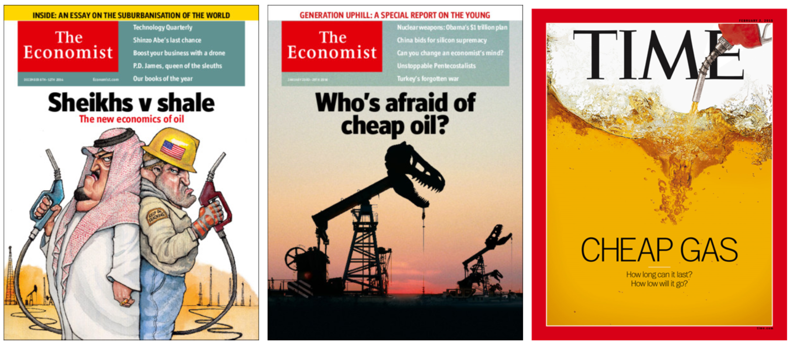

# Analysis of the future oil price crisis of 2014-2016
## A generalized linear model approach with time series 

### Objective

The objective of this work is to provide an empirical explanation of the behavior of international oil future prices during the crisis of 2014-2016 using macroeconomic variables.

### Methodology

To achieve the objective a generalized linear model approach with time series is used.

The dependent variable is:

- West Texas Intermediate (WTI). It is the oil price of future contracts from the oil produced in Texas and Oklahoma, which also serves as a price reference for other oil mixes.

Explanatory variables:

- JPM Dollar Index (JPM Dollar Index)
- Chicago Board Options Exchange SPX Volatility Index (VIX)
- OPEC total oil production (Prod. OPEP)
- World oil demand (Dem. Petróleo)
- United States long term Treasury Bonds' interest rate (TBILL-10YR)
- United States short term Treasury Bonds' interest rate (TBILL-1YR)

The sample of study included 225 monthly observations that belong to the period January 2000 to June 2018. The forecasting period covers three months from July to September of 2018.

Three types of models were fitted using the original, standardized and transformed data respectively. The following models were fitted for each group:

- Multiple linear regression (benchmark)
- Generalized Static linear model
- Generalized Dynamic liner model
- Generalized Dynamic liner model with static intercept and smoothing parameter (lambda = 10)
- Generalized Dynamic liner model with static intercept and smoothing parameter (lambda = 100)
- Generalized Dynamic liner model with static intercept and smoothing parameter (lambda = 1000)
- Generalized Dynamic liner model with static intercept and smoothing parameter (lambda = 100000)
- Generalized Dynamic liner model without intercept and smoothing parameter (lambda = 10)
- Generalized Dynamic liner model without static intercept and smoothing parameter (lambda = 100)
- Generalized Dynamic liner model without static intercept and smoothing parameter (lambda = 1000)
- Generalized Dynamic liner model without static intercept and smoothing parameter (lambda = 100000)

The deviance (DIC) and pseudo-R2 measures were used to evaluate the models. Also, the parameters' statistical significance and a visual inspection of the model for overfitting were used to select the best model.

### Tools

The statistical analysis was executed in **R** using **Just Another Gibbs Sampler (JAGS)** library.

### Results 

The best model that explains the oil future prices during the period of study is a dynamic generalize linear model with static intercept and smoothing factor. 

The variables with statistical significance that best contributed to explain the oil prices were:

- Dollar index
- OPEC oil production 
- World oil demand

The volatility index of the futures market, the short- and long-term interest rates of the Treasury Bonds had a less important impact.

### Index of the repository

**Deliverables**

- final_report.pdf: Final report
- final_presentation.pdf: Final presentation

**Code**

- Proyecto_Regresion.Rmd: Complete statistical analysis
- Presentacion_Proyecto_Final.Rmd: Final presentation code

**Models**

This directory contains the models used in the project. Each model has an R script that executed the model fitting and a text file that contains the BUGS code for JAGS.

**Data**

This directory includes that datasets used for the project.

- Datos_Crudos.xlsx: Includes the original data from Bloomberg and FRED
- Datos_SemiLimpios.csv: Pre-processed and clean data

**fig**

The fig directory includes all the images used in the R markdown and presentation.

